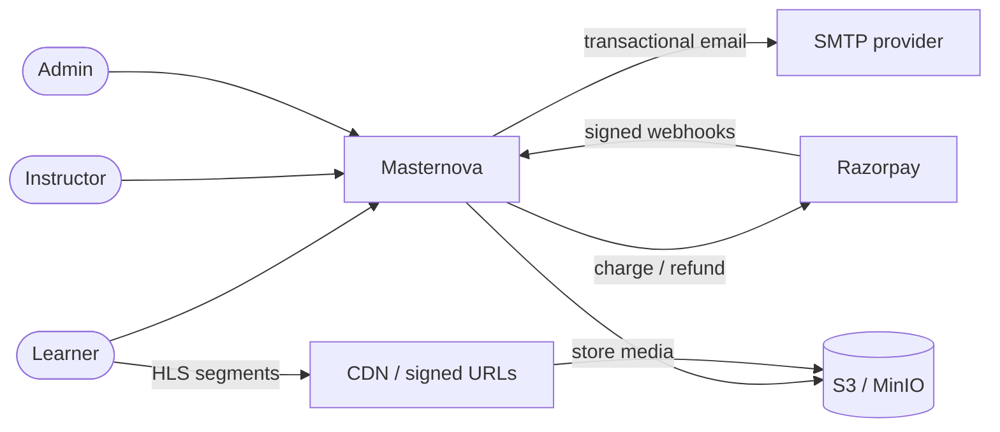
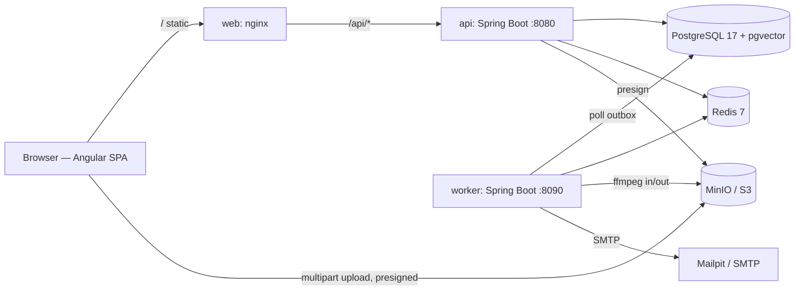
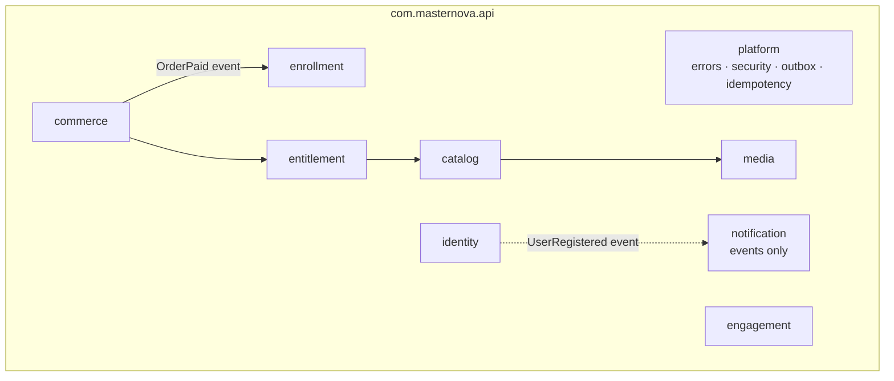

# Architecture

**Last updated:** 2026-10-02 · **Status:** Phase 0. Containers are real; module boxes are planned.

## 1. Context (C4 level 1)

## 2. Containers (C4 level 2)

| Container | Tech | Scales on | Why separate |
|---|---|---|---|
| `web` | Angular, served by nginx | — (static) | Same-origin `/api` proxy, so no CORS in prod |
| `api` | Spring Boot 4, Java 25, virtual threads | RPS / CPU | Request handling: I/O-bound and steady |
| `worker` | Spring Boot 4, no public API | Outbox / queue depth | Transcoding is CPU-bound and bursty; it must not starve request threads |
| `postgres` | 17 + pgvector | Vertical, then read replicas | Source of truth; the outbox lives here so state and events commit together |
| `redis` | 7 | — | Entitlement cache, progress write-back buffer, rate limits |
| `minio` | S3 API | — | Media. Browsers upload directly with presigned URLs |

## 3. Inside the api (C4 level 3): Spring Modulith modules

**Rules** (enforced by `ModularityTests`):

- A module uses another module only through its **top-level public types**.
- Effects that can fail independently are **events through the outbox**, never direct calls.
- `platform` is the only module everyone may depend on.

The real diagram is generated on every build at `backend/api/target/spring-modulith-docs/`.

## 4. Cross-cutting decisions

| Concern | Decision | Where |
|---|---|---|
| Errors | RFC 9457 Problem Details | [`api/conventions.md`](../api/conventions.md) §1 |
| Schema | Flyway owns it; Hibernate only `validate`s | `api/src/main/resources/db/migration` |
| Time | An injected `Clock`, never `Instant.now()` | `platform/PlatformConfig` |
| Config | Env vars over `application.yaml` defaults | `.env.example` |
| Logs | JSON (ECS) in containers, human-readable in dev | `LOGGING_STRUCTURED_FORMAT_CONSOLE` |
| Health | Actuator liveness/readiness groups → Docker `HEALTHCHECK`, K8s probes | `backend/healthcheck.sh` |
| Concurrency | Virtual threads for request handling | `spring.threads.virtual.enabled` |

## 5. Deployment views

- **Dev:** `make up` (infra) + `make api` / `make web` from source.
- **Containers:** `make stack`, all services via compose, web on :8081.
- **Kubernetes (Phase D4):** k3d + Helm, Argo CD syncing from `deploy/helm`.
- **AWS (Phase D6, optional):** ECS Fargate + RDS + ElastiCache + S3/CloudFront, via Terraform.
