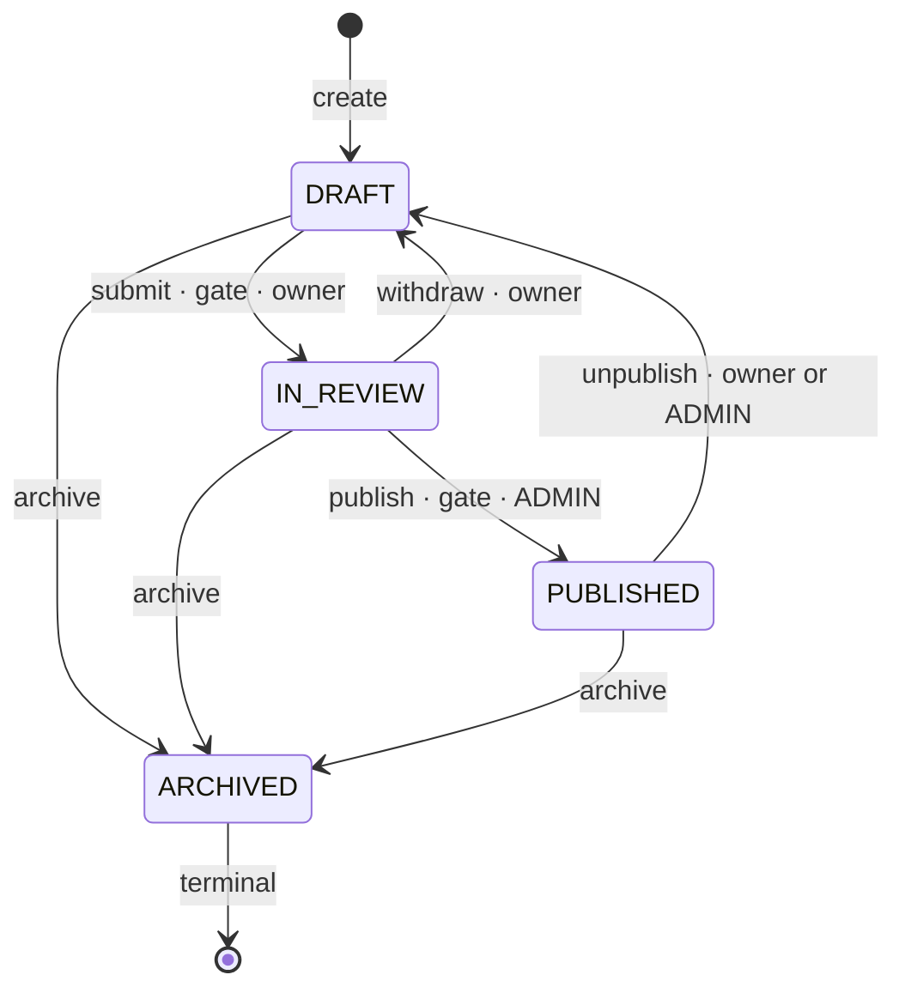
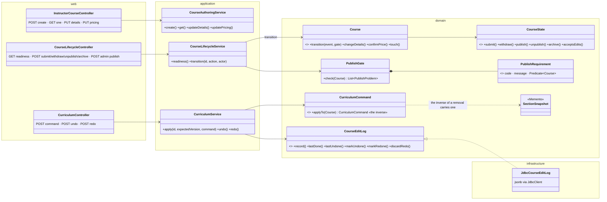
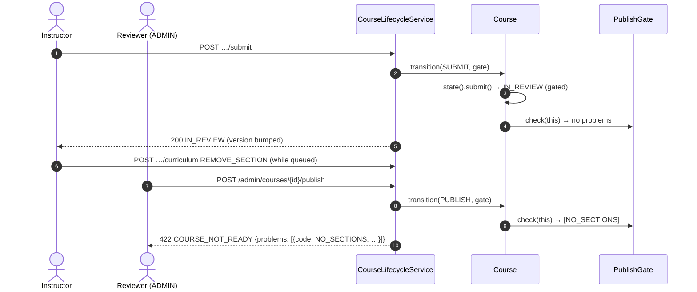

# Catalog authoring — Low Level Design

> **One-liner:** how an instructor builds a course over days and two open tabs **without losing
> an edit**, undoes a mistaken drag, and is stopped from publishing a half-finished course, with
> every rule living in the `Course` aggregate rather than in a service or a form.

**Module:** `backend/api/src/main/java/com/masternova/api/catalog` (authoring half) · **Status:** draft (6.1)
**Last updated:** 2026-10-03 · **Angular:** `frontend/src/app/features/instructor`
**Builds on:** [`catalog.md`](catalog.md) (the aggregate, visibility, Prototype). **Reused from:**
NestJS Masternova `docs/lld/wizard-draft-state.md`: same forces; several decisions come out
differently with JPA and Postgres (§7).

## 1. Problem

Authoring a course isn't a form submit. It's a session that spans days:

- Monday: the instructor types a description.
- Wednesday: they add sections and lectures.
- Friday: they drag a lecture into another section, delete the wrong section, and press Ctrl+Z.
- Next week: they press "Submit for review"; an admin publishes.

Meanwhile a tab stays open on the laptop and another on the desktop, both autosaving. The three
things that break:

1. **A concurrent save silently discards the other tab's work.** Last write wins, the description
   reverts, nobody notices.
2. **A half-finished course reaches the catalog**: no sections, no price decided, a 4-word
   description.
3. **A reorder violates the database's position constraint halfway**, although the finished
   order is legal.

## 2. Forces

- **Two open tabs is a real bug.** Autosave makes it the common case, not an edge case.
- **The publish gate must be a server rule.** The wizard's checklist is a convenience; the
  transition is the only place it can be enforced.
- **Illegal transitions must be impossible**, not merely discouraged: `PUBLISHED` is what the
  public query matches, `ARCHIVED` is what stops sales.
- **Undo must survive a load balancer and a deploy.** The api runs as several replicas (D4); the
  tab that made an edit may reach another process when it presses undo.
- **Ordering is a database constraint** (`UNIQUE (course_id, position)`), and Hibernate flushes
  row by row, so a swap is momentarily illegal.
- **Denormalised rollups** (`lecture_count`, `total_duration_seconds`) are read by every catalog
  card and must stay true through every edit.
- **Review must be real.** An `IN_REVIEW` that nothing has to pass through is a lie in an enum.

## 3. Domain model

The aggregate is unchanged from `catalog.md`: `Course` is the root; `Section` and `Lecture` live
inside it. Phase 6 adds:

| Addition | Meaning |
|---|---|
| `Course.version` (exists since V6) | the optimistic-concurrency token. Since the root is the consistency boundary, **every** change inside the aggregate bumps it, including a lecture rename (§4, "the root's version covers the aggregate"). |
| `Course.priceSetAt` | stamped when pricing is confirmed. Distinguishes "free" from "nobody has priced this yet". |
| `course_edit` (table) | one applied curriculum command, its inverse, the version it produced, whether it's undone. The undo/redo history. |
| `CourseState` | the State pattern over the persisted `CourseStatus`. |

**Legal states and who may move between them:**



Invariants:

- **No edge from `DRAFT` straight to `PUBLISHED`.** If one existed, review would be optional. A
  test asserts its absence (and every one of the 4 × 5 state/event pairs).
- **The gate runs on both edges that lead toward publication** (submit, publish): a course can be
  edited while it waits in review, and approving what the reviewer saw isn't publishing what it
  became.
- **`ARCHIVED` is terminal and read-only.** Archiving is this domain's delete (orders and
  enrollments reference courses). Bringing one back means duplicating it (Prototype) into a fresh
  `DRAFT`, which is reviewed like anything else.
- **`publishedAt` is stamped on the first publish and never moves** (it's the NEWEST sort key).
  Unpublish → re-publish keeps it.
- **A status change bumps `version`**, so every open tab's copy becomes stale.

**The publish gate** (coded requirements; the same list produces the 422 and the wizard's
checklist):

| Code | Satisfied when |
|---|---|
| `DESCRIPTION_TOO_SHORT` | description ≥ 50 characters |
| `PRICE_NOT_SET` | pricing was confirmed (`priceSetAt` present), free or paid |
| `NO_SECTIONS` | at least one section |
| `EMPTY_SECTION` | every section has at least one lecture |
| `TOO_FEW_LECTURES` | at least 3 lectures in total |
| `NO_PREVIEW` | at least one free preview lecture |

Media readiness (`VIDEO` lectures have a transcoded asset) joins the list in Phase 7, when media
exists to ask. Adding a requirement is adding one entry; nothing else moves.

## 4. Class design



**"The root's version covers the aggregate."** JPA increments `@Version` only when the **course
row** is updated. A lecture rename updates only the `lecture` row, so it wouldn't bump the
course's version, and a stale tab would overwrite it unnoticed. Every mutation through the root
therefore calls `touch(now)` (`updated_at`), which dirties the course row: the version moves with
any change anywhere in the aggregate. (The alternative, `LockModeType.OPTIMISTIC_FORCE_INCREMENT`,
is §7.)

**Module API:** still none. The identity module gains a public `IdentityApi.displayName(userId)`
because creating a course needs the instructor-name snapshot (catalog.md §3).

## 5. Main flows

**A curriculum edit, and the stale second tab:**

```mermaid
sequenceDiagram
  autonumber
  participant A as Tab A
  participant B as Tab B (stale)
  participant S as CurriculumService
  participant C as Course (aggregate)
  participant DB as Postgres
  A->>S: POST …/curriculum {expectedVersion: 7, kind: MOVE_LECTURE}
  S->>DB: load course + curriculum
  S->>S: owner or admin? editable (not ARCHIVED)? version == 7?
  S->>C: command.applyTo(course) → inverse
  S->>C: touch(now) — dirties the root
  S->>DB: INSERT course_edit {command, inverse, version 8}
  S->>DB: flush: UPDATE section/lecture …; UPDATE course … SET version=8 WHERE id=? AND version=7
  S->>DB: COMMIT (deferred position constraints checked here)
  S-->>A: 200 {version: 8, sections}
  B->>S: POST …/curriculum {expectedVersion: 7, RENAME_SECTION}
  S->>DB: load → version 8
  S-->>B: 409 VERSION_CONFLICT {expectedVersion: 7, currentVersion: 8}
```

If both requests load version 7 at the same instant, both pass the check; Hibernate's
`UPDATE … WHERE version = 7` lets one win and the other update **0 rows** →
`OptimisticLockException` → the whole transaction rolls back (its section rows and its
`course_edit` row included) → 409. Same answer, caught one step later.

**Undo / redo** (`course_edit` as the caretaker):

- **Undo:** the newest not-undone edit → apply its **inverse** → mark it undone → touch.
- **Redo:** the oldest edit undone since then → apply its **command** again → mark it done.
- **A new edit after an undo** discards the redo branch (like every editor).
- Both take `expectedVersion`, so a stale tab can't undo someone else's newer edit.

**Publishing:**



**Endpoints** (instructor routes need INSTRUCTOR or ADMIN, and ownership unless ADMIN):

| Endpoint | Body | Returns |
|---|---|---|
| `POST /api/v1/instructor/courses` (+ `Idempotency-Key`) | `{title, categorySlug, level, language}` | 201 + the new DRAFT |
| `GET /api/v1/instructor/courses/{id}` | — | the course with `version`, `priceSet` |
| `PUT /api/v1/instructor/courses/{id}/details` | `{expectedVersion, title, subtitle, description, categorySlug, level, language}` | the course (new `version`) |
| `PUT /api/v1/instructor/courses/{id}/pricing` | `{expectedVersion, priceMinor}` | the course |
| `POST /api/v1/instructor/courses/{id}/curriculum` | `{expectedVersion, command: {kind, …}}` | `{version, canUndo, canRedo, sections}` |
| `POST /api/v1/instructor/courses/{id}/curriculum/undo` · `/redo` | `{expectedVersion}` | same |
| `GET /api/v1/instructor/courses/{id}/readiness` | — | `{ready, requirements: [{code, satisfied, message}]}` |
| `POST /api/v1/instructor/courses/{id}/submit` · `/withdraw` · `/unpublish` · `/archive` | — | the course |
| `POST /api/v1/admin/courses/{id}/publish` | — | the course |

## 6. Patterns used

| Pattern | Class (`@DesignPattern` role) | The force that justified it |
|---|---|---|
| **State** | `CourseState` (sealed: `Draft`, `InReview`, `Published`, `Archived`) | illegal transitions must be impossible. Each state overrides **only its legal events**; the interface's default methods throw. Java's default methods answer the NestJS objection ("4 states × 5 events = 20 methods, 17 of them `throw`"). |
| **Specification** | `PublishRequirement` + `PublishGate` | independent, named, coded rules; one list yields both the 422 and the wizard checklist |
| **Command** | `CurriculumCommand` (sealed records, `@JsonTypeInfo(property = "kind")`) | **undo**: an edit must be a storable value that can produce its own inverse. Nine REST verbs can't be inverted. |
| **Memento** | `SectionSnapshot` / `LectureSnapshot` (memento), `Course` (originator), `course_edit` (caretaker) | the inverse of a removal is the removed content, which exists only before the delete. Whole-curriculum snapshots vs inverse commands are both built and compared in 6.5. |
| **Repository** | `CourseEditLog` (JDBC, jsonb) | the history is append-mostly JSON, queried by course and order: not an entity graph |

**Not used, on purpose:**

- **A `CourseLifecycle` service holding the transition table.** The rules belong to the aggregate
  that owns the status; the service only loads, checks the actor and saves.
- **An `ApplicationEvent` per transition.** Nothing listens yet. `CoursePublished` arrives with
  its first consumer (entitlement cache, Phase 8; search, Phase 11). Correcting catalog.md §6,
  which expected it here.
- **Builder for the gate.** It's a list of independent requirements, not a stepwise construction.

## 7. Alternatives rejected

| Option | Why not |
|---|---|
| last-write-wins autosave | the losing tab's work vanishes with no error. The reason `version` exists. |
| `updated_at` as the token | two writes inside one clock tick tie; a counter can't tie |
| pessimistic locking held across the editing session | a lock held for a human's think time is held until the browser crashes |
| `ETag` / `If-Match` instead of `expectedVersion` in the body | equivalent on the wire, but the Angular forms already carry the version as data, and the API conventions (§3) chose the body. [ADR-0010](../adr/0010-optimistic-concurrency-with-version.md). |
| `LockModeType.OPTIMISTIC_FORCE_INCREMENT` on every load | works, but it's set per query and forgotten on the next one. `touch()` lives in the aggregate's mutators, so no write path can skip it. |
| a conditional `UPDATE … SET version = version + 1 WHERE version = ?` claim (the NestJS design) | JPA's `@Version` already issues exactly that statement at flush. The service adds the cheap pre-check for a precise 409 body. |
| an in-memory undo stack | lost with two replicas or one deploy |
| deriving the inverse at undo time | impossible: the inverse of a removal is the removed content, gone after the delete |
| nine REST endpoints for curriculum edits | not invertible; a new edit type would touch the controller, the service and the undo path |
| renumbering positions with the "park negative, then settle" trick (NestJS: Prisma can't declare deferrable constraints) | Postgres supports `DEFERRABLE INITIALLY DEFERRED`, and Flyway runs plain SQL: the constraint is checked at commit, after every row has its final position (V10). |
| a transition guarded by `WHERE status = ?` | `@Version` already rejects a concurrent second transition (the row's version moved) |

## 8. Failure modes

| Failure | Detected by | Behaviour | Recovery |
|---|---|---|---|
| two tabs save the same version | pre-check, or `@Version` at flush | 409 `VERSION_CONFLICT` `{expectedVersion, currentVersion}` | the client reloads and re-applies |
| a stale tab presses publish | the gate re-runs on the current row | 422 `COURSE_NOT_READY` with coded problems | fix the listed steps |
| illegal transition (DRAFT → publish, anything from ARCHIVED) | `CourseState` default method | 409 `ILLEGAL_TRANSITION` `{from, action}` | — |
| an edit to an archived course | `state().acceptsEdits()` | 409 `COURSE_ARCHIVED` | duplicate it |
| a command names a section/lecture of another course | lookups scoped to the loaded aggregate | 404 (never "exists but not yours") | — |
| a reorder that isn't a permutation | the command validates against the aggregate | 400, nothing written | the client sends the full order |
| undo with nothing to undo | the log is empty | 409 `NOTHING_TO_UNDO` (`NOTHING_TO_REDO`) | — |
| a curriculum write fails mid-transaction | Postgres raises; the transaction rolls back | no partial drag, no `course_edit` row | retry with the same `expectedVersion` |
| a learner calls an instructor route | `@PreAuthorize` | 403 | — |
| an instructor publishes their own course | `@PreAuthorize("hasRole('ADMIN')")` on publish | 403 | ask a reviewer |

## 9. Data & indexes

- `V10__catalog_authoring.sql`:
  - `course.price_set_at TIMESTAMPTZ` (existing seeded/test courses: set for published ones).
  - The two position constraints become `DEFERRABLE INITIALLY DEFERRED`.
  - `course_edit (id, course_id → course ON DELETE CASCADE, seq, command jsonb, inverse jsonb,
    version_after, actor_id, undone_at, created_at)`, `UNIQUE (course_id, seq)`; the unique index
    serves "the newest done / oldest undone edit of this course".
- **Transaction boundary** (apply, undo, redo, transitions): load → check → mutate the aggregate →
  record the edit → flush (the versioned `UPDATE`) → commit. All or nothing.

## 10. Tests that prove it

*(filled in as the tasks land)*

## 11. Interview notes — 60-second recall

*(written last, in 6.8)*
