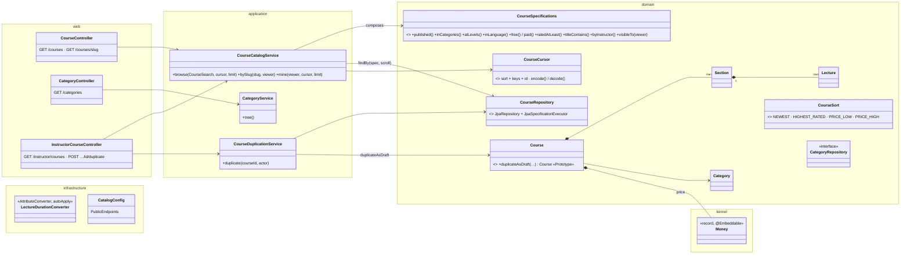
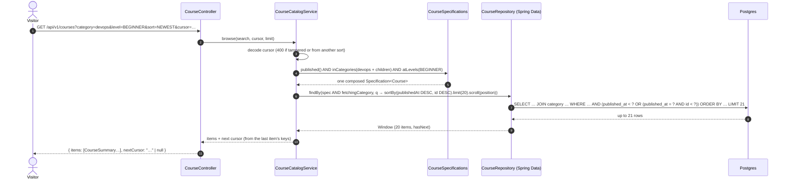
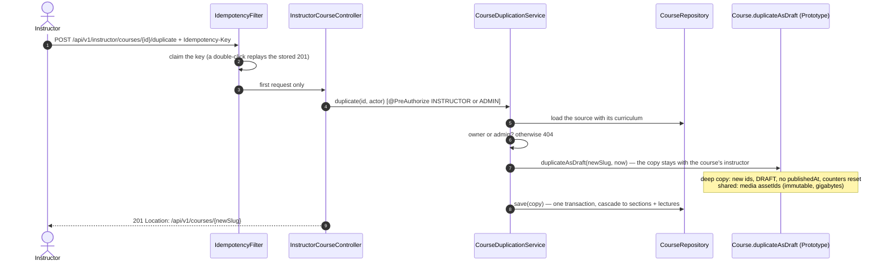

# Catalog — Low Level Design

> **One-liner:** what a course *is* (an aggregate of sections and lectures with a price), and how
> thousands of them are browsed, filtered and paged **without a growing `if` ladder, without
> `OFFSET`, and without N+1 queries**.

**Module:** `backend/api/src/main/java/com/masternova/api/catalog` · **Status:** draft (5.1)
**Last updated:** 2026-10-02 · **Angular:** `frontend/src/app/features/catalog`
**Reused from:** NestJS Masternova `docs/lld/catalog.md`. Same forces; the decisions are
re-derived for JPA/Spring Data, and some come out differently (§7).

**Scope of Phase 5:** the **read side** (browse, filter, page, detail), course **duplication**,
and the schema. Authoring (the lifecycle state machine, the publish gate, curriculum commands,
undo, optimistic-locking conflicts) is Phase 6 and gets its own LLD, `catalog-authoring.md`.

## 1. Problem

The catalog is the most-read surface of the product and the least uniform one.

- A visitor wants "published courses, newest first".
- The next one wants "free beginner DevOps courses in Hindi rated 4+, cheapest first", and
  then the next page, and the next.
- An instructor wants **their own** courses in every state, drafts included, which nobody else
  may see.
- A course page needs the course, its category, and its whole curriculum (sections → lectures)
  in one response.

Written the obvious way, the list is one method with an `if` per filter that grows every sprint,
and the visibility rule ("drafts only for their owner") gets copied into every query that can
return a course. Underneath it's a list, which means pagination, which brings the two classic
bugs: it gets **slower** the deeper you scroll, and it **duplicates or skips** rows when someone
publishes a course while you're reading.

## 2. Forces

- **Read volume.** Every visitor hits the catalog before anything else.
- **Filters compose freely.** Six optional facets plus a text search is 2⁷ combinations; none of
  them can be special-cased.
- **Visibility depends on the viewer, not the row.** The same draft is a 404 for a stranger, a
  200 for its author and a 200 for an admin.
- **Concurrent writes while reading.** Courses are published while people are paging.
- **Money.** A price is an integer in minor units plus a currency, or it is a rounding error
  waiting to become a chargeback (API conventions §5).
- **An aggregate with real structure.** Course → Section → Lecture, ordered, loaded together
  for the detail page. The ORM makes the N+1 query the *default* outcome.
- **Denormalised counters.** Rating and enrollment counts are written by other contexts later
  (Phases 10, 11) and must be sortable here.
- **Duplication.** Copying a course must copy its structure, but **not** its media (gigabytes of
  transcoded video in Phase 7), its sales or its ratings.

## 3. Domain model

`Course` is the **aggregate root**. `Section` and `Lecture` live **inside** it: no independent
lifecycle, never loaded without their course, cascaded with it. So there is **no
`SectionRepository` or `LectureRepository`**: a repository per table is how a domain goes
anemic, and it would let a caller add a lecture without updating the course's rollups.

| Type | Kind | Invariant |
|---|---|---|
| `Course` | entity, aggregate root | `slug` is unique and never regenerated on rename (a changed URL is a broken link). `publishedAt` is set **iff** the status is `PUBLISHED` or later, and never moves (DB `CHECK` too). `lectureCount` / `totalDuration` always equal the sum over its lectures (recomputed by the aggregate, never set from outside). |
| `Section` | entity, inside `Course` | `(course, position)` unique (DB constraint). Positions are 0..n-1 in list order. |
| `Lecture` | entity, inside `Section` | `(section, position)` unique. `assetId` points at media (Phase 7) and is **shared** by a duplicate. |
| `Category` | entity, reference data | two levels only: a root has no parent; a child's parent is a root. Seeded by Flyway. |
| `Money` | value object (`record`, `@Embeddable`), **kernel** | `amountMinor ≥ 0`; currency is ISO-4217; arithmetic refuses mixed currencies. Lives in the kernel because commerce (Phase 9) prices with it too. |
| `LectureDuration` | value object (`record`) | non-negative seconds; one column, so it's mapped with an `AttributeConverter`, not `@Embeddable`. |
| `CourseStatus` | enum | `DRAFT`, `IN_REVIEW`, `PUBLISHED`, `ARCHIVED`. Phase 5 only reads it; Phase 6 turns the transitions into the **State** pattern. |
| `CourseLevel`, `LectureKind` | enums | `BEGINNER / INTERMEDIATE / ADVANCED / ALL_LEVELS`; `VIDEO / ARTICLE` |

**Instructor name is a snapshot.** `course.instructor_name` copies the user's display name at
creation. The alternative (calling identity for every list page) couples the most-read query to
another module. The cost: a rename isn't reflected until identity publishes a `UserRenamed`
event that catalog consumes (no rename feature exists yet; noted in §8).

## 4. Class design

**Module API** (what other modules may use): **none in Phase 5.** No other module calls catalog
yet. Entitlement (Phase 8) will need "does this lecture exist, is it a free preview, which course
is it in?"; that's when `CatalogApi` appears, shaped by its first real caller.

**List fetch plan.** A list page joins the category with a small "fetch plan" Specification
(`fetchingCategory()`), not Spring Data's `project("category")`: in Spring Data JPA 4.1,
`project()` applies its fetch graph to `all()` / `page()` / `stream()` but **not** to `scroll()`
(found by `CatalogApiIT`).

**Repositories:** Spring Data interfaces live **directly in `domain/`** (the identity module's
choice too). They are interfaces; Spring generates the implementation, so `infrastructure/` has
nothing to add.

**Viewer on public routes.** `GET /courses/{slug}` is public but must know *who* is asking (an
owner may see their draft). The security chain already authenticates a bearer token on a
public route when one is present, so the controller takes an `Optional<CurrentUser>` (identity's
argument resolver learns to produce an empty `Optional` for anonymous callers).

## 5. Main flows

**Browse:**

**Detail (two statements, whatever the curriculum size):**

1. `findBySlug` with an entity graph `{category, sections}` → one `SELECT … JOIN` for the course,
   its category and its sections.
2. Touching `section.lectures()` triggers **batch fetching** (`@BatchSize` on the collection):
   one `SELECT … WHERE section_id IN (…)` for every section at once.
3. `visibleTo(viewer)` decides: `PUBLISHED` → anyone; otherwise only the owner or an admin;
   anyone else gets **404, not 403** (a 403 would confirm the draft exists).

**Duplicate (the interesting write):**

**Endpoints:**

| Endpoint | Auth | Returns |
|---|---|---|
| `GET /api/v1/categories` | public | the two-level tree |
| `GET /api/v1/courses?q&category&level*&language&price=FREE\|PAID&minRating&sort&limit&cursor` | public | `{items: CourseSummary[], nextCursor}`, `PUBLISHED` only |
| `GET /api/v1/courses/{slug}` | public (viewer optional) | `CourseDetailResponse`; drafts only for owner/admin, else 404 |
| `GET /api/v1/instructor/courses?limit&cursor` | INSTRUCTOR or ADMIN | the caller's own courses, every status, recently updated first |
| `POST /api/v1/instructor/courses/{id}/duplicate` | INSTRUCTOR or ADMIN + `Idempotency-Key` | 201 + `CourseDetailResponse` of the copy |

## 6. Patterns used

| Pattern | Class (`@DesignPattern` role) | The force that justified it |
|---|---|---|
| **Specification** | `CourseSpecifications` (leaves) composed with Spring Data's `Specification.allOf` / `and` / `or` / `not` | six facets that combine freely, and a visibility rule that must be in **every** query. Adding a facet = adding a leaf; `browse()` never changes. |
| **Value Object** | `Money` (kernel, `@Embeddable`), `LectureDuration` (`AttributeConverter`) | money in minor units can't be represented wrong; a duration can't be negative. Equality by value. |
| **Prototype** | `Course.duplicateAsDraft` → copy constructors of `Course` / `Section` / `Lecture` | the object that knows its own structure copies itself. Deep for the mutable metadata, shallow (shared) for the immutable media. |
| **Builder** | `CourseBuilder` (+ `LectureBuilder`) in the test sources | `Course.draft` takes nine arguments plus a curriculum; tests should state only the ones that matter to them. Builds through the real factory, so every test course is a legal one. |
| **Repository** | `CourseRepository`, `CategoryRepository` (Spring Data) | one per aggregate; no table-level repositories. |

**Not used, on purpose:**

- **A `CatalogApi` facade.** No caller exists yet (§4).
- **A `CourseDuplicator` interface.** One implementation, forever: the copy logic lives on the
  aggregate that knows its own structure.
- **`Cloneable` / `clone()`.** Shallow by default, bypasses constructors (so invariants), forces
  a checked exception and a cast; copy constructors are explicit about deep vs shared (pattern
  note 11).
- **MapStruct.** Three small DTOs with `static from(...)` mappers; nothing repetitive yet.
- **Domain events.** Phase 5 changes nothing anyone listens to. `CoursePublished` arrives with
  the lifecycle in Phase 6.

## 7. Alternatives rejected

| Option | Why not |
|---|---|
| `LIMIT/OFFSET` pagination | slower with depth (the DB reads and discards every skipped row) and **wrong** under concurrent publishes (rows repeat or vanish). [ADR-0009](../adr/0009-keyset-pagination-over-offset.md). |
| a hand-rolled keyset predicate | Spring Data's `ScrollPosition.keyset()` + `Window` composes with Specifications and handles `limit + 1` / direction. Hand-rolling only wins if we need Postgres' row comparison `(a, b) < (x, y)`; 5.9 measures whether we do. |
| Spring Data's `KeysetScrollPosition` serialised as-is to the client | its keys are a `Map<String, Object>`; Jackson would leak property names and lose types (an `Instant` comes back as a `String`). Our `CourseCursor` encodes typed values and **the sort it belongs to**, so a cursor reused with another sort is a 400, not wrong data. |
| Querydsl / jOOQ for the filters | an extra code generator for what the JPA Criteria API + Spring Data `Specification` already do. jOOQ stays the answer if catalog queries ever outgrow JPA. |
| `JOIN FETCH` sections **and** lectures | Hibernate refuses two `List` ("bag") fetches in one query (`MultipleBagFetchException`); switching to `Set` "works" but returns sections × lectures rows (a cartesian product). Entity graph for one level + batch fetching for the next = 2 statements, no product. |
| `hibernate.default_batch_fetch_size` globally | hides every N+1 instead of fixing the ones that matter, and makes statement counts hard to reason about in tests. `@BatchSize` where it's needed. |
| `Money` as two plain columns on `Course` | every price comparison and display re-invents rounding and currency checks. |
| `Money` with `double` or `BigDecimal` rupees | `double` can't represent 0.10; payment gateways take integer paise anyway (API conventions §5). |
| `Money` duplicated per module (one in catalog, one in commerce) | two definitions of money drift. It lives in the **kernel** with a compile-only `jakarta.persistence-api` dependency: annotations are inert metadata, and the kernel stays free of Spring and Hibernate. |
| instructor name joined from `app_user` | the list query would reach into identity's table, and the module rule is "talk to another module through its public API". A snapshot + a future event keeps the hot query inside catalog. |
| many-to-many course ↔ category | breaks the `(status, category, sort key)` index shape, and marketplace browse is single-category anyway. |
| hard `DELETE` of a course | would orphan orders and enrollments (Phases 9, 10). Archiving is the delete (Phase 6). |

## 8. Failure modes

| Failure | Detected by | Behaviour | Recovery |
|---|---|---|---|
| stranger asks for a draft | `visibleTo(viewer)` | **404** (`NOT_FOUND`), never 403 | — |
| cursor tampered, truncated, or from another sort | `CourseCursor.decode` | 400 `VALIDATION_FAILED`, `errors[0] = {field: cursor, code: INVALID_CURSOR}` | the client restarts from page 1 |
| `sort=RECENTLY_UPDATED` on the public list | `CourseSort.isPublic()` | 400, `errors[0].code = UNSUPPORTED_SORT` (no index serves it for published courses) | — |
| a course is published between two page loads | keyset anchors on the last row's key | no row repeats or vanishes | — |
| many courses share one sort key (same price) | `id` is always the last sort key | a total order; pages never overlap | — |
| unknown category slug | — | an empty list, not a 404 (a stale bookmark shouldn't error) | — |
| `limit` / `minRating` out of range, unknown enum | Bean Validation / binding on `BrowseCoursesRequest` | 400 `VALIDATION_FAILED`, one entry per field | — |
| double-clicked "Duplicate" | `Idempotency-Key` (platform) | the stored 201 is replayed, `Location` included; **one** copy | — |
| an admin duplicates someone's course | role check | allowed; the copy stays with the original instructor (the admin acts on their behalf) | — |
| the random slug suffix collides | `UNIQUE (slug)` | the insert fails (500), the key is released; a retry draws a new suffix | 1 in 2 billion per course; accepted |
| duplicate fails half-way | one transaction | no course, no sections | retry with the same key |
| learner calls an instructor endpoint | `@PreAuthorize` | 403 `FORBIDDEN` | — |
| instructor duplicates someone else's course | ownership check | 404 (same reason as drafts) | — |
| instructor renames themselves | — | old name on their courses until `UserRenamed` exists | owed: identity has no rename yet |
| N+1 sneaks back into the detail page | `CourseQueryCountIT` counts statements | the build fails | — |

## 9. Data & indexes

`V6__catalog.sql`: tables `category`, `course`, `section`, `lecture`, plus the seeded category
tree. Only primary keys, unique constraints and foreign keys: **no secondary indexes yet**.

`V8__catalog_indexes.sql` (task 5.9; `V7` went to the idempotency `Location` fix found in 5.6):
every secondary index arrives in its own migration, after
measuring each list query with `EXPLAIN ANALYZE` on 10,000 seeded courses. Two migrations on
purpose: the "before" number is then a real point in this schema's history. Evidence:
[`docs/db/indexes.md`](../db/indexes.md).

| Table | Keys / constraints | Notes |
|---|---|---|
| `category` | PK `id`, UNIQUE `slug`, FK `parent_id → category` | reference data |
| `course` | PK `id`, UNIQUE `slug`, FKs `instructor_id → app_user`, `category_id → category`; `CHECK`s on enums, `price_minor ≥ 0`, currency, and `published_at` vs status | `version` for Phase 6's optimistic locking |
| `section` | PK `id`, UNIQUE `(course_id, position)`, FK → course `ON DELETE CASCADE` | the unique index also serves "sections of a course" |
| `lecture` | PK `id`, UNIQUE `(section_id, position)`, FK → section `ON DELETE CASCADE` | `asset_id` has no FK until media exists (Phase 7) |

**Transactions:** reads are `@Transactional(readOnly = true)` (Hibernate skips dirty checking and
flushing). The duplicate is one read-write transaction: load, copy, `save`, commit.

## 10. Tests that prove it

| Level | Test | Proves |
|---|---|---|
| unit (no Spring) | `MoneyTest` (kernel), `LectureDurationConverterTest` | value semantics, overflow, mixed currencies refused, a corrupt row fails on load |
| unit (no Spring) | `CourseTest` | the aggregate's rules: rollups move with `addLecture`, a foreign section is refused, the curriculum can't be edited behind the root, `publishedAt` stamped once, slug/language shapes, rating summary consistency |
| integration (Postgres) | `CatalogPersistenceIT` | the aggregate round-trips with its value objects and section/lecture order; the DB refuses a duplicate slug and a published course without `published_at`; the seeded category tree |
| unit (no DB) | `ViewerTest` | visibility in memory: published for all; a draft only for its owner and admins |
| ⭐ integration (Postgres) | `CourseSpecificationsIT` | every leaf selects exactly its rows on the real schema; `%` and `_` in search text are literals; and/or/not compose; **the SQL and in-memory visibility rules agree** for 5 kinds of viewer; a search composes only the facets it has |
| unit | `CourseCursorTest` | typed round trip per sort; URL-safe; a cursor from another sort and every kind of garbage → 400, never a 500 |
| ⭐ HTTP + security + Postgres | `CatalogApiIT` | **55 rows sharing one sort key page as 20/20/15 with no duplicates**; a course published between two page loads doesn't shift page 2 (the OFFSET bug); price ties broken by id; **a page is 1 statement**; query-string binding + validation; a draft is 404 for strangers and 200 for its owner/admins; drafts never in the public list; the instructor list is role-gated (401/403) and shows every state |
| unit (Builder) | `CourseBuilderTest` | the test data builder's defaults are valid and its slugs unique; a built curriculum keeps the aggregate's rollups (it builds through the real methods) |
| ⭐ unit (Prototype) | `CourseDuplicationTest` | new ids, DRAFT, history reset; content + curriculum copied; children point at the NEW parent; **changing the copy never changes the source**; media asset ids **shared on purpose**; long titles stay ≤ 120 |
| ⭐ HTTP + Postgres | `CourseDuplicationIT` | 201 + `Location`; the copy is a non-public draft with every lecture persisted; **the same `Idempotency-Key` twice → one copy**, replay carries `Location`; key required; another instructor 404, learner 403, admin allowed (copy stays the instructor's) |
| frontend (Vitest) | `catalog-api.spec`, `catalog.spec`, `course-detail.spec`, `curriculum.spec`, `course-card.spec`, `money-pipe.spec`, `duration-pipe.spec` | URL → request (and bad URL values dropped); controls write the URL (merge); search debounced into one navigation; the next page uses the cursor; **a filter change cancels the in-flight page**; error + retry; `rxResource` re-loads on a new slug; 404 → "not found"; `@defer` curriculum |
| ⭐ e2e (Playwright, seeded) | `e2e/tests/catalog.spec.ts` | reload and Back keep the filters; scrolling the virtual viewport fetches with `cursor=` (40 loaded, < 20 in the DOM); the deferred curriculum loads when scrolled into view; a friendly 404 |
| ⭐ integration (Postgres) | `CourseQueryCountIT` (Hibernate statistics) | the course page is **2 statements** whatever the curriculum size (11 / 13 without `@BatchSize`, measured); a lazy to-one in a list costs 1 + distinct targets; two bags can't be join-fetched |

## 11. Interview notes — 60-second recall

*(written last, in 5.9)*
