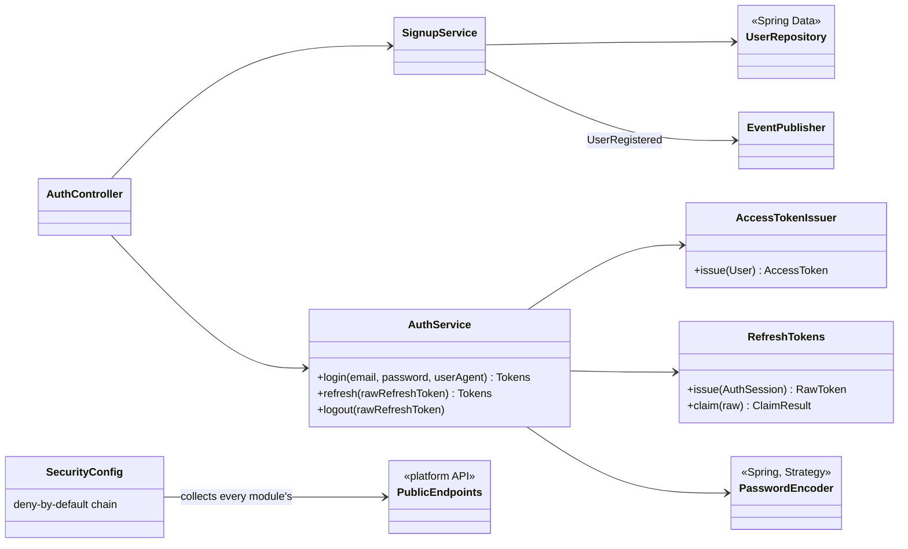

# Identity — Low Level Design

> **One-liner:** who you are and what you may do. Signup with email verification, login that
> issues a short-lived **JWT access token** and a **rotating refresh token** (stolen-token reuse
> revokes the whole session), role-based access (LEARNER / INSTRUCTOR / ADMIN), and the
> deny-by-default security filter chain for the whole API.

**Module:** `backend/api/src/main/java/com/masternova/api/identity` · **Status:** built (Phase 3: 3.1–3.10; Google sign-in 3.6 deferred)
**Last updated:** 2026-10-02 · **Angular:** `frontend/src/app/core/auth/` (store, interceptor, guards) + `features/auth/` (pages)

## 1. Problem

Learners, instructors and admins need accounts. The API must know **who** is calling (cheaply,
on every request) and **what they may do**. Sessions must last weeks without staying logged in
forever after a laptop is stolen. An attacker who copies a refresh token must be locked out the
moment either party uses it twice.

## 2. Forces

- **Every request is authenticated.** The check must be cheap, so no DB lookup per request: a
  signed, short-lived JWT, verified in memory.
- **Revocation.** A JWT can't be revoked before it expires, so keep it short (15 min). The
  long-lived credential (the refresh token) is **stateful** and revocable.
- **Token theft.** XSS can read `localStorage`. Keep the access token in memory, and the refresh
  token in an **httpOnly** cookie that JavaScript can't read.
- **Replay of a stolen refresh token.** Rotation plus reuse detection: a refresh token works
  **once**, and seeing it a second time means someone copied it, so revoke the session.
- **Concurrency.** Two tabs refreshing at once look like reuse. The client does **single-flight**
  refresh (one in-flight refresh per tab), and the server claims a token with a conditional
  `UPDATE` (exactly one winner).
- **Secrets at rest.** Store only **SHA-256 hashes** of refresh and verification tokens. A DB
  leak doesn't hand out live tokens.
- **Module boundaries.** Identity owns authentication and the security chain; other modules
  declare their own public endpoints (`PublicEndpoints`) instead of identity knowing them.

## 3. Domain model

| Entity / value | Key fields | Invariants |
|---|---|---|
| `User` (aggregate root) | id, `Email`, display name, password hash, roles, `emailVerifiedAt`, `@Version` | email unique (normalised lower-case); new users are `LEARNER`; at least one role |
| `Email` (value object, record) | value | trimmed, lower-cased, basic format check, ≤ 320 chars |
| `Role` (enum) | LEARNER, INSTRUCTOR, ADMIN | JWT `roles` claim → `ROLE_*` authorities |
| `AuthSession` (a device / login) | id = token family, user, created, last used, `revokedAt`, `revokeReason` | once revoked, never un-revoked; every refresh token belongs to one |
| `RefreshToken` | id, session, `tokenHash` (unique), issued, expires, `consumedAt` | consumed **at most once** (conditional update); consumed + presented again → REUSE |
| `VerificationToken` | id, user, `tokenHash`, purpose, expires, `usedAt` | single use, 24 h |

## 4. Class design



**Module API** (top-level `com.masternova.api.identity`): `Role`, `UserRegistered` (event),
`CurrentUser` (who is calling: id + roles). Everything else is internal.

## 5. Main flows

**Login → refresh (rotation) → reuse detected:**

```mermaid
sequenceDiagram
  participant B as Browser (Angular)
  participant A as AuthController
  participant DB as Postgres
  B->>A: POST /auth/login {email, password}
  A->>DB: user by email; bcrypt check; INSERT auth_session + refresh_token(hash R1)
  A-->>B: 200 {accessToken (JWT, 15 min)} + Set-Cookie refresh=R1 (httpOnly, SameSite=Strict, Path=/api/v1/auth)
  Note over B: access token kept in memory only
  B->>A: POST /auth/refresh (cookie R1)
  A->>DB: UPDATE refresh_token SET consumed_at=now WHERE hash=h(R1) AND consumed_at IS NULL  → 1 row
  A->>DB: INSERT refresh_token(hash R2) in the same session
  A-->>B: 200 {new access token} + Set-Cookie refresh=R2
  Note over B,A: an attacker who copied R1 tries it later
  B->>A: POST /auth/refresh (cookie R1 again)
  A->>DB: conditional UPDATE → 0 rows; R1 exists and is consumed → REUSE
  A->>DB: revoke the whole session (R2 dies too)
  A-->>B: 401 SESSION_REVOKED — everyone on that session must log in again
```

**Signup → verify:** `POST /auth/signup` → user (LEARNER, unverified) + verification token
(hash stored) + `UserRegistered` event **through the outbox** (the email is sent by the
notification module in Phase 4; in dev the link is logged) → `POST /auth/verify-email {token}`
sets `emailVerifiedAt`.

## 6. Patterns used

| Pattern | Where | The force that justified it |
|---|---|---|
| **Strategy** | Spring's `DelegatingPasswordEncoder` (bcrypt today, upgradeable by `{id}` prefix) | hashing algorithms change over time; stored hashes must keep working |
| **Chain of Responsibility** | the `SecurityFilterChain` (bearer-token filter → authorization) | each concern handles or passes the request on |
| **Observer** (via outbox) | `UserRegistered` → notification (Phase 4) | identity must not depend on notification |
| **Value Object** | `Email` record | normalisation and validation in one place |
| **Repository** | Spring Data `UserRepository`, `AuthSessionRepository`, `RefreshTokenRepository`, `VerificationTokenRepository` | persistence behind interfaces |
| *(extension point)* | `PublicEndpoints` beans (platform API) collected by `SecurityConfig` | each module owns its own public URLs, and nothing is public by accident |

## 7. Alternatives rejected

See [ADR-0006](../adr/0006-rotating-refresh-tokens-over-stateless-jwt.md). In short:

- **Long-lived stateless JWT only:** can't be revoked.
- **Server sessions (`JSESSIONID`):** stateful on every request, and needs sticky sessions or a
  session store.
- **Tokens in `localStorage`:** readable by XSS.
- **Storing raw refresh tokens:** a DB leak hands out live sessions.

## 8. Failure modes

| Failure | Detected by | Behaviour | Recovery |
|---|---|---|---|
| wrong password / unknown email | bcrypt mismatch / no user | 401 `INVALID_CREDENTIALS`, the **same** answer for both (no account probing) | — |
| expired access token | JWT `exp` | 401 `UNAUTHENTICATED` | the client refreshes once, then retries (interceptor) |
| expired / unknown refresh token | lookup | 401 `SESSION_EXPIRED` | log in again |
| refresh token reused | consumed token presented | **session revoked**, 401 `SESSION_REVOKED` | log in again; a security signal (D3 alert) |
| two tabs refresh at once | conditional UPDATE: one wins | the loser gets 401 and its tab re-reads the cookie-backed state | single-flight refresh in the client |
| duplicate signup | unique email | 409 `EMAIL_TAKEN` | — |
| verification token expired / used | lookup | 422 `VERIFICATION_TOKEN_INVALID` | request a new one (later task) |

## 9. Data & indexes

`V4__identity.sql`:

| Table | Notes |
|---|---|
| `app_user` | `email` VARCHAR(320) UNIQUE, normalised by `Email` |
| `app_user_role` | (user, role) |
| `auth_session` | index on user |
| `refresh_token` | `token_hash` UNIQUE, index on session |
| `verification_token` | `token_hash` UNIQUE |

All foreign keys are indexed (Postgres doesn't do it for you: note 10 §10).

## 10. Tests that prove it

**Backend** (`backend/api/src/test/java/com/masternova/api/identity/`):

| Claim | Test | Kind |
|---|---|---|
| emails are normalised (one person = one account); invalid emails can't exist; a new user is an unverified LEARNER; a user never has zero roles; verification happens once; a revoked session keeps its first reason | `EmailAndUserTest` (7) | plain JUnit, no Spring |
| the mapping round-trips; the DB itself rejects a duplicate email; ⭐ a refresh token can be consumed **exactly once** (conditional `UPDATE`) | `IdentityPersistenceIT` (3) | `@DataJpaTest` + Testcontainers |
| signup → unverified LEARNER + `UserRegistered` in the outbox; `ASHA@x` and `asha@x` are the same account (409); field-by-field 400s; the emailed token verifies **once**; unknown tokens → 422 | `SignupIT` (5) | full app + Postgres |
| login returns a JWT and a **hardened cookie** (`HttpOnly`, `SameSite=Strict`, `Path=/api/v1/auth`); the JWT opens protected endpoints; wrong password ≡ unknown email; tampered/expired tokens → 401; refresh rotates every time; ⭐ **reusing an old refresh token revokes the whole session**; logout ends it; ⭐ two tabs refreshing at once → one wins, the other looks like reuse | `AuthIT` (9) | full app + Postgres |
| a learner can't use admin endpoints (403 `INSUFFICIENT_ROLE`); a promoted role arrives with the **next refresh**; an admin can't demote themself (422 `CANNOT_DEMOTE_SELF`); invalid requests → 400 | `RbacIT` (5) | full app + Postgres |
| the HTTP contract **without a database**: no token → 401 Problem + `WWW-Authenticate: Bearer` before any controller runs; the JWT becomes the `CurrentUser` passed to the service; an invalid body never reaches the service; domain exceptions → stable codes | `AdminUserControllerTest` (6) | ⭐ `@WebMvcTest` slice + real security chain + `jwt()` |
| `@PreAuthorize("hasRole('ADMIN')")` lets ADMIN through, denies everyone else **before the method body runs**, and fails closed with no authentication | `UserAdminServiceSecurityTest` (3) | ⭐ tiny context + `@EnableMethodSecurity` + `@WithMockUser` |
| deny-by-default: an unknown route is 401, not 404 or 200 | `ApiApplicationIT` | full app |
| identity uses only platform's public API | `ModularityTests` | static |

**Which test for which question?** Pure rules → plain JUnit (milliseconds). The HTTP contract →
a `@WebMvcTest` slice (about a second, no Docker). Method security → a tiny context. Anything that
depends on SQL semantics (unique constraints, conditional updates, concurrency) → Testcontainers,
because a mock would happily "prove" something Postgres doesn't do.

**Frontend** (`frontend/src/app/`, Vitest):

| Claim | Test |
|---|---|
| the token lives in memory; ⭐ **single-flight refresh**: 3 concurrent callers → 1 request; a failed refresh signs out; `restoreSession` is silent without a cookie; logout clears state even if the server call fails | `auth-store.spec.ts` (5) |
| the token is attached to API calls but never to `/auth/*`; a 401 → refresh once → retry; a failed refresh → `/login?returnUrl=…` | `auth-interceptor.spec.ts` (5) |
| `authGuard` redirects with a return URL; `roleGuard` checks roles; `guestGuard` keeps signed-in users off login/signup | `auth-guard.spec.ts` (4) |
| cross-field password match; server field errors land on the right controls; ⭐ `safeReturnUrl` blocks `//evil`, `https://…`, `/\…`, `javascript:` | `form-utils.spec.ts` |
| login: no request while invalid, one generic message for `INVALID_CREDENTIALS`, safe redirect; signup: `EMAIL_TAKEN` and 400s mapped onto fields, `confirmPassword` never sent; verify-email: success / invalid / missing token; admin: UUID validation, full role set PUT, error codes → messages | page specs (`login`, `signup`, `verify-email`, `account`, `admin`) |

## 11. Interview notes — 60-second recall

- **Shape:** short-lived **JWT access token** (15 min, HS256, in memory in the SPA) + long-lived
  **opaque refresh token** (30 days, httpOnly `SameSite=Strict` cookie scoped to
  `/api/v1/auth`, only its SHA-256 hash stored).
- **Why both:** the JWT is verified with no DB lookup on every request; the refresh token is the
  **revocable** part. Revocation takes effect within one access-token lifetime.
- **Rotation + reuse detection (the part interviewers dig into):**
  - Every refresh consumes the token with `UPDATE … WHERE consumed_at IS NULL`: exactly one
    winner, even under concurrency.
  - A consumed token presented again means it was copied → **revoke the whole session**. The
    revocation commits even though the request fails (`noRollbackFor`).
  - The client refreshes **single-flight**, so two parallel 401s don't look like theft.
- **Security chain:** deny-by-default; modules declare their public routes as `PublicEndpoints`
  beans (nothing is public by accident). 401/403 from inside the filter chain are written as the
  same Problem Details as everything else.
- **RBAC:** roles in the JWT → `ROLE_*` authorities; `@PreAuthorize` on the **service** (every
  caller gets the rule, not just one controller). A role change reaches the user at the next
  refresh. Lockout protection: an admin can't demote themself.
- **Small things that show care:** one answer for wrong password and unknown email, plus a dummy
  hash to equalise timing; bcrypt behind `DelegatingPasswordEncoder` (upgradeable); passwords
  capped at 72 bytes (bcrypt's limit); open-redirect-safe `returnUrl` in the SPA.
- **Known trade-offs:** up to 15 min of a revoked user's access token remains valid; HS256 means
  every verifier can also sign (RS256 + JWKS if more services verify). Both are in ADR-0006.
