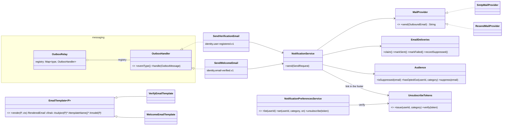
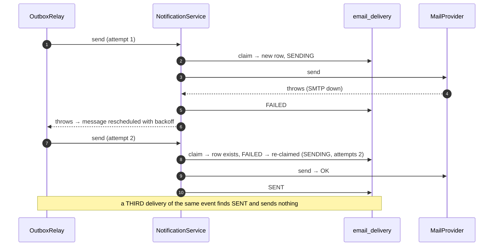

# Notification — Low Level Design

> **One-liner:** turn a domain event into **exactly one consented, rendered email**, and never let
> a mail outage fail the transaction that caused it.

**Modules:**
- send side, in the worker: `backend/worker/src/main/java/com/masternova/worker/notification`
- consent side, in the api: `backend/api/src/main/java/com/masternova/api/notification`
- the outbox protocol both sides share: `backend/messaging` ([ADR-0008](../adr/0008-shared-messaging-module.md))

**Status:** draft (Phase 4.1) → built (4.8) · **Last updated:** 2026-10-02
**Angular:** `frontend/src/app/features/account/notifications` (preferences), `features/unsubscribe`
**Reused from:** NestJS Masternova `docs/lld/notification.md` (same forces and the same delivery
state machine, re-derived for Spring).

## 1. Problem

Many things in this product end in an email. "Verify your address" and "welcome" come first.
Receipts, refunds and "your transcode failed" follow in later phases. Every one of them is a
**consequence** of something else (a signup, a payment, a job), and none may fail the thing it's
a consequence of. Signup must succeed even when SMTP is down.

That's the easy half. The hard half is around the send:

- **Redelivery:** the outbox delivers **at least once**, so the same event arrives twice, and a
  user who gets two verification emails calls support.
- **Consent:** some categories are opt-out and some are not. Getting that backwards means either
  spamming people or hiding a receipt behind a preference.
- **Bounces:** an address that hard-bounces must stop receiving mail **globally and immediately**.
  Continuing to send to dead mailboxes gets the sending domain blocklisted, and then *nobody*
  gets receipts.

## 2. Forces

- **Partial failure:** SMTP is a system we don't control.
- **Retries:** the outbox redelivers, so every handler runs more than once.
- **Consent is not uniform:** a receipt and an announcement are not the same thing.
- **Deliverability is shared:** one user's bounces degrade everyone's mail.
- **Two deployables, one context.** Sending is a background loop (worker); changing a preference
  is a request (api). They have different lifecycles and different failure modes.
- **Rendering is client compatibility:** inline styles, and a plaintext part (no plaintext scores
  as spam).
- **Link prefetching:** mail scanners fetch every link before a human sees it, so a GET must never
  unsubscribe anyone.

## 3. Domain model

| Table (owner) | Invariant |
|---|---|
| `email_delivery` (written by the worker) | `(event_id, template, recipient)` is **unique**. One row *is* one email: once it is `SENT` or `SUPPRESSED`, that email is never sent again. |
| `email_suppression` (written by both) | keyed by address. Its presence forbids **every** send to that address, of every category, mandatory ones included. |
| `notification_preference` (api) | `(user_id, category)`. **Absent means subscribed**: a new account needs no rows, and a new category defaults to on. |

**Delivery states** (`email_delivery.status`):

```text
                 ┌─────────┐   provider OK
   claim ───────►│ SENDING │──────────────────► SENT        (terminal)
                 └────┬────┘
                      │ provider error (temporary)
                      ▼
                   FAILED ──── redelivery (by the outbox, not by us) ──► SENDING again
                      │
                      │ provider error (permanent, e.g. SMTP 550) → address suppressed
                      ▼
                  BOUNCED                                                  (terminal)

   refused (suppressed / opted out) ──► SUPPRESSED   (terminal: a deliberate non-send, recorded, not dropped)
```

A `SENDING` row older than the outbox **lease** is treated as abandoned (the worker died
mid-send) and may be re-claimed. The lease is the longest a healthy relay can legitimately hold a
message.

**Categories** are the product decision, stated once (`kernel`: `NotificationCategory`):

| Category | Mandatory? | Phase 4 emails |
|---|---|---|
| `ACCOUNT_SECURITY` | **yes** | verify your email |
| `PURCHASE` | **yes** | (receipts, Phase 9) |
| `COURSE_ACTIVITY` | no | (transcode done/failed, Phase 7) |
| `ENGAGEMENT` | no | (reviews, Q&A, Phase 11) |
| `PRODUCT_NEWS` | no | **welcome**: onboarding the user didn't ask for, so it carries a real unsubscribe link from the first email |

## 4. Class design



**Shared between the two deployables:** the **kernel** (plain Java) holds
`NotificationCategory` and `UnsubscribeTokens` (the HMAC codec). The worker issues links and the
api verifies them, so one implementation means the two can't disagree.

**Module API** (api): `notification` publishes no events in Phase 4. Its REST endpoints are its
interface (§5).

## 5. Main flows

**Happy path: signup → verification email:**

```mermaid
sequenceDiagram
  autonumber
  participant ID as identity (api)
  participant OB as outbox_message
  participant RL as OutboxRelay (worker)
  participant H as SendVerificationEmail
  participant NS as NotificationService
  participant DL as email_delivery
  participant MP as MailProvider (SMTP → Mailpit)
  ID->>OB: INSERT UserRegistered — same transaction as the user row
  Note over ID: signup returns 201; the email is owed, not awaited
  RL->>OB: claim (FOR UPDATE SKIP LOCKED)
  RL->>H: handle(message)
  H->>NS: send(eventId, VERIFY_EMAIL, to, userId, payload)
  NS->>NS: suppressed? opted out? (mandatory categories skip the opt-out check)
  NS->>NS: render (Template Method): subject + HTML + plaintext
  NS->>DL: INSERT (event, template, recipient) — the claim
  NS->>MP: send
  MP-->>NS: provider message id
  NS->>DL: SENT
  RL->>OB: DONE
```

**The interesting failure: the provider is down, then the event arrives again:**



**Consent (api):**

| Endpoint | Auth | Does |
|---|---|---|
| `GET /api/v1/me/notification-preferences` | user | every category with `enabled` + `mandatory` |
| `PUT /api/v1/me/notification-preferences/{category}` `{enabled}` | user | 422 `CATEGORY_MANDATORY` for mandatory categories |
| `POST /api/v1/notifications/unsubscribe` `{token}` | public | verifies the HMAC token, then opts that user out of that category |

The email's link opens the Angular page `/unsubscribe?token=…`, and **the page** POSTs. A
scanner's GET only loads the page, so it never unsubscribes anyone.

**Unsubscribe token:**

```text
base64url(userId "." category "." expiresEpochSec) "." base64url(HMAC-SHA256(secret, that))
```

- Valid for 30 days.
- The secret (`NOTIFICATION_TOKEN_SECRET`) is a file secret, the same in both deployables
  (devops note 03 §6).
- Comparison is constant-time (`MessageDigest.isEqual`).

## 6. Patterns used

| Pattern | Class (`@DesignPattern` role) | The force that justified it |
|---|---|---|
| **Observer** (durable) | `SendVerificationEmail`, `SendWelcomeEmail` as `OutboxHandler`s | one cause, independently failing effects; identity doesn't know notification exists |
| **Registry** (Factory Method family) | `OutboxRelay`'s `Map<eventType, OutboxHandler>`, built from the injected `List` | choose an implementation by a discriminator, without a `switch` that must be edited for every new consumer |
| **Template Method** | `EmailTemplate.render` (final): subject → model → HTML → plaintext → footer by category | the skeleton is fixed; only the content varies. Each template can't "forget" the plaintext part or the unsubscribe footer. |
| **Adapter** | `SmtpMailProvider` (`JavaMailSender`), `ResendMailProvider` (`RestClient` → Resend HTTP API) behind `MailProvider` | a third-party API is not our domain interface. Mailpit in dev, Resend in prod, chosen by `masternova.mail.provider`. |
| **Repository** | `EmailDeliveries`, `Audience` (JDBC) | the pipeline's rules are decisions, not queries. "Suppression outranks a receipt" is unit-tested without Postgres. |

**Not used, on purpose:**

- **A generic `processed_event` table** (the roadmap's original 4.3). It deduplicates handlers
  whose effects are **database writes in the same transaction**. An email is an **external**
  effect that can't be rolled back. Recording "processed" after the send leaves a crash window
  (sent, not recorded → sent twice). Recording it before leaves the opposite one (recorded, then
  crashed → never sent). Notification needs the per-email **state machine** above (claim → send →
  `SENT`, with `FAILED` re-claimable). The generic table arrives with the first DB-effect consumer
  (enrollment, Phase 9), together with multi-handler-per-event support. "One implementation is
  not a seam" (CLAUDE.md §0).
- **An Abstract Factory for channels** (email / in-app / SMS). There is one channel.

## 7. Alternatives rejected

| Option | Why not |
|---|---|
| send the email inside the signup transaction | SMTP down = signup down. A slow SMTP holds a DB connection. A rollback can't unsend. |
| `@TransactionalEventListener(AFTER_COMMIT)` in the api | lost on a crash between commit and send. No retries. Runs in the request's process. |
| the relay keeps running in the api, and the api sends email too | couples request latency and memory to SMTP. The worker exists so the api never waits on third parties. |
| copy the outbox claim SQL into the worker | two copies of a concurrency protocol drift. The shared `messaging` module owns the table, the writer and the relay (ADR-0008). |
| an unsubscribe GET link | prefetchers would unsubscribe people. The GET opens a page, and the page POSTs. |
| storing preferences as `opted_in` rows | every new account and every new category would need a backfill. Absent = subscribed. |

## 8. Failure modes

| Failure | Detected by | Behaviour | Recovery |
|---|---|---|---|
| SMTP/Resend down or timing out | the provider throws | delivery `FAILED`; the handler throws; the outbox retries with backoff | automatic; `DEAD` after max attempts (alert, D3) |
| permanent rejection (550 mailbox unknown) | `PermanentDeliveryException` | address **suppressed**; delivery `BOUNCED`; the handler returns normally (no pointless retries) | none: stop mailing that address |
| the same event delivered twice | the unique `(event, template, recipient)` claim | `SENT` → no-op; `FAILED` → re-claim and send | — |
| worker dies mid-send | `SENDING` older than the lease | re-claimed on redelivery. At-least-once: a rare duplicate is possible if SMTP accepted the mail just before the crash | accepted; documented |
| user opted out | a `notification_preference` row | delivery `SUPPRESSED` (a reason is recorded) | — |
| mandatory email to an opted-out user | the category is mandatory | **sent** (consent doesn't apply to account security) | — |
| suppressed address | an `email_suppression` row | **never sent**, even mandatory: deliverability beats everything | remove the suppression manually |
| a forged or expired unsubscribe token | HMAC / expiry check | 422 `UNSUBSCRIBE_TOKEN_INVALID`; nothing changes | request a new email |
| a template rendering error | an exception before the claim | the handler throws → retries → `DEAD` (a bug, not an outage) | fix and replay `DEAD` |

## 9. Data & indexes

`V5__notification.sql` (api Flyway: the api owns the schema for both deployables):

| Table | Key / index | Notes |
|---|---|---|
| `email_delivery` | PK `id`, **UNIQUE `(event_id, template, recipient)`** | the claim; `status`, `attempts`, `provider_message_id`, `last_error`, timestamps |
| `email_suppression` | PK `email` (`citext`) | `reason` (`BOUNCED`, `COMPLAINED`, `MANUAL`), `created_at` |
| `notification_preference` | PK `(user_id, category)`, FK → `app_user` ON DELETE CASCADE | `enabled`, `updated_at` |

The outbox table moves, unchanged (same file name and checksum, so Flyway history is untouched),
into the `messaging` module's resources: `db/migration/V2__platform_outbox.sql`.

**Transactions:**

- The worker's claim and mark calls are **separate short statements**. No transaction spans an
  SMTP call, which may take seconds.
- The api's preference writes are single-row upserts.

## 10. Tests that prove it

*(Completed in 4.8.)*

## 11. Interview notes — 60-second recall

*(Written last, in 4.8.)*
