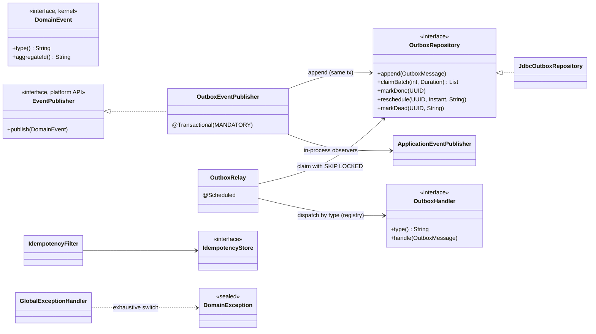
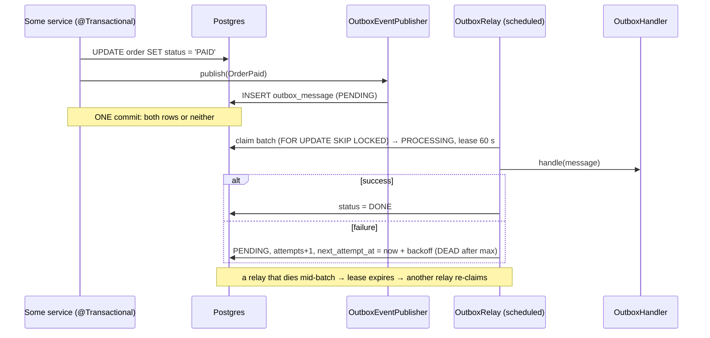
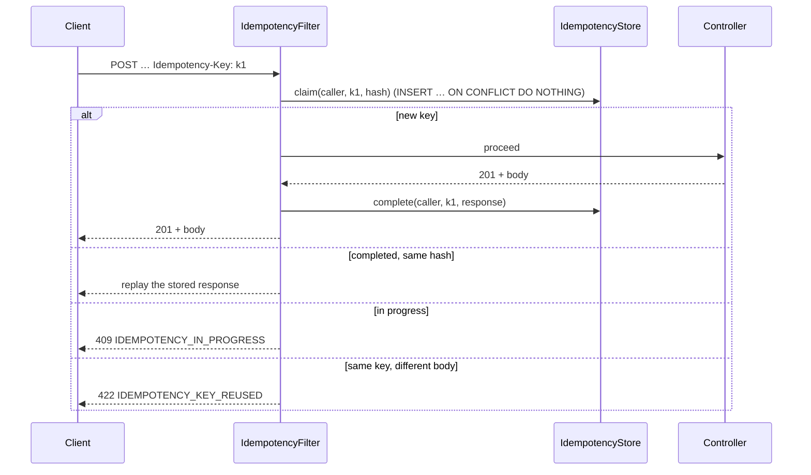

# Platform kernel — Low Level Design

> **One-liner:** the cross-cutting plumbing every bounded context relies on: one error model,
> domain events with a **transactional outbox** (effects that can fail independently are never
> lost and never dual-written), and **idempotency keys** (a retried request never causes a
> second effect).

**Module:** `backend/api/src/main/java/com/masternova/api/platform` (+ `backend/kernel` for event contracts) · **Status:** draft (§1–§6, Phase 2.1) → built (2.8)
**Last updated:** 2026-10-02 · **Angular:** — (no screens; the error model shapes every client error message)

## 1. Problem

Every module from Phase 3 on needs the same three things:

1. **Fail consistently.** Clients get one error shape with stable codes, whichever module failed.
2. **Tell other parts of the system that something happened** (user registered, order paid) so
   they react (send an email, grant access, update search). This must be reliable, and the
   reaction must never be lost just because the mail server was down for a minute.
3. **Survive retries.** A mobile client on a flaky network retries "Pay"; a webhook provider
   redelivers. The effect must happen once.

Building these per module would mean seven slightly different, slightly wrong versions.

## 2. Forces

- **Partial failure / dual write.** "Save the order, then publish an event" is two writes to two
  systems. If the process dies between them, the event is lost (or, the other way round, it's
  published for an order that rolled back). There is no distributed transaction to fix this.
- **Concurrency.** Two relay instances must not process the same event. Fifty concurrent
  identical requests must produce one effect (note 07).
- **Retries everywhere.** Clients, providers and our own relay all retry, so every consumer must
  tolerate duplicates.
- **Many modules, one contract.** The error codes and event envelope are a public API: they must
  be stable and versioned.
- **Multiple instances.** In-memory locks and sets don't work across pods. The database is the
  referee.

## 3. Domain model

| Concept | Shape | Invariants |
|---|---|---|
| `DomainException` (sealed) | `NotFound` · `Conflict` · `Validation` · `RuleViolation` · `Forbidden`, each with a stable `code` and typed `details` | every kind maps to exactly one HTTP status (exhaustive switch); 5xx never leaks internals |
| `DomainEvent` (kernel) | a record per event: `type()` (stable, versioned, e.g. `identity.user-registered.v1`) + `aggregateId()` | immutable; the type string never changes once published (add `.v2` instead) |
| `OutboxMessage` | row: id, type, aggregate id, JSON payload, occurred at, status, attempts, next attempt at, locked until, last error | written **in the same transaction** as the state change; status only moves `PENDING → PROCESSING → (DONE | PENDING retry | DEAD)` |
| `IdempotencyRecord` | row: (caller, key) PK, request hash, status `IN_PROGRESS`/`COMPLETED`, stored response, expires at | one row per (caller, key); the same key + a different body is rejected; the stored response is replayed |

## 4. Class design

**Module API** (top-level `com.masternova.api.platform`, usable by every other module):
`DomainException` and its subtypes, `EventPublisher`, `OutboxHandler`, `OutboxMessage`,
`IdempotencyKeyRequired`, `MasternovaProperties`. Everything in sub-packages (`web`, `outbox`,
`idempotency`, `security`) is internal.

## 5. Main flows

**Publishing reliably (outbox):**

**Idempotent request:**

## 6. Patterns used

| Pattern | Class (`@DesignPattern` role) | The force that justified it | Catalog note |
|---|---|---|---|
| **Transactional Outbox** | `OutboxEventPublisher` (Writer), `OutboxRelay` (Relay) | dual-write / partial failure: no distributed transactions | [17](../../patterns/docs/17-transactional-outbox.md) |
| **Observer** | `EventPublisher` (Subject), `OutboxHandler` / `@TransactionalEventListener` (Observers) | modules react without the publisher knowing them | [7](../../patterns/docs/07-observer.md) |
| **Repository** | `OutboxRepository` / `JdbcOutboxRepository`, `IdempotencyStore` / `JdbcIdempotencyStore` | persistence behind an interface: SQL in one place, fakes in tests | [16](../../patterns/docs/16-repository-unit-of-work.md) |
| **Unit of Work** | `@Transactional` boundary; `EventPublisher` requires it (`MANDATORY`) | the state change and its event commit together | [16](../../patterns/docs/16-repository-unit-of-work.md) |
| **Registry** (Factory) | handlers indexed by `type()` (the generic `Registry` idea from note 04) | dispatch without a `switch` on event type | [9](../../patterns/README.md) |
| **Chain of Responsibility** | `IdempotencyFilter` in the servlet filter chain | a request concern that runs before any controller | [3](../../patterns/README.md) |

## 7. Alternatives rejected

| Option | Why not |
|---|---|
| Publish to a broker (Kafka/RabbitMQ) directly from the service | dual write: the broker publish and the DB commit can disagree. A broker can be added *behind* the relay later. |
| Spring Modulith's event publication registry as the only mechanism | in-process listener tracking; it doesn't give the worker a queue to claim from with `SKIP LOCKED`. ADR-0005 (task 2.5) decides the split. |
| In-memory idempotency (a `ConcurrentHashMap`) | wrong with 2+ instances and lost on restart (note 07 §6) |
| `@Transactional(REQUIRES_NEW)` for the outbox insert | would commit the event even when the business transaction rolls back: the exact bug we're avoiding. Hence `MANDATORY`. |
| One exception class with an HTTP status field | statuses leak into the domain, and there's no compile-time check that every kind is mapped |

## 8. Failure modes

| Failure | How it is detected | Behaviour | Recovery |
|---|---|---|---|
| Business transaction rolls back | — | the outbox row rolls back with it | nothing to do: no ghost event |
| Handler throws | caught by the relay | `PENDING` again, `attempts+1`, exponential backoff | automatic retry; `DEAD` after `max-attempts` → alert (D3) + replay |
| Relay process dies mid-batch | lease (`locked_until`) expires | another relay re-claims the rows | at-least-once delivery, so handlers must be idempotent |
| Two relays poll at once | — | `FOR UPDATE SKIP LOCKED`: each gets different rows | — |
| Duplicate request, same key | `(caller, key)` primary key | replay the stored response | — |
| Request crashes mid-way with a claimed key | `IN_PROGRESS` older than the timeout | claim expires and can be retried | the client retries with the same key |

## 9. Data & indexes

- `V2__platform_outbox.sql`: `outbox_message` + a **partial index** on `(next_attempt_at)
  WHERE status IN ('PENDING','PROCESSING')`, so the relay's claim query stays fast however many
  `DONE` rows exist.
- `V3__platform_idempotency.sql`: `idempotency_record`, PK `(caller, idem_key)`, index on
  `expires_at` for the cleanup job.
- Transaction boundaries:
  - The **caller's** `@Transactional` covers the business write and the outbox insert.
  - The relay uses **short** transactions: claim (one tx), then handle (outside any tx), then
    mark (one tx).

## 10. Tests that prove it

*(Filled in as tasks land; the full list is completed in 2.8.)*

## 11. Interview notes — 60-second recall

*(Written last, in 2.8.)*
