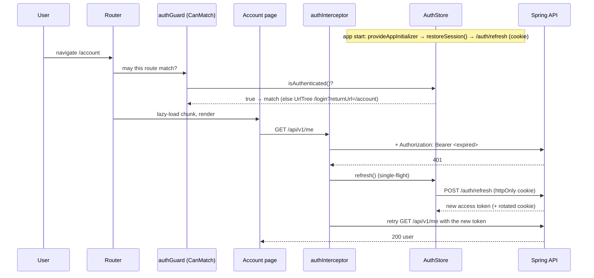

# Angular 02: Routing, Guards, Interceptors, Typed Reactive Forms

> **One-liner:** the **router** maps URLs to lazy-loaded components. **Guards** decide whether a
> route may match. A functional **interceptor** wraps every HTTP call: it attaches the token and,
> on a 401, refreshes once and retries. **Typed reactive forms** hold form state in code, with
> validators as plain functions. The server's Problem Details are mapped back onto the same
> controls, so client errors and server errors look identical to the user.

**Roadmap:** tasks 3.7–3.10 · **Last updated:** 2026-10-02 · **Angular:** 22 (standalone, zoneless, Vitest)
**Code:**
- [`core/auth/`](../../frontend/src/app/core/auth/):
  - `AuthApi`: the HTTP calls.
  - `AuthStore`: a signal store with single-flight refresh.
  - `authInterceptor`.
  - `authGuard` / `roleGuard` / `guestGuard`.
- [`core/api/problem.ts`](../../frontend/src/app/core/api/problem.ts): Problem Details helpers.
- [`features/auth/`](../../frontend/src/app/features/auth/):
  - The `login`, `signup` and `verify-email` pages.
  - `form-utils.ts`: the validators, server-error mapping and `safeReturnUrl`.
- [`features/account/`](../../frontend/src/app/features/account/) and [`features/admin/`](../../frontend/src/app/features/admin/) (`AdminApi` + a role editor).
- [`app.routes.ts`](../../frontend/src/app/app.routes.ts) and [`app.config.ts`](../../frontend/src/app/app.config.ts).

**Backend counterpart:** [`docs/lld/identity.md`](../../docs/lld/identity.md), [ADR-0006](../../docs/adr/0006-rotating-refresh-tokens-over-stateless-jwt.md)
**Run it:** `make up && make api` and `make web`, then http://localhost:4200/signup. The
verification link is printed in the api log in dev.
**Tests:** `cd frontend && pnpm test`

**Priority marks:** ⭐⭐⭐ must know (interviews, bugs) · ⭐⭐ use daily · ⭐ good to know.

| # | Section | Priority |
|---|---|---|
| 1 | [The big picture: one request's journey](#1-the-big-picture-one-requests-journey-) | ⭐⭐⭐ |
| 2 | [Routing: lazy routes, URL → input binding, navigation](#2-routing-lazy-routes-url--input-binding-navigation-) | ⭐⭐⭐ |
| 3 | [Guards: `CanMatch` vs `CanActivate`, functional guards, `UrlTree`](#3-guards-canmatch-vs-canactivate-functional-guards-urltree-) | ⭐⭐⭐ |
| 4 | [App initializer: restoring the session before the first route](#4-app-initializer-restoring-the-session-before-the-first-route-) | ⭐⭐ |
| 5 | [Functional HTTP interceptors](#5-functional-http-interceptors-) | ⭐⭐⭐ |
| 6 | [Single-flight refresh with `shareReplay`](#6-single-flight-refresh-with-sharereplay-) | ⭐⭐⭐ |
| 7 | [Where does the token live?](#7-where-does-the-token-live-) | ⭐⭐⭐ |
| 8 | [Typed reactive forms](#8-typed-reactive-forms-) | ⭐⭐⭐ |
| 9 | [Validators: built-in, custom, cross-field](#9-validators-built-in-custom-cross-field-) | ⭐⭐⭐ |
| 10 | [Server errors → form controls (Problem Details)](#10-server-errors--form-controls-problem-details-) | ⭐⭐ |
| 11 | [SPA security: what the client can and can't do](#11-spa-security-what-the-client-can-and-cant-do-) | ⭐⭐⭐ |
| 12 | [Testing guards, interceptors, forms and pages](#12-testing-guards-interceptors-forms-and-pages-) | ⭐⭐ |
| 13 | [Common mistakes](#13-common-mistakes-) | ⭐⭐⭐ |
| 14 | [Interview Q&A](#14-interview-qa-) | ⭐⭐⭐ |
| 15 | [30-second recall](#15-30-second-recall) | ⭐⭐⭐ |

---

## 1. The big picture: one request's journey ⭐⭐⭐

A signed-in user opens `/account` after their access token has expired.



Every piece has exactly one job:

| Piece | Job | File |
|---|---|---|
| `AuthApi` | HTTP calls only, no state | `core/auth/auth-api.ts` |
| `AuthStore` | who is signed in (signals), the token in memory, single-flight refresh | `core/auth/auth-store.ts` |
| `authInterceptor` | attach the token; on a 401, refresh once and retry | `core/auth/auth-interceptor.ts` |
| guards | may this route match? | `core/auth/auth-guard.ts` |
| pages | forms, and messages for the user | `features/*` |

---

## 2. Routing: lazy routes, URL → input binding, navigation ⭐⭐⭐

```ts
// app.routes.ts
{
  path: 'admin',
  canMatch: [authGuard, roleGuard('ADMIN')],              // §3
  loadComponent: () => import('./features/admin/admin').then((m) => m.Admin),  // ⭐ lazy chunk
},
{ path: '**', redirectTo: '' },                            // unknown URL → home (always last)
```

- **`loadComponent`** with a dynamic `import()` gives the page **its own JS chunk**, downloaded only
  on first visit. `pnpm build` prints them: `admin 36 kB`, `login 3 kB`, … The initial bundle
  holds only the shell.
- **Route order matters:** the first match wins, so `**` goes last.

**URL → component inputs** ⭐ (`withComponentInputBinding()` in `app.config.ts`):

```ts
// /verify-email?token=abc   →   VerifyEmail.token() === 'abc'
export class VerifyEmail {
  readonly token = input<string>();      // no ActivatedRoute, no subscribe
}
// /login?returnUrl=/admin   →   Login.returnUrl() === '/admin'
```

Path params (`:id`), query params and route `data` all bind to inputs **by name**. Before this
existed, you injected `ActivatedRoute` and subscribed to `queryParamMap`. You'll still see that in
older codebases, so recognise it.

⚠️ Inputs are set **before `ngOnInit`**, not in the constructor. `VerifyEmail` reads
`this.token()` in `ngOnInit` for that reason.

**Navigating from code:**

| Call | Takes | Use |
|---|---|---|
| `router.navigate(['/login'], { queryParams: { returnUrl } })` | commands array | building URLs from parts |
| `router.navigateByUrl('/account')` | a full URL string | you already have the URL (e.g. `returnUrl`) |
| `routerLink="/signup"` in the template | — | links (renders a real `<a href>`, so middle-click works) |

---

## 3. Guards: `CanMatch` vs `CanActivate`, functional guards, `UrlTree` ⭐⭐⭐

A guard is **a plain function** that runs in an injection context, so it can call `inject()`:

```ts
export const authGuard: CanMatchFn = (_route, segments) => {
  if (inject(AuthStore).isAuthenticated()) return true;
  const returnUrl = '/' + segments.map((s) => s.path).join('/');
  return inject(Router).createUrlTree(['/login'], { queryParams: { returnUrl } });  // ⭐ redirect
};
```

**Return values:**

| Return | Meaning |
|---|---|
| `true` | allowed |
| `false` | blocked: the router tries the next route, or for `CanActivate`, stays where it is |
| `UrlTree` | ⭐ **redirect**. Prefer this to calling `router.navigate()` inside the guard, which starts a second navigation while the first is still running. |
| `Observable` / `Promise` of the above | async checks (e.g. "load the user first") |

**Which guard type?**

| Guard | Runs | Use for |
|---|---|---|
| ⭐ **`canMatch`** | *before* the route is chosen; a `false` means "this route doesn't exist for you" | auth/role checks on lazy routes: **the chunk is never downloaded** by someone who can't use it |
| `canActivate` | after matching, before activating | checks that need the resolved route |
| `canActivateChild` | for every child route | one check for a whole section |
| `canDeactivate` | when leaving | "you have unsaved changes" |
| `resolve` | before activating | pre-fetch data (often replaced by loading inside the component) |

**Guard factories:** `roleGuard('ADMIN')` is a function that **returns** a guard. It's the same
idea as a Java method returning a lambda:

```ts
export function roleGuard(...roles: Role[]): CanMatchFn {
  return () => inject(AuthStore).hasAnyRole(roles) || inject(Router).createUrlTree(['/']);
}
```

**Guards run in order:** `[authGuard, roleGuard('ADMIN')]` checks signed-in first, then the role.
`guestGuard` does the reverse: it keeps signed-in users *off* `/login` and `/signup`.

⭐ **A guard is UX, not security.** Anyone can edit the JavaScript in their browser. The real check
is `@PreAuthorize("hasRole('ADMIN')")` on the server (§11).

---

## 4. App initializer: restoring the session before the first route ⭐⭐

After a page reload, the in-memory token is gone, but the httpOnly refresh cookie is still there:

```ts
// app.config.ts
provideAppInitializer(() => inject(AuthStore).restoreSession()),   // returns a Promise
```

Angular **waits for the Promise** before the first navigation. So by the time `authGuard` runs on
`/account`, the store already knows whether you're signed in. Without this, a reload of a
protected page would bounce you to `/login` and then back.

`restoreSession()` never rejects. No cookie, or an expired one, simply means anonymous, not an
error. A rejecting initializer would stop the app from starting.

---

## 5. Functional HTTP interceptors ⭐⭐⭐

```ts
export const authInterceptor: HttpInterceptorFn = (req, next) => {
  if (!req.url.startsWith('/api/') || req.url.startsWith('/api/v1/auth/')) {
    return next(req);                                    // ⭐ never intercept the auth calls themselves
  }
  const store = inject(AuthStore);
  const withToken = (r: HttpRequest<unknown>, token: string | null) =>
    token ? r.clone({ setHeaders: { Authorization: `Bearer ${token}` } }) : r;  // ⭐ requests are IMMUTABLE

  return next(withToken(req, store.accessToken())).pipe(
    catchError((error) => {
      if (!(error instanceof HttpErrorResponse) || error.status !== 401) return throwError(() => error);
      return store.refresh().pipe(
        switchMap((fresh) => next(withToken(req, fresh))),   // retry ONCE with the new token
        catchError(() => { /* session over → /login?returnUrl=… */ return throwError(() => error); }),
      );
    }),
  );
};
// registered once: provideHttpClient(withInterceptors([authInterceptor]))
```

**Key ideas:**

- **It's a chain.** Each interceptor calls `next(req)` to pass the request on; it is Chain of
  Responsibility, the same as Spring's filter chain. Order is the order of the array.
- **`HttpRequest` is immutable.** Use `req.clone({ … })`, never mutate.
- **Skip the auth endpoints.** If `/auth/refresh` itself got a 401 and the interceptor tried to
  refresh, it would loop forever.
- **Retry exactly once.** The retry is a plain `next(...)` after the refresh, not a recursive call
  through the interceptor, so a second 401 is just an error.
- **Only same-origin `/api/` URLs get the token.** Never send your bearer token to a third-party
  URL.
- **Functional vs class interceptors:** `HttpInterceptorFn` (a function using `inject()`) is the
  modern form. Class-based `HttpInterceptor` + `HTTP_INTERCEPTORS` is the older one you'll meet in
  existing code.

---

## 6. Single-flight refresh with `shareReplay` ⭐⭐⭐

**The problem:** a page fires three API calls, all three get a 401, and all three ask to refresh.
Three `/auth/refresh` calls present **the same single-use refresh token** three times. The server
sees the second use as **theft** and revokes the session (ADR-0006), so the user is logged out for
no reason.

**The fix:** at most one refresh in flight; every caller shares its result.

```ts
refresh(): Observable<string> {
  this.refreshInFlight ??= this.api.refresh().pipe(       // ⭐ create only if none is running
    tap((tokens) => this.apply(tokens)),
    map((tokens) => tokens.accessToken),
    catchError((e) => { this.clear(); return throwError(() => e); }),
    finalize(() => (this.refreshInFlight = null)),        // done → the next 401 may refresh again
    shareReplay({ bufferSize: 1, refCount: false }),      // ⭐ one HTTP call, many subscribers
  );
  return this.refreshInFlight;
}
```

- **Without `shareReplay`,** every `subscribe()` to a cold HTTP Observable sends **another**
  request.
- **`bufferSize: 1`** means a subscriber that arrives late still gets the token.
- **`refCount: false`** keeps the request alive even if the first subscriber unsubscribes.
- The spec `refresh is SINGLE-FLIGHT` proves it: three subscribers, `expectOne(...)`, and all
  three receive `t2`.

The server has its own guard: a conditional `UPDATE … WHERE consumed_at IS NULL`. **Both sides**
are needed, because the client can't coordinate across browser tabs. `AuthIT.twoTabsRefreshing…`
shows what happens then.

---

## 7. Where does the token live? ⭐⭐⭐

| Storage | XSS can read it? | Sent automatically? | Survives reload? | Verdict |
|---|---|---|---|---|
| `localStorage` / `sessionStorage` | **yes** | no | yes | ❌ for tokens: one XSS bug steals every session |
| a JS variable / signal (**access token**) | only while the page is compromised | no (the interceptor adds it) | no | ✅ short-lived (15 min), so the damage is small |
| **httpOnly cookie** (**refresh token**) | **no** | yes, but only to `Path=/api/v1/auth` | yes | ✅ `SameSite=Strict` blocks cross-site sends (CSRF) |

That's why the store says "token in memory only", and why the initializer (§4) exists: memory is
cleared on reload, so the cookie gets a new token.

---

## 8. Typed reactive forms ⭐⭐⭐

**Template-driven vs reactive:**

| | Template-driven (`ngModel`) | Reactive (`FormGroup`) |
|---|---|---|
| State lives | in the template | **in the component class** |
| Validation | directives in HTML | **functions in code** (testable) |
| Typed | weakly | ✅ fully (Angular 14+) |
| Use for | tiny forms | everything else, and what interviews expect |

```ts
protected readonly form = inject(NonNullableFormBuilder).group({
  email: ['', [Validators.required, Validators.email]],
  password: ['', Validators.required],
});
// form.controls.email          → FormControl<string>
// form.getRawValue()           → { email: string; password: string }   ✅ typed
// form.value                   → Partial<{ email: string; … }>          (disabled controls are left out)
```

- **`NonNullableFormBuilder`** means `reset()` returns each control to its initial `''`, not
  `null`, so values are `string`, never `string | null`. Prefer it.
- **`getRawValue()` vs `.value`:** `.value` drops **disabled** controls, so its type is `Partial`.
  Use `getRawValue()` when submitting.
- **Template wiring:** `<form [formGroup]="form" (ngSubmit)="submit()">` and
  `<input formControlName="email">`. Import `ReactiveFormsModule` in the component.
- **Control state you'll use:**

| Property | Meaning | Typical use |
|---|---|---|
| `valid` / `invalid` | validators pass? | block submit |
| `touched` | user left the field | show errors only after they've tried |
| `dirty` / `pristine` | value changed? | admin "Save" disabled while `pristine` |
| `errors` / `hasError('x')` / `getError('x')` | which validators failed | messages |

**Submit pattern** (every page here uses it):

```ts
submit() {
  if (this.form.invalid) { this.form.markAllAsTouched(); return; }  // ⭐ reveal ALL errors at once
  this.submitting.set(true);                                        // disables the button: no double submit
  …
}
```

**Typed groups catch typos at compile time:**

```ts
rolesForm = fb.group({ LEARNER: false, INSTRUCTOR: false, ADMIN: false });
rolesForm.getRawValue().ADMNI   // ❌ compile error, not a silent `undefined`
```

**Material:** `<mat-form-field>` + `matInput` + `<mat-error>`. A `mat-error` is shown only when the
control is **invalid and touched** (Material's default "error state matcher"). That's why
`markAllAsTouched()` makes every error appear.

⭐ **Good to know:** Angular has a newer **signal-based forms** API that is still experimental.
Reactive forms remain the standard, and the one interviews ask about.

---

## 9. Validators: built-in, custom, cross-field ⭐⭐⭐

A validator is just a function: **control in, errors object or `null` out**.

```ts
// custom, single field (admin.ts)
export function uuidValidator(control: AbstractControl<string>): ValidationErrors | null {
  return !control.value || UUID.test(control.value.trim()) ? null : { uuid: true };
}   // empty → null: "required" is a separate validator's job (compose, don't duplicate)

// cross-field, on the GROUP (form-utils.ts): no single control can know if two passwords match
export function passwordsMatch(a: string, b: string): ValidatorFn {
  return (group) =>
    group.get(a)?.value && group.get(b)?.value && group.get(a)?.value !== group.get(b)?.value
      ? { passwordMismatch: true } : null;
}
fb.group({ … }, { validators: passwordsMatch('password', 'confirmPassword') });
// read it from the group: form.hasError('passwordMismatch')
```

| Kind | Where | Example in Masternova |
|---|---|---|
| built-in | `Validators.required`, `email`, `minLength`, `maxLength`, `pattern` | signup: password 8–72, **the same rule as the backend's `@Size`** |
| custom sync | a function returning `ValidationErrors \| null` | `uuidValidator` |
| cross-field | a validator on the `FormGroup` | `passwordsMatch`, `atLeastOneChecked` (admin roles) |
| async | returns an `Observable`/`Promise` (e.g. "is this email free?") | not used: the server's 409 already answers it (§10) |

⭐ **The server validates again, always.** Client validation is for fast feedback. The backend's
Bean Validation is the rule.

---

## 10. Server errors → form controls (Problem Details) ⭐⭐

The API answers errors as RFC 9457 Problem Details with a stable `code` (see
[`docs/api/conventions.md`](../../docs/api/conventions.md)):

```json
{ "status": 400, "code": "VALIDATION_FAILED",
  "errors": [{ "field": "email", "code": "Email", "message": "must be a well-formed email address" }] }
```

`applyServerErrors` puts each field error **on the matching control**. It then shows in the same
`<mat-error>` slot as a client-side error:

```ts
for (const [field, message] of Object.entries(fieldErrors(problem))) {
  form.get(field)?.setErrors({ ...control.errors, server: message });
}
```

| Server answer | Page reaction |
|---|---|
| 400 with `errors[]` | each message under its field |
| 409 `EMAIL_TAKEN` | an error on the email control |
| 401 `INVALID_CREDENTIALS` | **one** generic message. Never say *which* part was wrong: that would tell an attacker which emails have accounts. |
| 404 `NOT_FOUND`, 422 `CANNOT_DEMOTE_SELF` | a code → message map (admin) |
| anything else | "Something went wrong" |

⭐ **Branch on `code`, never on `detail`.** `detail` is human copy and may change; `code` is the
contract.

A `server` error is cleared automatically: the next `setValue` (the user types) re-runs the
validators, which replaces `errors`.

---

## 11. SPA security: what the client can and can't do ⭐⭐⭐

| Threat | Client-side defence (ours) | Real defence |
|---|---|---|
| a user opens `/admin` without the role | `roleGuard` hides it (UX) | ⭐ `@PreAuthorize` on the server: **403** |
| XSS steals tokens | the access token is in memory only; the refresh token is httpOnly | Angular escapes all bindings by default. Never `bypassSecurityTrust…` user content. |
| **open redirect** | ⭐ `safeReturnUrl`: only `/path`, never `//host`, `https://…`, `/\…` or `javascript:` | — |
| CSRF on the refresh cookie | — | `SameSite=Strict` + `Path=/api/v1/auth` (ADR-0006) |
| a stolen refresh token | — | rotation + reuse detection revokes the session |

**Open redirect, explained:** `/login?returnUrl=https://evil.example` is a link to *our* site, so
it looks trustworthy. Without the check, after a successful login we'd send the user to the
attacker's page, which can then show a fake "session expired, log in again" form. `//evil.example`
is **protocol-relative**, so the browser treats it as another host. That's why "starts with `/`"
alone isn't enough.

---

## 12. Testing guards, interceptors, forms and pages ⭐⭐

| What | Technique | Spec |
|---|---|---|
| HTTP | `provideHttpClient()` + `provideHttpClientTesting()`; `http.expectOne(url).flush(body, {status})`; `http.verify()` in `afterEach` (fails on unexpected calls) | all API, store and page specs |
| a guard | `TestBed.runInInjectionContext(() => guard(route, segments, snapshot))`, then serialise the `UrlTree` | `auth-guard.spec.ts` |
| the interceptor | register it with `withInterceptors([authInterceptor])` and send real `HttpClient` calls | `auth-interceptor.spec.ts` |
| single-flight | 3 subscribers → `expectOne` → all receive the value | `auth-store.spec.ts` |
| query param → input | `fixture.componentRef.setInput('token', 'abc')` (what the router would do) | `verify-email.spec.ts` |
| forms like a user | set `input.value`, dispatch `input`, then submit the `<form>` (helpers in `src/testing/dom.ts`) | `login`, `signup`, `admin` specs |
| navigation | `vi.spyOn(router, 'navigateByUrl').mockResolvedValue(true)` | `login.spec.ts`, `account.spec.ts` |
| pure functions | call them; `it.each` table tests | `form-utils.spec.ts` (the open-redirect table) |

**Test like a user:** type into the DOM, then click or submit. Don't call protected methods or
poke `component.form` directly. A test that drives the DOM breaks only when *behaviour* changes,
not when you rename a field.

---

## 13. Common mistakes ⭐⭐⭐

| ❌ Mistake | ✅ Instead | § |
|---|---|---|
| `canActivate` for auth on lazy routes | `canMatch`: the chunk isn't downloaded | 3 |
| `router.navigate()` inside a guard | return a `UrlTree` | 3 |
| treating guards as security | the server enforces; guards are UX | 3, 11 |
| reading route inputs in the constructor | `ngOnInit` (or a `computed`) | 2 |
| tokens in `localStorage` | memory + httpOnly refresh cookie | 7 |
| the interceptor refreshing on `/auth/*` 401s | skip the auth endpoints (else an infinite loop) | 5 |
| mutating `req.headers` | `req.clone({ setHeaders })` | 5 |
| every 401 calling `/refresh` | single-flight with `shareReplay` | 6 |
| sending the token to any URL | only same-origin `/api/` | 5 |
| `FormBuilder` + `string \| null` everywhere | `NonNullableFormBuilder` | 8 |
| `form.value` on submit | `getRawValue()` (`.value` drops disabled controls) | 8 |
| errors visible before the user typed anything | show when `touched`; `markAllAsTouched()` on submit | 8 |
| a cross-field rule on one control | a validator on the `FormGroup` | 9 |
| branching on `error.detail` text | branch on `code` | 10 |
| "wrong password" vs "no such email" messages | one generic message | 10 |
| redirecting to any `returnUrl` | `safeReturnUrl` | 11 |

---

## 14. Interview Q&A ⭐⭐⭐

**Q1. `CanActivate` vs `CanMatch`?**
`CanMatch` runs while the router is choosing a route. If it fails, the route is treated as
non-existent: the next route is tried, and a lazy route's code is never loaded. `CanActivate`
runs after matching and blocks activation. Use `CanMatch` for role-based lazy sections.

**Q2. How do you redirect from a guard?**
Return a `UrlTree` (`router.createUrlTree(['/login'], { queryParams })`). The router cancels the
current navigation and starts the redirect cleanly.

**Q3. How do you attach a JWT to every request?**
A functional `HttpInterceptorFn` registered with `provideHttpClient(withInterceptors([...]))`.
It clones the request with an `Authorization` header, and only for your own API's URLs.

**Q4. How do you handle an expired access token?**
In the interceptor: on a 401, call a **single-flight** refresh (one in-flight request shared via
`shareReplay`), then retry the original request once with the new token. If the refresh fails,
clear the session and go to login with a `returnUrl`. Never refresh on the auth endpoints
themselves.

**Q5. Where do you store tokens in an SPA, and why?**
The access token in memory (short-lived). The refresh token in an httpOnly, Secure,
`SameSite=Strict` cookie scoped to the auth path. `localStorage` is readable by any XSS. On
reload, an app initializer uses the cookie to get a fresh access token.

**Q6. Reactive vs template-driven forms?**
Reactive forms keep state and validation in the class: typed, testable, composable. Template-driven
forms keep them in the template with `ngModel`. Use reactive forms for anything non-trivial.

**Q7. How do you write a validator that compares two fields?**
Put a `ValidatorFn` on the `FormGroup` (the `validators` option). It reads both controls and
returns an error on the group, e.g. `{ passwordMismatch: true }`.

**Q8. How do you show server-side validation errors in a form?**
Map the API's field errors to controls with `control.setErrors({ server: message })`, so they show
in the same error slot as client-side errors. They clear when the user edits the field.

**Q9. What is an open redirect, and how do you prevent it?**
Redirecting to an attacker-supplied URL taken from a parameter. Allow only same-site paths: must
start with `/`, and must not start with `//` or `/\`.

**Q10. Is a route guard enough to protect admin pages?**
No. It's UX. All authorisation must be enforced by the API, because client code can be modified.

---

## 15. 30-second recall

- **Routes:**
  - `loadComponent` gives each page its own chunk; `**` goes last.
  - `withComponentInputBinding()` turns `?token=` into `input()`, read in `ngOnInit`.
- **Guards:**
  - Functions using `inject()`; return `true` or a `UrlTree`.
  - **`canMatch`** for auth and roles, so the chunk isn't loaded.
  - `roleGuard(...)` is a guard factory.
  - Guards are UX; the server is security.
- **Startup:** `provideAppInitializer(() => store.restoreSession())` waits for the refresh cookie
  before the first route.
- **Interceptor:**
  - `HttpInterceptorFn`; `clone` the request; add `Bearer` only for `/api/`, never for
    `/auth/*`.
  - On a 401: single-flight refresh, retry **once**. On failure: `/login?returnUrl=`.
- **Single-flight:** `??=` + `shareReplay({bufferSize: 1, refCount: false})` + `finalize`
  (reset).
- **Tokens:** access token in memory (15 min); refresh token in an httpOnly `SameSite=Strict`
  cookie on `/api/v1/auth`; never `localStorage`.
- **Forms:**
  - `NonNullableFormBuilder`, submit with `getRawValue()`.
  - `markAllAsTouched()` on an invalid submit.
  - Validators are functions; cross-field ones go on the group.
  - Server `errors[]` → `setErrors({server})`. Branch on `code`.
- **Security:** one message for bad credentials; `safeReturnUrl` blocks `//`, `https:`, `/\`.
- **Tests:** `HttpTestingController` + `verify()`; `runInInjectionContext` for guards;
  `setInput` for route inputs; drive the DOM like a user.
- **Next:** note 03, Material in depth (stepper, table, dialog, drag-drop): Phases 5–6.

*Related:* [Angular 01: essentials](01-angular-essentials.md) · [Identity LLD](../../docs/lld/identity.md) · [ADR-0006](../../docs/adr/0006-rotating-refresh-tokens-over-stateless-jwt.md) · [Proxy (15)](../docs/15-proxy.md) (how `@PreAuthorize` works on the server)
