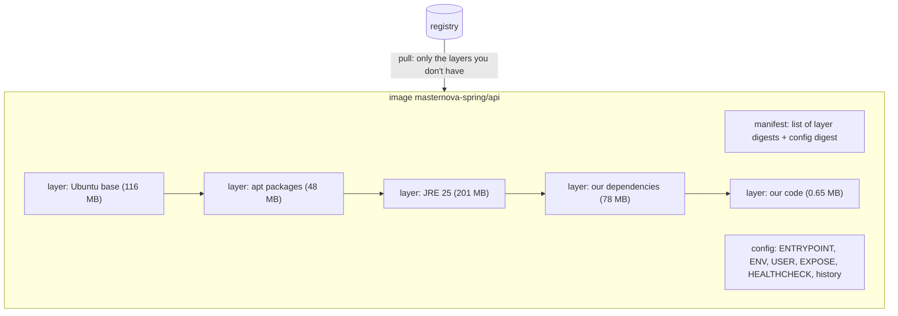

# DevOps 01: Container Images — layers, caching, Dockerfile vs Buildpacks

> **One-liner:** an image is a **stack of read-only layers** plus a config, and each layer is a
> tar of file changes. Build speed, push/pull time and CVE count all come down to two things:
> **what is in each layer**, and **how often each layer changes**. Order the Dockerfile from
> least-changing to most-changing, keep the runtime image to what the app needs, and measure.

**Roadmap:** D1.1 (layers, Buildpacks) · D1.2 (slim runtime, to come) · **Last updated:** 2026-10-02
**Real files:** [`backend/Dockerfile`](../../backend/Dockerfile) (one Dockerfile for `api` and `worker`), [`backend/healthcheck.sh`](../../backend/healthcheck.sh), [`backend/.dockerignore`](../../backend/.dockerignore)
**Measured on:** Docker 29.7 (containerd image store), `eclipse-temurin:25-jre` (Ubuntu 26.04), Spring Boot 4.1, api image.

**Priority marks:** ⭐⭐⭐ must know (interviews, incidents) · ⭐⭐ use daily · ⭐ good to know.

| # | Section | Priority |
|---|---|---|
| 1 | [What an image is](#1-what-an-image-is-) | ⭐⭐⭐ |
| 2 | [Our Dockerfile, line by line](#2-our-dockerfile-line-by-line-) | ⭐⭐⭐ |
| 3 | [Layer caching: the experiment](#3-layer-caching-the-experiment-) | ⭐⭐⭐ |
| 4 | [Inspecting images: `docker history`, `dive`](#4-inspecting-images-docker-history-dive-) | ⭐⭐ |
| 5 | [Build context and `.dockerignore`](#5-build-context-and-dockerignore-) | ⭐⭐ |
| 6 | [Dockerfile vs Cloud Native Buildpacks](#6-dockerfile-vs-cloud-native-buildpacks-) | ⭐⭐ |
| 7 | [Command cheat sheet](#7-command-cheat-sheet-) | ⭐⭐ |
| 8 | [Common mistakes](#8-common-mistakes-) | ⭐⭐⭐ |
| 9 | [Interview Q&A](#9-interview-qa-) | ⭐⭐⭐ |
| 10 | [30-second recall](#10-30-second-recall) | ⭐⭐⭐ |

---

## 1. What an image is ⭐⭐⭐



- **A layer** is a tar of file **changes** (added, modified, deleted files), identified by the
  SHA-256 of its content. The same content gives the same digest, so the layer is shared between
  images and never downloaded twice.
- **The config** holds the metadata: `ENTRYPOINT`, `ENV`, `USER`, … Instructions like `ENV` or
  `EXPOSE` create **no layer**; they show as `0B` in `docker history`.
- **A container** is the image's layers plus one thin **writable** layer on top
  (copy-on-write). Delete the container and that layer goes too.
- **Layers are additive.** Deleting a file in a later layer hides it, but the bytes are **still
  in the image**. That's "wasted space" in `dive` (§4).

**Two sizes ⭐** (Docker 29 with the containerd store shows both):

| Column | Our api | Meaning |
|---|---|---|
| CONTENT SIZE | **189 MB** | the compressed layer blobs: what a `push`/`pull` moves over the network |
| DISK USAGE | 634 MB | compressed blobs **plus** the unpacked filesystem (~444 MB) kept on disk |

When someone says "the image is 630 MB", ask which number they mean. For pull time, it's the
compressed size.

---

## 2. Our Dockerfile, line by line ⭐⭐⭐

```dockerfile
# ---- stage 1: build ----
FROM eclipse-temurin:25-jdk AS build             # full JDK + build tools: only for building
ARG APP=api                                      # one Dockerfile builds api OR worker
WORKDIR /src
COPY . .
RUN --mount=type=cache,target=/root/.m2 \        # ⭐ BuildKit cache mount: ~/.m2 survives between builds,
    ./mvnw -B -q -pl ${APP} -am package -DskipTests …   #    but never ends up in a layer
RUN cp ${APP}/target/${APP}-*.jar app.jar \
 && java -Djarmode=tools -jar app.jar extract --layers --launcher --destination extracted
                                                 # ⭐ split the fat jar into 4 folders (below)

# ---- stage 2: runtime ----
FROM eclipse-temurin:25-jre AS runtime           # JRE only: no compiler, no Maven, no sources
RUN groupadd --system app && useradd --system --gid app --no-create-home app
COPY --chmod=755 healthcheck.sh /usr/local/bin/healthcheck   # rarely changes → early (§3)
WORKDIR /app
COPY --from=build /src/extracted/dependencies/ ./            # 78 MB, changes when the pom changes
COPY --from=build /src/extracted/spring-boot-loader/ ./      # 0.7 MB, changes with Boot upgrades
COPY --from=build /src/extracted/snapshot-dependencies/ ./   # usually empty
COPY --from=build /src/extracted/application/ ./             # 0.65 MB, changes on EVERY commit
USER app                                                     # ⭐ never run as root
HEALTHCHECK … CMD ["healthcheck"]
ENV JAVA_TOOL_OPTIONS="-XX:MaxRAMPercentage=75 -XX:+ExitOnOutOfMemoryError"   # note 02 (D1.3)
ENTRYPOINT ["java", "org.springframework.boot.loader.launch.JarLauncher"]
```

**Why each choice:**

| Choice | Force |
|---|---|
| **Multi-stage** | the JDK, Maven, `~/.m2` and the sources stay in the build stage. The runtime image gets only what runs: smaller, and less to attack. |
| **Cache mount** for `~/.m2` | dependencies download once per machine, not on every build. Unlike `COPY`ing `~/.m2`, it never bloats a layer. |
| **`jarmode=tools extract --layers`** | a fat jar is one 80 MB file: change one class and the whole 80 MB layer changes. Extracted, the 78 MB of libraries become their own layer, which stays cached. |
| **`--launcher`** + `JarLauncher` | keeps Boot's classpath ordering from the jar, so the extracted app behaves exactly like `java -jar`. |
| **Non-root `USER`** | a container escape or app RCE lands as an unprivileged user. Kubernetes `runAsNonRoot` (D4) refuses root images anyway. |
| **No curl/wget**, a bash `/dev/tcp` healthcheck | every extra package brings its own CVEs (§6, and D1.2). |
| **Exec-form `ENTRYPOINT`** `["java", …]` | Java is PID 1 and receives `SIGTERM` directly, so graceful shutdown works. The shell form `ENTRYPOINT java …` wraps it in `/bin/sh -c`, which doesn't forward signals. |
| **One Dockerfile, `ARG APP`** | api and worker share the kernel module and the whole recipe. Two copies would drift. |

---

## 3. Layer caching: the experiment ⭐⭐⭐

**The rule:** when a layer changes, **every layer after it** is rebuilt, and gets a new digest
even if its content is the same. So order instructions from least-changing to most-changing.

What we measured (`docker inspect -f '{{range .RootFS.Layers}}…'` before and after a change, then
`diff`):

| Experiment | Layers changed (of 13) | Bytes to push |
|---|---|---|
| Edit only a **comment** in `ApiApplication.java` | **0**: byte-identical image | 0 |
| Add a real constant to `ApiApplication.java` (old order: healthcheck after the app) | **2**: application + healthcheck | ~0.67 MB |
| Same change, **after moving the healthcheck above the app layers** | **1**: application only | **0.65 MB** |

**Why a comment changed nothing ⭐:** comments don't reach the bytecode. And the build is
**reproducible**: Spring Boot's parent sets `project.build.outputTimestamp`, so every jar entry
gets a fixed timestamp. Identical classes → an identical jar → identical layers. Without
reproducible builds, every build would produce a "new" jar, even from the same commit.

**Why the healthcheck layer changed:** it was copied *after* the application layer. Its content
was the same, but it was rebuilt on top of a new parent, so it got a new digest and had to be
pushed again. Moving it up (commit for D1.1) fixed that. A small win, but the same mistake with a
50 MB layer costs real time on every deploy.

**What this buys in practice:** a typical commit pushes **0.65 MB** instead of the 80 MB fat jar.
On a node that already runs the previous version, the pull is just as small.

---

## 4. Inspecting images: `docker history`, `dive` ⭐⭐

**`docker history <image>`**: one row per instruction, with its size. Ours, top to bottom (newest
first), condensed:

```text
0B      ENTRYPOINT / ENV / HEALTHCHECK / USER / EXPOSE     ← config only, no layer
651kB   COPY extracted/application                          ← our code
4.1kB   COPY extracted/snapshot-dependencies
696kB   COPY extracted/spring-boot-loader
77.6MB  COPY extracted/dependencies                         ← Spring, Hibernate, Jackson, …
41kB    RUN groupadd/useradd
──────── everything below comes from eclipse-temurin:25-jre ────────
201MB   the JRE
47.7MB  apt-get install (tzdata, locales, ca-certificates, …)
116MB   Ubuntu 26.04 base
```

**Only ~79 MB of the 444 MB is ours.** The rest is the base image. That's why the base image is
the lever for size and CVEs (D1.2).

**`dive <image>`** (run as a container, no install needed):

```bash
docker run --rm -e CI=true -v /var/run/docker.sock:/var/run/docker.sock wagoodman/dive:latest masternova-spring/api:local
```

| dive metric | Ours | Meaning |
|---|---|---|
| efficiency | **97.7 %** | share of bytes that aren't overwritten or deleted later |
| wasted bytes | 19 MB | files stored twice or deleted in a later layer |
| top waste | `libcrypto.so.3` 13 MB, `libssl.so.3` 2.2 MB, dpkg/debconf metadata | **the base image**: Temurin's layer upgrades OpenSSL that Ubuntu's layer already had, so both copies ship |

`CI=true` makes dive print a report and pass/fail against thresholds (`lowestEfficiency`,
`highestUserWastedPercent`), which you can add to a CI job. Without `CI=true`, it opens an
interactive explorer: pick a layer and see exactly which files it added.

**The classic waste dive catches in *your* layers:**

```dockerfile
RUN apt-get update && apt-get install -y build-essential   # layer 1: +200 MB
RUN rm -rf /var/lib/apt/lists/* && apt-get purge …         # layer 2: hides the files, the 200 MB stay
# ✅ install, use and clean up in ONE RUN — or better, do it in a build stage
```

---

## 5. Build context and `.dockerignore` ⭐⭐

`docker build … backend` sends the **whole `backend/` folder** to the builder: that's the build
context. Our `.dockerignore` excludes `**/target`, IDE files, … so a local `target/` with old
jars is never sent and never accidentally copied.

**Trade-off we accept:** `COPY . .` means any change in `backend/` (even the worker's code)
invalidates the api's Maven step. It costs ~40 s thanks to the `~/.m2` cache mount. The usual
alternative, copying the poms first and running `dependency:go-offline`, mostly duplicates what
the cache mount already gives us, and it's fiddly with a multi-module build. Revisit only if
builds get slow.

---

## 6. Dockerfile vs Cloud Native Buildpacks ⭐⭐

Spring Boot can build an image **without a Dockerfile**:

```bash
./mvnw -pl kernel install -DskipTests
./mvnw -pl api spring-boot:build-image -Dspring-boot.build-image.imageName=masternova-spring/api:buildpacks
```

It runs the Paketo **builder** (`paketobuildpacks/builder-noble-java-tiny`): buildpacks detect
"a Spring Boot jar, Java 25" and assemble the image on a minimal **run image**.

**Measured, same app:**

| | Our Dockerfile | Buildpacks (Paketo, `tiny`) |
|---|---|---|
| Base / OS | Ubuntu 26.04 (Temurin JRE image) | Ubuntu 24.04 **"tiny"**: no shell, no package manager |
| JRE | Temurin 25, 201 MB | BellSoft Liberica 25, 276 MB |
| Unpacked size | 444 MB | **403 MB** |
| OS packages (`dpkg`) | 106 | a handful (distroless-like) |
| **CVEs (Trivy, all severities)** | 41 (37 MEDIUM, 4 LOW), 0 fixable | **4** (3 MEDIUM, 1 UNKNOWN), 0 fixable |
| First build | ~40 s (warm `~/.m2`) | **3 min 23 s** (pulls a 1.27 GB builder, downloads the JRE) |
| Code layer on change | `application` layer, 0.65 MB | "Application Slice", 0.64 MB: the same idea |
| Shell inside (`docker exec … sh`) | yes | **no**: `exec: "sh": executable file not found` |
| SBOM | add later (D2) | ✅ built in (a "Software Bill-of-Materials" layer) |
| Memory settings | ours (`MaxRAMPercentage`) | a **memory calculator** sets `-Xmx`, metaspace, thread stacks from the container limit |
| Image created date | build time | `1980-01-01`: deliberately fixed for reproducibility (shows as "46 years ago") |
| User | `app` (named) | uid 1002 |

**When to pick which:**

| Buildpacks win | A Dockerfile wins |
|---|---|
| many services, one platform team: consistent, patched base images; rebasing the OS layer without rebuilding (`pack rebase`) | you need to see and control every line (learning, audits) |
| no Dockerfile to maintain or review | custom OS packages, unusual layouts, non-JVM tools in the image |
| small attack surface by default (tiny run image) | a shell-based healthcheck or debugging inside the container |
| SBOM and sensible JVM memory flags for free | fast, cache-friendly builds in CI without pulling a 1.27 GB builder |

**Our decision:** keep the Dockerfile. It's the learning goal, and it builds 5× faster here. But
Buildpacks shows the real lesson: **41 → 4 CVEs, just by shipping fewer OS packages.** D1.2 gets
the same benefit inside our own Dockerfile (jlink / distroless / chiseled) and records the choice
in an ADR.

⚠️ **No shell = no `healthcheck.sh`.** Our healthcheck needs bash. On a shell-less image you
rely on the orchestrator's HTTP probes instead: Kubernetes `livenessProbe`/`readinessProbe` (D4)
or a Java-based check. Docker's `HEALTHCHECK` is ignored by Kubernetes anyway.

---

## 7. Command cheat sheet ⭐⭐

| Command | What it tells you |
|---|---|
| `docker images` | DISK USAGE vs CONTENT SIZE (§1) |
| `docker history [--human=false] ` | size per instruction |
| `docker inspect -f '{{range .RootFS.Layers}}{{println .}}{{end}}' ` | layer digests: `diff` two builds to see what changed |
| `docker inspect -f '{{.Config.User}} {{.Config.Entrypoint}}' ` | runs as? starts with? |
| `docker run --rm -e CI=true -v /var/run/docker.sock:/var/run/docker.sock wagoodman/dive ` | efficiency and wasted bytes |
| `docker run --rm --entrypoint sh  -c 'dpkg -l \| grep -c ^ii'` | how many OS packages ship |
| `make scan` / `trivy image ` | CVEs |
| `docker build --progress=plain …` | full build log, including which steps were `CACHED` |
| `./mvnw -pl api spring-boot:build-image` | Buildpacks image, no Dockerfile |

---

## 8. Common mistakes ⭐⭐⭐

| ❌ Mistake | ✅ Instead | § |
|---|---|---|
| `COPY app.jar` as one fat-jar layer | extract the layers: the dependencies stay cached | 2, 3 |
| frequently changing files early in the Dockerfile | least-changing → most-changing | 3 |
| `RUN install` then `RUN rm` in separate layers | one `RUN`, or a build stage | 4 |
| a JDK, Maven and sources in the runtime image | multi-stage: a JRE-only runtime | 2 |
| running as root | `USER app` | 2 |
| `ENTRYPOINT java -jar …` (shell form) | exec form `["java", …]`, so signals reach the JVM | 2 |
| curl/wget installed "just for the healthcheck" | a bash `/dev/tcp` check, or orchestrator probes | 2, 6 |
| no `.dockerignore` | exclude `target/`, `node_modules/`, `.git` | 5 |
| quoting "the image is 630 MB" | say which size: compressed (pull) or on disk | 1 |
| `:latest` base images in production | pin a version (and let Dependabot bump it; already set up) | — |

---

## 9. Interview Q&A ⭐⭐⭐

**Q1. What is a Docker image layer, and why does order matter?**
A layer is a content-addressed tar of filesystem changes from one instruction. Changing a layer
invalidates the cache for every layer after it. So put rarely-changing steps (base, OS packages,
dependencies) first and the app code last. Then a commit rebuilds and pushes only the small final
layer.

**Q2. How do you containerise a Spring Boot app efficiently?**
A multi-stage build: compile in a JDK stage, then
`java -Djarmode=tools -jar app.jar extract --layers`, and copy the dependencies / loader /
snapshot / application folders as separate layers into a JRE-only runtime. Non-root user,
exec-form entrypoint, and container-aware memory flags. In ours, a code change ships 0.65 MB
instead of 80 MB.

**Q3. What is a multi-stage build?**
Several `FROM` stages in one Dockerfile. Later stages `COPY --from` only the artifacts they need,
so build tools never reach the final image.

**Q4. Buildpacks vs Dockerfile?**
Buildpacks detect the app and assemble an image with a curated base, SBOM and JVM tuning, and no
Dockerfile to maintain. A Dockerfile gives full control and faster, simpler builds. Platform teams
with many services favour Buildpacks; we keep the Dockerfile and borrow its lessons.

**Q5. Why is a smaller image more secure?**
Every package is potential CVEs and attacker tooling (a shell, curl). We measured it: Ubuntu-based
JRE 41 CVEs vs Paketo tiny 4, for the same app.

**Q6. Why does the same commit sometimes produce a different image?**
Non-reproducible builds: timestamps in jars, `apt-get update` fetching new versions, unpinned base
tags. Spring Boot fixes jar timestamps (`project.build.outputTimestamp`), so identical code gives
identical layers. Pin the base images too.

**Q7. How do you find what's bloating an image?**
`docker history` for size per step, and `dive` for files per layer and wasted space (files
deleted or overwritten in later layers).

---

## 10. 30-second recall

- **Image** = manifest + config + content-addressed layers. A container adds one writable layer.
  Sizes: compressed (pull) vs on disk.
- **Order:** least-changing → most-changing. A changed layer rebuilds everything after it.
- **Spring Boot:**
  - Multi-stage; `jarmode=tools extract --layers --launcher`.
  - 4 layers: dependencies 78 MB / loader / snapshot / application 0.65 MB.
- **Our numbers:**
  - A comment change → 0 layers (reproducible build).
  - A code change → 1 layer, 0.65 MB.
  - 444 MB unpacked, of which only ~79 MB is ours.
  - dive efficiency 97.7 %; the waste is in the base image.
- **Hygiene:** non-root, exec-form entrypoint, no curl, `.dockerignore`, one-`RUN` cleanups.
- **Buildpacks:** no Dockerfile, tiny base, SBOM, memory calculator; slower builds, no shell.
  **41 → 4 CVEs** by shipping less OS.
- **Next (D1.2):** slim our own runtime (jlink / distroless / chiseled) and pick one in an ADR.
