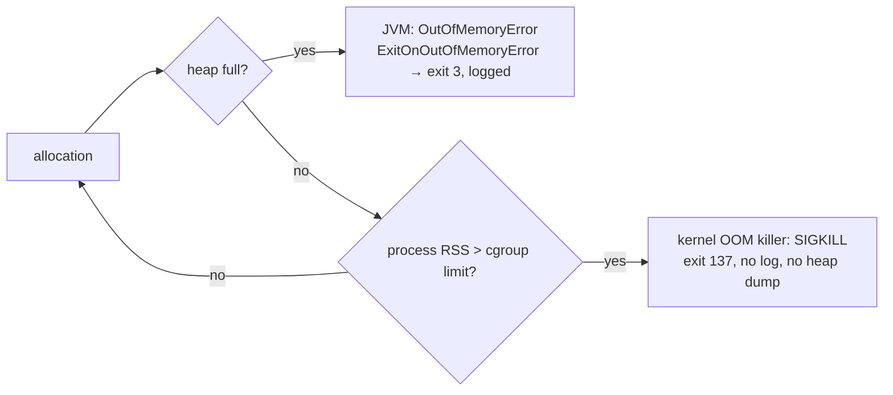

# DevOps 02: The JVM in Containers — limits, heap, GC, OOM, startup

> **One-liner:** the JVM reads the container's **cgroup** limits and sizes itself from them: heap,
> GC choice, thread counts. Get those numbers wrong and you get either a wasted node, or a process
> the **kernel kills silently** (exit 137). Size the heap as a percentage of the limit, leave room
> for everything that isn't heap, and know which GC you actually got. For startup, Java 25's
> **AOT cache** halves our boot time with one training run at image build.

**Roadmap:** D1.3 · **Last updated:** 2026-10-02
**Real files:** [`backend/Dockerfile`](../../backend/Dockerfile) (`JAVA_TOOL_OPTIONS`, the AOT training run, `ENTRYPOINT`)
**Measured on:** the api image (Alpine Temurin 25 JRE, Spring Boot 4.1), Docker 29.7 on an 8-CPU / 7.6 GiB host.

**Priority marks:** ⭐⭐⭐ must know (interviews, incidents) · ⭐⭐ use daily · ⭐ good to know.

| # | Section | Priority |
|---|---|---|
| 1 | [How the JVM sees a container](#1-how-the-jvm-sees-a-container-) | ⭐⭐⭐ |
| 2 | [Heap sizing: `MaxRAMPercentage` and the non-heap budget](#2-heap-sizing-maxrampercentage-and-the-non-heap-budget-) | ⭐⭐⭐ |
| 3 | [GC ergonomics: the Serial GC surprise](#3-gc-ergonomics-the-serial-gc-surprise-) | ⭐⭐⭐ |
| 4 | [Two ways to die: `OutOfMemoryError` vs the OOM killer](#4-two-ways-to-die-outofmemoryerror-vs-the-oom-killer-) | ⭐⭐⭐ |
| 5 | [Startup: the Java 25 AOT cache](#5-startup-the-java-25-aot-cache-) | ⭐⭐ |
| 6 | [No limit is also a choice](#6-no-limit-is-also-a-choice-) | ⭐⭐ |
| 7 | [Our flags, and why](#7-our-flags-and-why-) | ⭐⭐ |
| 8 | [Command cheat sheet](#8-command-cheat-sheet-) | ⭐⭐ |
| 9 | [Common mistakes](#9-common-mistakes-) | ⭐⭐⭐ |
| 10 | [Interview Q&A](#10-interview-qa-) | ⭐⭐⭐ |
| 11 | [30-second recall](#11-30-second-recall) | ⭐⭐⭐ |

---

## 1. How the JVM sees a container ⭐⭐⭐

A container is a normal Linux process with **cgroup** limits (memory, CPU) and namespaces.
`docker run --memory=1g --cpus=2` and a Kubernetes `resources.limits` both end up as cgroup v2
files (`memory.max`, `cpu.max`).

Since JDK 10 (backported to 8u191), the JVM **reads those files** instead of the host's totals:

```bash
docker run --rm --memory=1g --cpus=2 --entrypoint java masternova-spring/api:local -XshowSettings:system -version
# Operating System Metrics:  Provider: cgroupv2 · Effective CPU Count: 2 · Memory Limit: 1.00G
```

What the JVM derives from them:

| From | It sizes |
|---|---|
| **memory limit** | max heap (`MaxRAMPercentage`), initial heap, and whether this is a "server-class machine" (§3) |
| **CPU limit** (`cpu.max` quota) | `availableProcessors()` → GC threads, JIT compiler threads, `ForkJoinPool.commonPool()`, **virtual-thread carrier threads**, Tomcat/Netty defaults |

⚠️ **CPU *requests* (Kubernetes `requests.cpu`) don't limit anything the JVM sees.** Only a
*limit* (quota) changes `availableProcessors()`. You can also pin it: `-XX:ActiveProcessorCount=2`.

---

## 2. Heap sizing: `MaxRAMPercentage` and the non-heap budget ⭐⭐⭐

**The default max heap is only 25 % of the limit.** In a 1 GiB container that's 256 MB of heap
and ~770 MB doing nothing. So we set `-XX:MaxRAMPercentage=75`, as most Spring images do.

Measured: what the JVM picks under each limit (`-XX:+PrintFlagsFinal`, our image):

| Limit | `--cpus` | Max heap (75 %) | GC chosen |
|---|---|---|---|
| 256 MiB | 1 or 2 | 192 MB | Serial |
| 512 MiB | 1 or 2 | 384 MB | Serial |
| 1 GiB | 1 or 2 | 768 MB | Serial |
| 2 GiB | 1 | 1536 MB | Serial |
| 2 GiB | **2** | 1536 MB | **G1** |
| none (host 7.6 GiB) | 8 | **5832 MB** | G1 |

**The heap is not the whole process ⭐.** A JVM's memory is:

```text
container RSS ≈ heap  +  metaspace (class metadata, ~100 MB for Spring)
                      +  code cache (JIT output)  +  thread stacks (~1 MB each for platform threads)
                      +  direct/NIO buffers (Netty, Tomcat)  +  GC bookkeeping  +  the JVM itself
```

What our api actually used after booting and handling 60 signup/login calls:

| Limit | Booted? | Memory used | Verdict |
|---|---|---|---|
| 256 MiB | yes, `Started in 13.8 s` | **254.5 / 256 MiB** | ⚠️ on the edge: the first real load spike gets it OOM-killed |
| 384 MiB | yes | 343 MiB | tight |
| 512 MiB | yes | 348 MiB | OK |
| 768 MiB | yes | 348 MiB | comfortable |

So the api's working set is **~350 MB** at light load, about 250 MB of it non-heap and live data.

**Rule of thumb:**

```text
limit  ≥  max heap + ~250 MB non-heap headroom
75 %  of 1 GiB = 768 MB heap + ~250 MB  ≈ 1 GiB   ✅  →  our D1.4 / D4 limit
75 %  of 512 MiB = 384 MB heap + ~250 MB > 512 MiB ⚠️  →  use ~50–60 % for small containers
```

The percentage is a ratio, but the non-heap overhead is roughly **fixed**. That's why small
containers need a smaller percentage.

---

## 3. GC ergonomics: the Serial GC surprise ⭐⭐⭐

If you don't choose a GC, the JVM picks one. It picks **G1 only on a "server-class machine": at
least 2 CPUs and at least ~1792 MB**. Below that, it silently picks **Serial**, the single-threaded
stop-the-world collector. Look at §2's table: 1 GiB with 2 CPUs gets Serial; 2 GiB with 2 CPUs
gets G1.

A very common Kubernetes setting, `limits: {cpu: "1", memory: "1Gi"}`, therefore runs **Serial
GC**, and nobody chose that.

| GC | Good for | Pauses |
|---|---|---|
| Serial | tiny heaps (< ~500 MB), 1 CPU, batch | stop-the-world, single thread; fine when the heap is small |
| **G1** (server default) | general services, heaps 1–32 GB | short, mostly concurrent |
| ZGC (generational) | latency-critical, big heaps | sub-millisecond, costs more CPU and memory |
| Parallel | throughput batch jobs | longer, multi-threaded stop-the-world |

**What we do:** leave ergonomics in the image (it's correct for its environment), and **know** what
we get. For a ≥ 1 GiB service heap, set `-XX:+UseG1GC` explicitly in the deployment's
`JAVA_TOOL_OPTIONS` when the CPU limit is below 2 (D4), and then measure pauses with `-Xlog:gc`.
Check what you got with `java -XX:+PrintFlagsFinal -version | grep -E 'Use(Serial|G1|Z)GC'`.

---

## 4. Two ways to die: `OutOfMemoryError` vs the OOM killer ⭐⭐⭐

The same program, allocating 1 MB arrays forever, in a 256 MiB container:

```bash
docker run --memory=256m --memory-swap=256m -v …:/w eclipse-temurin:25-jdk-alpine \
  java -XX:MaxRAMPercentage=<N> -XX:+ExitOnOutOfMemoryError /w/Alloc.java
```

| `MaxRAMPercentage` | Heap max | What happened | Exit code | `OOMKilled` | Log |
|---|---|---|---|---|---|
| 50 | 128 MB | the **JVM** ran out of heap first | **3** | false | `Terminating due to java.lang.OutOfMemoryError: Java heap space` |
| 75 | 192 MB | the **JVM** ran out of heap first | **3** | false | same |
| 95 | 243 MB | heap + non-heap exceeded the limit: the **kernel** killed it mid-allocation | **137** (128 + SIGKILL 9) | **true** | *nothing*: the last line was `holding 192 MB` |



**Why we want the first one ⭐:**

- **A JVM OOM is debuggable.** The log says *heap*, and you can add
  `-XX:+HeapDumpOnOutOfMemoryError` to see *what* filled it.
- **A kernel kill is silent.** Kubernetes shows `OOMKilled`, and you're left guessing.
- **`-XX:+ExitOnOutOfMemoryError`** turns "a JVM limping along after an OOM" (threads dead,
  caches half-built) into a clean crash. The orchestrator restarts it.

Keeping the heap at ≤ 75 % (with the §2 headroom) is what makes the JVM hit its own limit first.

---

## 5. Startup: the Java 25 AOT cache ⭐⭐

**The problem:** each JVM start re-reads, verifies, loads and links many thousands of classes (a
Spring Boot service easily loads over ten thousand), and then profiles hot code from scratch. In Kubernetes, startup time is
rollout time, autoscaling reaction time and crash-recovery time.

**The feature** (JEP 483 in Java 24; JEP 514 and JEP 515 in Java 25): do a **training run** once,
save the loaded and linked classes (plus method profiles) to an **AOT cache** file, and **map**
it on every later start.

```dockerfile
# backend/Dockerfile (runtime stage, after the app layers are copied)
RUN java -XX:AOTCacheOutput=app.aot \
      -Dspring.context.exit=onRefresh \                 # ⭐ Spring: build the context, then exit
      -Dspring.flyway.enabled=false \                   # ⭐ the build has no database …
      -Dspring.jpa.hibernate.ddl-auto=none \
      -Dspring.jpa.properties.hibernate.boot.allow_jdbc_metadata_access=false \
      -Dspring.jpa.database-platform=org.hibernate.dialect.PostgreSQLDialect \
      -jar app.jar
ENTRYPOINT ["java", "-XX:AOTCache=app.aot", "-jar", "app.jar"]
```

**Three details that make or break it:**

1. **The classpath must be plain JARs, loaded by the JDK's own class loaders.** Boot's
   `JarLauncher` uses its own class loader, so those classes can't be cached. That's why the
   extract dropped `--launcher`: it produces `app.jar` + `lib/*.jar` with a manifest classpath,
   run with `java -jar app.jar`.
2. **The training run must not need infrastructure.** `spring.context.exit=onRefresh` creates
   the beans and exits before the web server, `ApplicationRunner`s and schedulers start. Anything
   that talks to the database *during* bean creation has to be switched off for this run only:
   Flyway, schema validation, Hibernate's JDBC metadata lookup. Lettuce connects lazily, so Redis
   is fine.
3. **The cache must match the runtime exactly:** the same JVM build and the same JARs. Building it
   in the same image stage guarantees that. If it doesn't match, the JVM **silently starts
   without it** (`AOTMode=auto`). Check with `-Xlog:aot=info` (`Opened AOT cache app.aot.`).

**Measured** (api, `--cpus=2 --memory=1g`, real Postgres + Redis, 3 runs each):

| Image | Time to ready (HTTP) | `Started … in` | Memory after start |
|---|---|---|---|
| launcher layout (before) | 12.3–13.0 s | 11.6–12.3 s | 339–367 MiB |
| plain `-jar` layout, no cache | 12.0–12.9 s | 11.5–12.4 s | 339–344 MiB |
| ⭐ **plain `-jar` + AOT cache** | **6.8–7.4 s** | **6.1–6.6 s** | **280–283 MiB** |

**~45 % faster to ready, ~60 MB less memory** (cached class metadata is mapped from the file
instead of built in memory). The layout change alone gains nothing. The rest of the 6 s is real
work: connecting to Postgres, Flyway's check, Hibernate validation.

**What it costs:**

| Cost | Amount |
|---|---|
| image size | +151 MB unpacked (**+34 MB compressed**) for the api; the worker's cache is 109 MB |
| per deploy | the cache changes with every code change, so a deploy ships ~35 MB instead of 0.65 MB (note 01 §3). Accepted: it's still one layer. |
| build time | +~25 s for the training run |
| config | the "no database during training" properties above |

**Alternatives:**

| Option | Startup | Trade-off |
|---|---|---|
| CDS archive (`-XX:ArchiveClassesAtExit`, older) | faster, but less than an AOT cache | the AOT cache supersedes it (it adds linking + profiles); not measured here |
| ⭐ AOT cache (ours) | ~45 % faster | a bigger image, a training run |
| GraalVM native image | ~0.1 s, tiny memory | long native builds, a closed world (reflection config), different runtime behaviour, no JIT peak performance |
| CRaC (checkpoint/restore) | ~0.1 s | needs CRIU and privileges, and secrets/connections captured in the snapshot need care |

---

## 6. No limit is also a choice ⭐⭐

Our compose stack sets **no memory limits**, so each JVM sizes itself from the **host**: 75 % of
7.6 GiB = a **5.8 GB** max heap, for the api *and* for the worker. The heap grows lazily: the api
idles at **510 MiB** in compose, against 280 MiB under a 1 GiB limit. Two JVMs could together
claim 150 % of the host before either sees GC pressure, and then the host's OOM killer picks a
victim.

**Every JVM container needs a memory limit.** D1.4 adds them to compose, and Kubernetes manifests
(D4) get `requests` and `limits`.

---

## 7. Our flags, and why ⭐⭐

| Flag | Where | Why |
|---|---|---|
| `-XX:MaxRAMPercentage=75` | `JAVA_TOOL_OPTIONS` (image) | use the container's memory; the default 25 % wastes most of it. Needs a ≥ ~1 GiB limit (§2). |
| `-XX:+ExitOnOutOfMemoryError` | `JAVA_TOOL_OPTIONS` (image) | crash cleanly on a heap OOM and let the orchestrator restart |
| `-XX:AOTCache=app.aot` | `ENTRYPOINT` | ~45 % faster start, ~60 MB less memory (§5) |
| *(no GC flag)* | — | ergonomics are right for the default; set G1 per deployment when the CPU limit is < 2 (§3) |
| `JAVA_TOOL_OPTIONS` rather than `ENTRYPOINT` args | — | the JVM reads it automatically. Deployments add flags (e.g. `-XX:+UseG1GC`) without touching the image. It also applies to `docker exec … java`, which is why `Picked up JAVA_TOOL_OPTIONS` appears in logs. |

---

## 8. Command cheat sheet ⭐⭐

| Command | Shows |
|---|---|
| `java -XshowSettings:system -version` | the cgroup limits the JVM detected |
| `java -XX:+PrintFlagsFinal -version \| grep -E 'MaxHeapSize\|Use(Serial\|G1\|Z)GC\|ActiveProcessorCount'` | the heap, GC and CPU count it chose |
| `java -Xlog:os+container=debug -version` | the cgroup detection details |
| `java -Xlog:gc …` | GC events and pause times |
| `docker inspect -f '{{.State.ExitCode}} {{.State.OOMKilled}}' <c>` | 137 + true = the kernel killed it |
| `docker stats --no-stream` | memory used vs limit |
| `java -XX:AOTCache=app.aot -XX:AOTMode=on -Xlog:aot=info -version` | does the cache load? (`on` fails loudly instead of silently skipping it) |
| `kubectl describe pod` → `Last State: Terminated, Reason: OOMKilled` | the Kubernetes view of the same kill (D4) |

---

## 9. Common mistakes ⭐⭐⭐

| ❌ Mistake | ✅ Instead | § |
|---|---|---|
| no memory limit on JVM containers | always set one; the JVM sizes itself from it | 6 |
| `-Xmx` equal to the container limit | heap ≈ 75 % at most; leave ~250 MB for non-heap | 2 |
| relying on the default heap (25 %) | `MaxRAMPercentage=75` (or lower for small limits) | 2 |
| 75 % in a 512 MiB container | ~50–60 %: the non-heap overhead is fixed | 2 |
| assuming G1 | check: < 2 CPUs or < ~1.8 GB means Serial | 3 |
| reading "OOMKilled" as a heap problem | 137 = the kernel (total RSS); exit 3 with a log = the heap | 4 |
| running on after an `OutOfMemoryError` | `-XX:+ExitOnOutOfMemoryError` | 4 |
| an AOT/CDS cache with Boot's `JarLauncher` | extract without `--launcher`, run `-jar app.jar` | 5 |
| a training run that needs the database | `spring.context.exit=onRefresh` + DB-free properties | 5 |
| trusting the cache is used | `-Xlog:aot=info` / `AOTMode=on` once, in CI or by hand | 5 |

---

## 10. Interview Q&A ⭐⭐⭐

**Q1. How does the JVM behave in a container?**
Since JDK 10 it reads cgroup limits: the max heap is a percentage of the memory limit (25 % by
default), and the CPU quota sets `availableProcessors()`, which sizes GC, JIT and ForkJoin
threads. So you set `MaxRAMPercentage` (we use 75), not a fixed `-Xmx`, and the image works under
any limit.

**Q2. Your pod restarts with `OOMKilled`, but there's no `OutOfMemoryError` in the logs. Why?**
The kernel killed the process because its total RSS (heap + metaspace + threads + direct buffers
+ code cache) exceeded the cgroup limit before the heap filled. Lower the heap percentage or raise
the limit, and check non-heap growth (thread count, direct buffers). We reproduced it: 95 % heap
in 256 MiB → exit 137 with no log line; 75 % → a clean `OutOfMemoryError`, exit 3.

**Q3. Which GC will your service use with a 1 CPU / 1 GiB limit?**
Serial. G1 is only chosen on a "server-class machine" (≥ 2 CPUs and ≥ ~1.8 GB). Set
`-XX:+UseG1GC` explicitly if you want it, and measure pauses.

**Q4. How do you speed up Spring Boot startup in containers?**
Java 25's AOT cache: a training run at image build (`-XX:AOTCacheOutput`, with Spring's
`spring.context.exit=onRefresh` and no database), then `-XX:AOTCache` at runtime. Ours went from
~12.5 s to ~7 s to ready, and used 60 MB less memory. Requirements: a plain JAR classpath and the
same JVM. The alternatives are GraalVM native image or CRaC, each with bigger trade-offs.

**Q5. What does `-XX:+ExitOnOutOfMemoryError` buy you?**
After an OOM, a JVM can keep running in a broken state (dead threads, half-finished work).
Exiting immediately lets the orchestrator restart a clean instance, and the log says why.

**Q6. Does a CPU request limit the JVM?**
No, only a CPU *limit* (cgroup quota) changes what the JVM sees. You can pin it with
`-XX:ActiveProcessorCount`.

---

## 11. 30-second recall

- **The JVM reads cgroups:** memory limit → max heap (25 % by default, **75 % ours**); CPU quota
  → processor count → GC/JIT/ForkJoin/virtual-thread carriers.
- **Non-heap is ~250 MB for Spring** (metaspace, code cache, threads, buffers). Limit ≥ heap +
  ~250 MB, so 75 % needs ~1 GiB; use 50–60 % for small containers.
- **Serial GC** unless ≥ 2 CPUs and ≥ ~1.8 GB. 1 CPU / 1 GiB pods run Serial.
- **OOM:** exit 3 + a log = heap (`ExitOnOutOfMemoryError`); exit 137 + `OOMKilled` + silence =
  kernel. Keep the heap ≤ 75 % so the JVM hits its own wall first.
- **AOT cache (Java 25):**
  - A training run at build (`AOTCacheOutput`, `spring.context.exit=onRefresh`, no DB), then
    `-XX:AOTCache`.
  - 12.5 → 7 s to ready, −60 MB; costs +34 MB compressed per deploy.
  - Needs a plain `-jar` layout (no `JarLauncher`).
- **No limit = sized from the host:** a 5.8 GB heap; the api idles at 510 MiB vs 280 MiB.
  → D1.4 adds limits.
