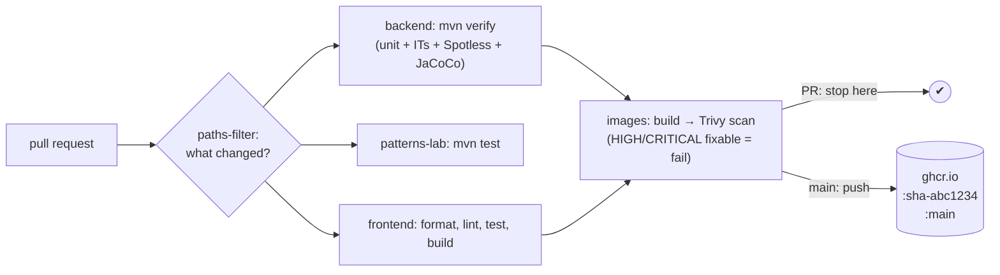
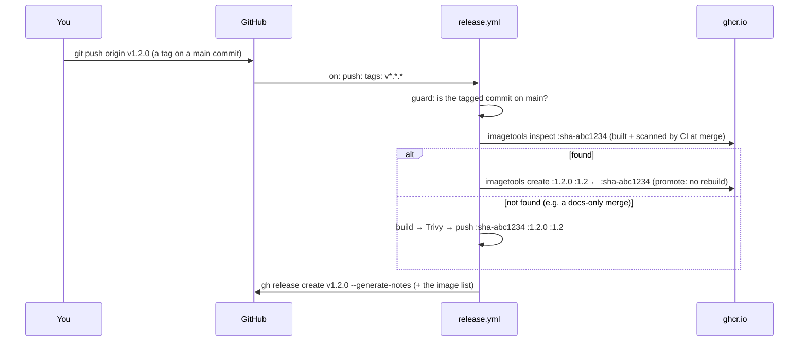

# DevOps 04: The CI/CD Pipeline — from "tests pass" to shippable artifacts

> **One-liner:** CI proves a change is safe. CD turns that **exact** tested build into a
> **versioned, scanned, signed artifact** in a registry, ready for any environment to pull.
> Every rule below exists so that what runs in production is provably the thing that passed the
> checks.

**Roadmap:** D2.1–D2.6 · **Last updated:** 2026-10-02
**Real files:** [`.github/workflows/ci.yml`](../../.github/workflows/ci.yml), [`.github/workflows/release.yml`](../../.github/workflows/release.yml), [`Makefile`](../../Makefile) (`make release`)
**Decisions for this repo** (2026-10-02):
- **Releases are tag-driven:** a `vX.Y.Z` tag pushed by the owner, never a bot commit.
- **No Dependabot auto-merge:** updates are re-applied as the owner's commit.
- **`main` is protected:** PR + green checks, no required reviews.
- **Images are public on GHCR.**

**Priority marks:** ⭐⭐⭐ must know (interviews, incidents) · ⭐⭐ use daily · ⭐ good to know.

| # | Section | Priority | Task |
|---|---|---|---|
| 1 | [The pipeline at a glance](#1-the-pipeline-at-a-glance-) | ⭐⭐⭐ | — |
| 2 | [Publishing images: registry, tags, permissions](#2-publishing-images-registry-tags-permissions-) | ⭐⭐⭐ | D2.1 |
| 3 | [Releases: tag-driven, promote don't rebuild](#3-releases-tag-driven-promote-dont-rebuild-) | ⭐⭐⭐ | D2.2 |

---

## 1. The pipeline at a glance ⭐⭐⭐



| Trigger | What runs | What it produces |
|---|---|---|
| pull request | only the jobs whose files changed, then images built + scanned | a green/red check, nothing published |
| merge to `main` | the same jobs | images pushed to GHCR as `:sha-<commit>` and `:main` |
| `vX.Y.Z` tag | `release.yml`: guard → promote (or build + scan) → GitHub Release | `:X.Y.Z` + `:X.Y` image tags, a Release with notes |

**Path filters** (`dorny/paths-filter`): a docs-only PR runs nothing heavy, and a frontend PR
skips the 2-minute Maven build. `ci.yml` is in every filter, so a change to CI itself always runs
everything.

---

## 2. Publishing images: registry, tags, permissions ⭐⭐⭐

**Where:** GitHub Container Registry, one package per image:

```text
ghcr.io/b-nimai/masternova-spring-api
ghcr.io/b-nimai/masternova-spring-worker
ghcr.io/b-nimai/masternova-spring-web
```

**Tags** (computed by `docker/metadata-action`):

| Tag | Example | Mutable? | Used by |
|---|---|---|---|
| ⭐ `sha-<7>` | `:sha-3c1c64e` | **never**: one per commit | deployments (D4 pins these), rollbacks, "what exactly is running?" |
| `main` | `:main` | moves on every merge | "latest from main" for local experiments |
| `X.Y.Z`, `X.Y` | `:1.4.2`, `:1.4` | `X.Y.Z` never; `X.Y` moves to the newest patch | releases (D2.2) |

**Why immutable tags matter ⭐:** with `:latest` (or `:main`) in a deployment, two pods started
an hour apart can run different code, and "roll back" means nothing. A `sha-` tag (or the digest
`@sha256:…`) names exactly one build. Kubernetes' `imagePullPolicy: IfNotPresent` is also only
safe with immutable tags.

**Push only what passed the scan:**

```yaml
- build (load: true) → masternova-spring/api:ci     # local to the runner
- Trivy scan of that image                          # fails the job on fixable HIGH/CRITICAL
- docker/login-action → ghcr.io                     # only on main
- build-push-action (push: true)                    # same inputs → every layer comes from the cache
```

The second build is not a rebuild. The same context and build args hit the GHA layer cache
(`cache-from: type=gha`), so it re-uses the scanned layers and only uploads them. If the scan
fails, the push steps never run.

**Permissions: least privilege per job ⭐:**

```yaml
permissions:            # workflow default: read-only
  contents: read
jobs:
  images:
    permissions:
      contents: read
      packages: write   # only this job can push packages
```

`GITHUB_TOKEN` is a short-lived token minted per run, so there are **no stored registry
passwords**. `packages: write` exists only in the job that needs it. A compromised test
dependency in the `backend` job can't push a poisoned image.

**PRs never publish.** The `PUBLISH` flag is true only for `push` events on `main`. A PR from a
fork wouldn't get `packages: write` anyway.

**OCI labels:** `metadata-action` adds `org.opencontainers.image.source`, `.revision` (the commit
SHA) and `.created`. The `source` label links the package to the repository on GitHub. `revision`
answers "which commit is this image?" from the image alone:

```bash
docker inspect -f '{{index .Config.Labels "org.opencontainers.image.revision"}}' ghcr.io/b-nimai/masternova-spring-api:main
```

**Visibility:** the packages are **public**, like the repo. The local Kubernetes cluster (D4)
pulls them without an image-pull secret.

**Pull one:**

```bash
docker pull ghcr.io/b-nimai/masternova-spring-api:main
```

---

## 3. Releases: tag-driven, promote don't rebuild ⭐⭐⭐

**How to release:**

```bash
make release VERSION=1.2.0     # on a clean, up-to-date main: annotated tag v1.2.0, pushed as you
```



**Promote, don't rebuild ⭐:** a rebuild at release time is a *different* artifact. Base images
moved, `apk upgrade` pulled new packages, a dependency resolved differently. What you tested is
not what you shipped. `docker buildx imagetools create --tag :1.2.0 :sha-abc1234` adds a tag to
the **existing manifest** inside the registry: same digest, same bytes, nothing rebuilt or
re-uploaded. The release is **exactly** the image CI scanned at merge time.

**Which version is running?**

- A promoted image was built *before* anyone chose the version number, so the app can't know
  "1.2.0".
- It does know its **commit**: CI passes `GIT_SHA` as a build arg, and `/actuator/info` shows
  `app.commit`. The tag maps that commit to the version.
- The image's OCI labels carry the same revision.
- The `GIT_SHA` `ARG` is declared **after** the AOT training run in the Dockerfile. A different
  SHA per build therefore never invalidates the cached layers: a rebuild with a new SHA took 3.4 s,
  everything `CACHED`.

**Guards:**

| Guard | Why |
|---|---|
| the tag pattern `v[0-9]+.[0-9]+.[0-9]+` | only real semver tags trigger releases |
| the tagged commit must be on `main` (`git merge-base --is-ancestor`) | nobody releases an unreviewed branch by tagging it |
| `gh release create --verify-tag` | the Release refers to a tag that really exists |
| `make release` checks a clean `main`, then `git pull --ff-only` | you tag exactly what's on the remote `main` |

**Semantic versioning:** `MAJOR.MINOR.PATCH`:

- **MAJOR:** a breaking API change (for us, `/api/v2`, conventions §0).
- **MINOR:** a new backwards-compatible feature, e.g. a new module or endpoint.
- **PATCH:** fixes only.

`:1.2` moves to the newest patch, so consumers who want fixes but no features pin `:1.2`.

**Why not release-please (or semantic-release)?** They read conventional commits and open a
"release PR" that bumps versions and writes `CHANGELOG.md`. That's great automation, but the
commits are authored by `github-actions[bot]`, and this repo's history must show only its owner.
A tag-driven flow keeps every commit human, and still generates notes:
`--generate-notes` lists the merged PRs since the previous tag.

**What *is* created by automation:** the Release object and the image tags. Neither is a commit;
`git log` is untouched.

