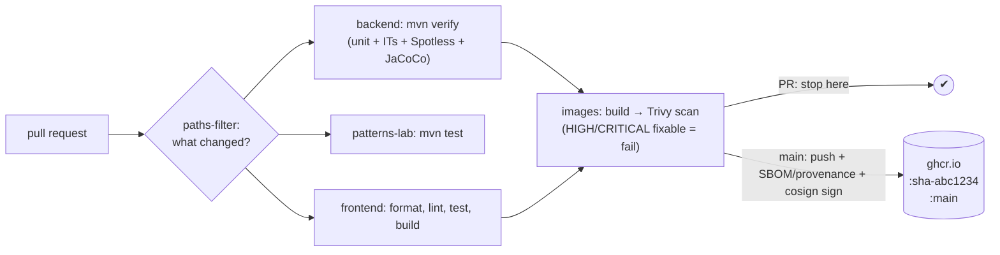
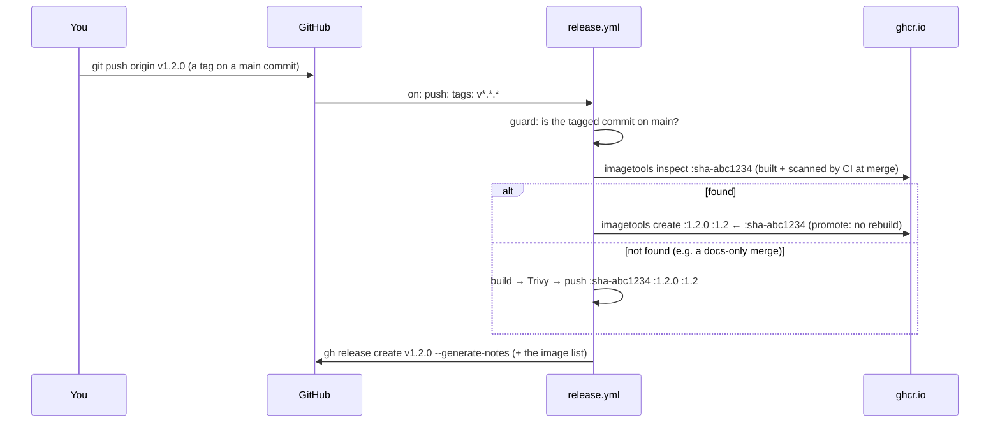
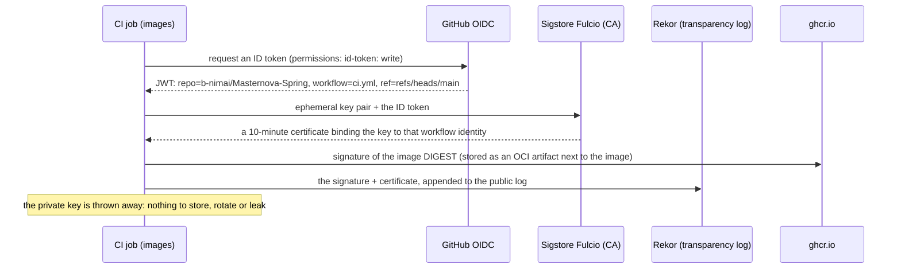

# DevOps 04: The CI/CD Pipeline — from "tests pass" to shippable artifacts

> **One-liner:** CI proves a change is safe. CD turns that **exact** tested build into a
> **versioned, scanned, signed artifact** in a registry, ready for any environment to pull.
> Every rule below exists so that what runs in production is provably the thing that passed the
> checks.

**Roadmap:** D2.1–D2.6 · **Last updated:** 2026-10-02
**Real files:** [`.github/workflows/ci.yml`](../../.github/workflows/ci.yml), [`.github/workflows/release.yml`](../../.github/workflows/release.yml), [`.github/workflows/codeql.yml`](../../.github/workflows/codeql.yml), [`backend/pom.xml`](../../backend/pom.xml) (JaCoCo gate), [`Makefile`](../../Makefile) (`make release`)
**Decisions for this repo** (2026-10-02):
- **Releases are tag-driven:** a `vX.Y.Z` tag pushed by the owner, never a bot commit.
- **No Dependabot auto-merge:** updates are re-applied as the owner's commit.
- **`main` is protected:** PR + green checks, no required reviews.
- **Images are public on GHCR.**

**Priority marks:** ⭐⭐⭐ must know (interviews, incidents) · ⭐⭐ use daily · ⭐ good to know.

| # | Section | Priority | Task |
|---|---|---|---|
| 1 | [The pipeline at a glance](#1-the-pipeline-at-a-glance-) | ⭐⭐⭐ | — |
| 2 | [Publishing images: registry, tags, permissions](#2-publishing-images-registry-tags-permissions-) | ⭐⭐⭐ | D2.1 |
| 3 | [Releases: tag-driven, promote don't rebuild](#3-releases-tag-driven-promote-dont-rebuild-) | ⭐⭐⭐ | D2.2 |
| 4 | [Supply chain: SBOMs, provenance, keyless signing](#4-supply-chain-sboms-provenance-keyless-signing-) | ⭐⭐⭐ | D2.3 |
| 5 | [Quality gates: coverage, CodeQL, actionlint, dependency policy](#5-quality-gates-coverage-codeql-actionlint-dependency-policy-) | ⭐⭐ | D2.4 |

---

## 1. The pipeline at a glance ⭐⭐⭐



| Trigger | What runs | What it produces |
|---|---|---|
| pull request | only the jobs whose files changed, then images built + scanned | a green/red check, nothing published |
| merge to `main` | the same jobs | images pushed to GHCR as `:sha-<commit>` and `:main` |
| `vX.Y.Z` tag | `release.yml`: guard → promote (or build + scan) → GitHub Release | `:X.Y.Z` + `:X.Y` image tags, a Release with notes |

**Path filters** (`dorny/paths-filter`): a docs-only PR runs nothing heavy, and a frontend PR
skips the 2-minute Maven build. `ci.yml` is in every filter, so a change to CI itself always runs
everything.

---

## 2. Publishing images: registry, tags, permissions ⭐⭐⭐

**Where:** GitHub Container Registry, one package per image:

```text
ghcr.io/b-nimai/masternova-spring-api
ghcr.io/b-nimai/masternova-spring-worker
ghcr.io/b-nimai/masternova-spring-web
```

**Tags** (computed by `docker/metadata-action`):

| Tag | Example | Mutable? | Used by |
|---|---|---|---|
| ⭐ `sha-<7>` | `:sha-3c1c64e` | **never**: one per commit | deployments (D4 pins these), rollbacks, "what exactly is running?" |
| `main` | `:main` | moves on every merge | "latest from main" for local experiments |
| `X.Y.Z`, `X.Y` | `:1.4.2`, `:1.4` | `X.Y.Z` never; `X.Y` moves to the newest patch | releases (D2.2) |

**Why immutable tags matter ⭐:** with `:latest` (or `:main`) in a deployment, two pods started
an hour apart can run different code, and "roll back" means nothing. A `sha-` tag (or the digest
`@sha256:…`) names exactly one build. Kubernetes' `imagePullPolicy: IfNotPresent` is also only
safe with immutable tags.

**Push only what passed the scan:**

```yaml
- build (load: true) → masternova-spring/api:ci     # local to the runner
- Trivy scan of that image                          # fails the job on fixable HIGH/CRITICAL
- docker/login-action → ghcr.io                     # only on main
- build-push-action (push: true)                    # same inputs → every layer comes from the cache
```

The second build is not a rebuild. The same context and build args hit the GHA layer cache
(`cache-from: type=gha`), so it re-uses the scanned layers and only uploads them. If the scan
fails, the push steps never run.

**Permissions: least privilege per job ⭐:**

```yaml
permissions:            # workflow default: read-only
  contents: read
jobs:
  images:
    permissions:
      contents: read
      packages: write   # only this job can push packages
```

`GITHUB_TOKEN` is a short-lived token minted per run, so there are **no stored registry
passwords**. `packages: write` exists only in the job that needs it. A compromised test
dependency in the `backend` job can't push a poisoned image.

**PRs never publish.** The `PUBLISH` flag is true only for `push` events on `main`. A PR from a
fork wouldn't get `packages: write` anyway.

**OCI labels:** `metadata-action` adds `org.opencontainers.image.source`, `.revision` (the commit
SHA) and `.created`. The `source` label links the package to the repository on GitHub. `revision`
answers "which commit is this image?" from the image alone:

```bash
docker inspect -f '{{index .Config.Labels "org.opencontainers.image.revision"}}' ghcr.io/b-nimai/masternova-spring-api:main
```

**Visibility:** the packages are **public**, like the repo. The local Kubernetes cluster (D4)
pulls them without an image-pull secret.

**Pull one:**

```bash
docker pull ghcr.io/b-nimai/masternova-spring-api:main
```

---

## 3. Releases: tag-driven, promote don't rebuild ⭐⭐⭐

**How to release:**

```bash
make release VERSION=1.2.0     # on a clean, up-to-date main: annotated tag v1.2.0, pushed as you
```



**Promote, don't rebuild ⭐:** a rebuild at release time is a *different* artifact. Base images
moved, `apk upgrade` pulled new packages, a dependency resolved differently. What you tested is
not what you shipped. `docker buildx imagetools create --tag :1.2.0 :sha-abc1234` adds a tag to
the **existing manifest** inside the registry: same digest, same bytes, nothing rebuilt or
re-uploaded. The release is **exactly** the image CI scanned at merge time.

**Which version is running?**

- A promoted image was built *before* anyone chose the version number, so the app can't know
  "1.2.0".
- It does know its **commit**: CI passes `GIT_SHA` as a build arg, and `/actuator/info` shows
  `app.commit`. The tag maps that commit to the version.
- The image's OCI labels carry the same revision.
- The `GIT_SHA` `ARG` is declared **after** the AOT training run in the Dockerfile. A different
  SHA per build therefore never invalidates the cached layers: a rebuild with a new SHA took 3.4 s,
  everything `CACHED`.

**Guards:**

| Guard | Why |
|---|---|
| the tag pattern `v[0-9]+.[0-9]+.[0-9]+` | only real semver tags trigger releases |
| the tagged commit must be on `main` (`git merge-base --is-ancestor`) | nobody releases an unreviewed branch by tagging it |
| `gh release create --verify-tag` | the Release refers to a tag that really exists |
| `make release` checks a clean `main`, then `git pull --ff-only` | you tag exactly what's on the remote `main` |

**Semantic versioning:** `MAJOR.MINOR.PATCH`:

- **MAJOR:** a breaking API change (for us, `/api/v2`, conventions §0).
- **MINOR:** a new backwards-compatible feature, e.g. a new module or endpoint.
- **PATCH:** fixes only.

`:1.2` moves to the newest patch, so consumers who want fixes but no features pin `:1.2`.

**Why not release-please (or semantic-release)?** They read conventional commits and open a
"release PR" that bumps versions and writes `CHANGELOG.md`. That's great automation, but the
commits are authored by `github-actions[bot]`, and this repo's history must show only its owner.
A tag-driven flow keeps every commit human, and still generates notes:
`--generate-notes` lists the merged PRs since the previous tag.

**What *is* created by automation:** the Release object and the image tags. Neither is a commit;
`git log` is untouched.

---

## 4. Supply chain: SBOMs, provenance, keyless signing ⭐⭐⭐

Three questions an auditor (or an incident) asks about a running image:

| Question | Answer in this repo |
|---|---|
| **What's inside it?** "Are we affected by the new CVE in library X?" | **SBOMs**, at three levels (below) |
| **How and from what was it built?** | a **provenance** attestation (SLSA): commit, workflow, build args, base images |
| **Did *our* pipeline build it, unmodified?** | a **cosign** signature on the digest, keyless, recorded in a public transparency log |

### SBOM: the ingredient list

**1. Inside every jar (Maven, CycloneDX).** Spring Boot's parent already configures
`cyclonedx-maven-plugin`; declaring it in `api/pom.xml` and `worker/pom.xml` is enough. Each build
writes `META-INF/sbom/application.cdx.json` into the jar:

```text
CycloneDX 1.6 · 143 components · spring-core 7.0.9 · jackson-databind 3.1.7 · hibernate-core 7.4.5.Final
· tomcat-embed-core 11.0.26 · postgresql 42.7.13 …
```

- **Still reproducible:** two clean builds produced **byte-identical jars**. The plugin derives the
  serial number from the content (a name-based UUID) and omits the timestamp, so note 01's
  "identical code → identical layers" survives.
- **Spring Boot's Actuator has an `sbom` endpoint** that serves this file. We **don't expose
  it**: a public list of exact library versions is a gift to attackers.
- CI uploads the jar SBOMs as the `sbom-maven` artifact.

**2. Attached to the image in the registry (BuildKit).** `sbom: true` on the push makes BuildKit
scan the final image (OS packages + JARs + npm packages) and store an SPDX SBOM **next to** the
image, as an attestation in the same image index:

```bash
docker buildx imagetools inspect ghcr.io/b-nimai/masternova-spring-api:main --format '{{ json .SBOM }}'
```

**3. As a release asset (Syft, CycloneDX).** `release.yml` runs `anchore/sbom-action` on each
released image and attaches `sbom-api.cdx.json`, `sbom-worker.cdx.json` and `sbom-web.cdx.json`
to the GitHub Release. Anyone can download and scan them without pulling the images:

```bash
trivy sbom sbom-api.cdx.json        # CVE scan from the SBOM alone
```

### Provenance: the build receipt

`provenance: mode=max` attaches a **SLSA provenance** attestation: the source repo and commit, the
workflow that ran, the build arguments (including `GIT_SHA`), and the exact base-image digests.
`mode=max` includes the full build details. Never pass secrets as build args, because they would
end up here (we don't; secrets are runtime files, note 03 §6).

```bash
docker buildx imagetools inspect ghcr.io/b-nimai/masternova-spring-api:main --format '{{ json .Provenance }}'
```

### Signing: keyless cosign ⭐



```yaml
permissions:
  id-token: write                         # lets the job ask GitHub for an OIDC token
steps:
  - uses: sigstore/cosign-installer@v4
  - run: cosign sign --yes "$IMAGE@$DIGEST"   # DIGEST = the push step's output
```

- **Sign the digest, not a tag.** Tags move; a digest names exactly one image. The release tags
  `:1.2.0` point at the same digest, so the signature CI made at merge time also covers the
  release. Promotion keeps signatures valid for free.
- **Keyless means no secret.** There's no `COSIGN_PRIVATE_KEY` to store in GitHub, and none to
  leak. Trust is in the **identity** in the certificate (this repo's workflow, this ref), and
  Rekor makes every signature publicly auditable.

**Verifying:** you state *who* you trust, not which key:

```bash
cosign verify ghcr.io/b-nimai/masternova-spring-api:main \
  --certificate-identity-regexp '^https://github.com/b-nimai/Masternova-Spring/\.github/workflows/' \
  --certificate-oidc-issuer https://token.actions.githubusercontent.com
```

We tried the same mechanism on an image that's already keylessly signed (Google's distroless):

```text
$ cosign verify gcr.io/distroless/static-debian13:nonroot \
    --certificate-oidc-issuer https://accounts.google.com \
    --certificate-identity keyless@distroless.iam.gserviceaccount.com
Verification for gcr.io/distroless/static-debian13:nonroot --
  - The cosign claims were validated
  - Existence of the claims in the transparency log was verified offline
  - The code-signing certificate was verified using trusted certificate authority certificates
                                                                        → exit 0

$ cosign verify … --certificate-identity someone-else@example.com
Error: no matching signatures: none of the expected identities matched what was in the certificate,
got subjects [keyless@distroless.iam.gserviceaccount.com]                → exit 1
```

**Where verification gets enforced:** a Kubernetes admission controller (Sigstore
policy-controller or Kyverno, D4/D5) can refuse to run any image without a valid signature from
this workflow. That closes the loop: only images our CI built, scanned and signed can run.

---

## 5. Quality gates: coverage, CodeQL, actionlint, dependency policy ⭐⭐

A **gate** is a check that **fails the build**. A report nobody reads isn't a gate.

### Coverage: merge first, then gate ⭐

Our tests come in two kinds, each with its own JaCoCo data file:

| Data file | Written by | api line coverage |
|---|---|---|
| `jacoco.exec` | Surefire (unit tests, `*Test`) | **27.5 %** (235 / 853 lines) |
| `jacoco-it.exec` | Failsafe (Testcontainers ITs, `*IT`) | — |
| ⭐ `jacoco-merged.exec` | the `merge` goal at `verify` | **91 %** lines, 69 % branches |

Before D2.4, the report read **only** `jacoco.exec`. A gate on that number would have said "27 %"
about a codebase whose security chain, outbox and idempotency are proven end to end by ITs. You'd
either set a meaningless floor, or write mock-heavy unit tests just to move a number. So the
parent POM now:

```text
verify:  merge (jacoco.exec + jacoco-it.exec → jacoco-merged.exec)
         → report (from the merge)   → target/site/jacoco/, uploaded by CI
         → check  (from the merge)   → fails the build below the module's floor
```

Floors are **per module**, set a few points under what was measured (a **ratchet**):

| Module | Measured (merged) | Floor (`coverage.line` / `coverage.branch`) |
|---|---|---|
| api | 91 % / 69 % | 0.88 / 0.65 |
| kernel | 51 % / 81 % | 0.45 / 0.75 (mostly annotation and enum declarations) |
| worker | a 3-line skeleton | 0 (raised in Phase 4) |

It fails as intended. With the floor forced up to 95 %:

```text
[WARNING] Rule violated for bundle api: lines covered ratio is 0.90, but expected minimum is 0.95
[ERROR] BUILD FAILURE … Coverage checks have not been met.
```

**Rules for the floor:** raise it when coverage grows, **never lower it to get a build through**,
and treat coverage as a smoke alarm, not a goal. 100 % coverage with weak assertions proves
nothing; the concurrency ITs prove more with fewer lines.

### CodeQL: semantic static analysis

`codeql.yml` analyses **Java** and **TypeScript** with the `security-and-quality` query suite:

- injection (SQL, log, path)
- unsafe deserialisation
- hard-coded credentials
- missing authorization patterns
- resource leaks
- …

It runs on every PR, on `main`, and **weekly**: new queries find old bugs. `build-mode: none`
analyses the sources without compiling, so there's no Maven or pnpm build in this workflow.
Results go to *Security → Code scanning*, and a PR that **introduces** a high-severity alert gets
a failing check.

CodeQL vs Trivy: **CodeQL reads *our* code** for bugs. **Trivy reads *other people's* code** (the
packages in the image) for known CVEs. You need both.

### actionlint: lint the pipeline itself

A typo in `release.yml` only shows up when someone pushes a tag, which is the worst moment. The
`workflows` job runs **actionlint** on every change under `.github/`:

- expression syntax and types
- unknown action inputs
- shellcheck on `run:` blocks
- invalid `needs`/`if` references

Run it locally:

```bash
docker run --rm -v "$PWD":/repo -w /repo rhysd/actionlint:latest
```

### Dependency policy: Dependabot, no auto-merge

Dependabot opens grouped weekly PRs: Maven, npm, Docker base images, and GitHub Actions. Many teams
auto-merge green patch updates. **This repo deliberately doesn't**: its history must show only the
owner. A green Dependabot PR is re-applied as the owner's own commit (same diff, CI proves it
again), and the bot's PR is closed. The trade-off is a few minutes of manual work per week,
against a clean, single-author history.

