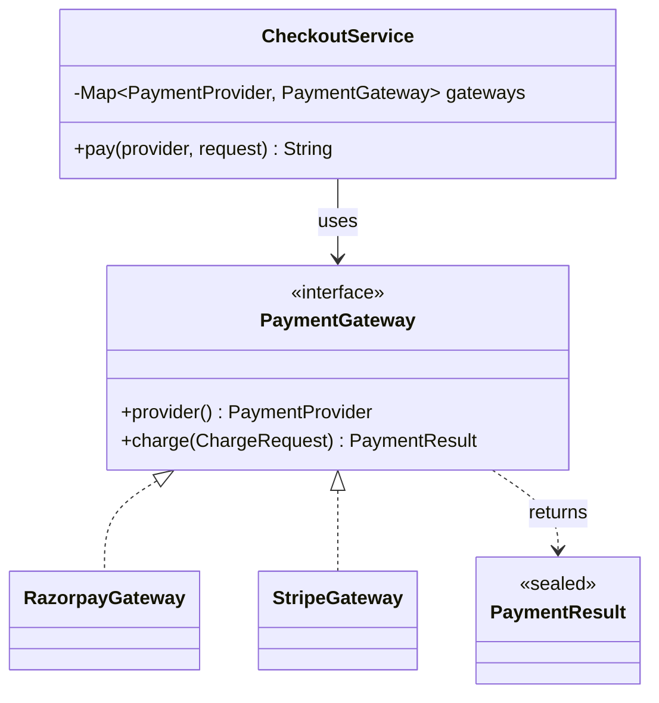

# Strategy — pick one interchangeable algorithm at runtime

> **One-liner:** define a family of algorithms behind one interface, so the caller chooses one at
> runtime and new ones are added without editing the caller.

**Type:** Behavioral · **Status:** lab built, real code arrives in Phases 3, 7 and 9 · **Last updated:** 2026-10-02
**Real code:** — (planned: `com.masternova.api.commerce.payment.PaymentGateway`) · **Lab:** [`lab/.../strategy/`](../lab/src/main/java/com/masternova/patterns/strategy/)

**Trigger phrase:** "*support several providers/methods/algorithms, and more later*", or
"*the behaviour depends on a type/config value*".

## 1. The problem in Masternova

Checkout must charge through **Razorpay** today and maybe **Stripe** tomorrow. Without Strategy,
the checkout service grows a branch for each provider:

```java
if (provider == RAZORPAY) { /* razorpay SDK calls, INR rules */ }
else if (provider == STRIPE) { /* stripe SDK calls, limits */ }
// every new provider = edit + retest this class
```

That one class then knows every provider's rules, changes for every provider, and is hard to
unit-test. Strategy moves each branch into its own class behind `PaymentGateway`.

The same shape shows up again later:

- **Phase 3:** auth methods (password, Google OAuth).
- **Phase 7:** transcode profiles (240p … 1080p ladder).
- **Phase 9:** coupon types (percent, fixed).

## 2. Structure



| GoF role | Masternova class | Responsibility |
|---|---|---|
| Strategy | `PaymentGateway` | The contract every provider honours |
| ConcreteStrategy | `RazorpayGateway`, `StripeGateway` | One provider's rules and API calls |
| Context | `CheckoutService` | Picks a strategy by key and uses it, without knowing the concrete class |

## 3. Code walkthrough

```java
public CheckoutService(Collection<? extends PaymentGateway> strategies) {
  for (PaymentGateway gateway : strategies) {             // Spring will inject List<PaymentGateway>
    PaymentGateway previous = gateways.putIfAbsent(gateway.provider(), gateway);
    if (previous != null) throw new IllegalArgumentException("two gateways for " + gateway.provider());
  }
}

public String pay(PaymentProvider provider, ChargeRequest request) {
  PaymentGateway gateway = gateways.get(provider);      // registry lookup, not if/else
  return switch (gateway.charge(request)) {              // exhaustive over the sealed result
    case PaymentResult.Approved(String ref)    -> "Paid — reference " + ref;
    case PaymentResult.Declined(String reason) -> "Payment declined: " + reason;
  };
}
```

- **Registry (`EnumMap`):** strategies are indexed once at construction, so selecting one is
  O(1) and there is no `switch` on the provider anywhere.
- **Fail fast:** a duplicate registration is a wiring bug, so it throws at startup, not at the
  first payment.
- In Spring, `CheckoutService` becomes a `@Service` and its constructor receives
  `List<PaymentGateway>`, which is every bean implementing the interface. Adding a provider is
  then *just a new `@Component`*.

## 4. Java features that make it nicer

- **`record ChargeRequest`:** an immutable input. The compact constructor validates it (no
  negative money).
- **`sealed interface PaymentResult`:** the compiler knows the only outcomes, so the `switch` is
  exhaustive with no `default`.
- **Record deconstruction patterns:** `case Approved(String ref)` pulls fields out in the
  `case` label (Java 21+).
- **Lambdas:** if the strategy interface had one method, each strategy could be a lambda, e.g.
  `Map<CouponType, Function<Money, Money>>`.

## 5. When NOT to use it

- **Only one implementation, and no second one is on the roadmap.** One implementation is not a
  seam, so call the class directly (YAGNI).
- **The variants differ only by data, not behaviour.** For example, the ladder rungs differ only
  in resolution and bitrate. A record/enum of settings is enough there. Use Strategy when the
  *code* differs.
- **The choice never changes at runtime.** Then a single injected bean (plain DI) is enough; you
  don't need a registry.

## 6. Where Spring itself uses it

- **DI of an interface:** the container picks the implementation.
- **`PasswordEncoder`:** bcrypt, argon2 and others are strategies.
- **`ResourceLoader`**, Jackson serializers.
- **Spring Security:** `AuthenticationProvider` (one per auth method).

## 7. Alternatives considered

| Alternative | Why not here |
|---|---|
| `if/else` / `switch` on provider | Violates Open/Closed; one class changes for every provider |
| Enum with abstract method per constant | Fine for tiny pure logic, but providers need injected SDK clients and config, which enums can't take |
| Inheritance (`abstract class Checkout`, subclass per provider) | Fixes the behaviour at construction; can't pick per request; that's Template Method's job |

## 8. Interview Q&A

- **Q: Strategy vs State?**
  **A:** Same class diagram, different intent. In Strategy, the *client* chooses the algorithm
  and strategies don't know each other. In State, the *object itself* switches state, and
  states decide the next state.
- **Q: Strategy vs Template Method?**
  **A:** Strategy is composition: swap the whole algorithm at runtime. Template Method is
  inheritance: a fixed skeleton where subclasses fill in steps, chosen at compile time.
- **Q: How do you select a strategy without a `switch`?**
  **A:** A registry (`Map<Key, Strategy>`) built from the injected `List<Strategy>`, with each
  strategy reporting its own key.
- **Q: Which SOLID principles does it serve?**
  **A:** OCP (add, don't edit), SRP (one provider per class), DIP (the context depends on the
  abstraction).

## 9. 30-second recall

- **Intent:** a family of interchangeable algorithms behind one interface, chosen at runtime.
- **Roles:** Strategy (interface) · ConcreteStrategy · Context (holds and uses one).
- **In Masternova:** payment gateways, auth methods, transcode profiles, coupon types.
- **Pitfall:** one implementation is not a seam. And select via a registry, not a `switch` that
  just moved somewhere else.

*Related:* State (planned, `02-state.md`) · Template Method (planned, `06-template-method.md`) · LLD notes: `../../../LLD/`
