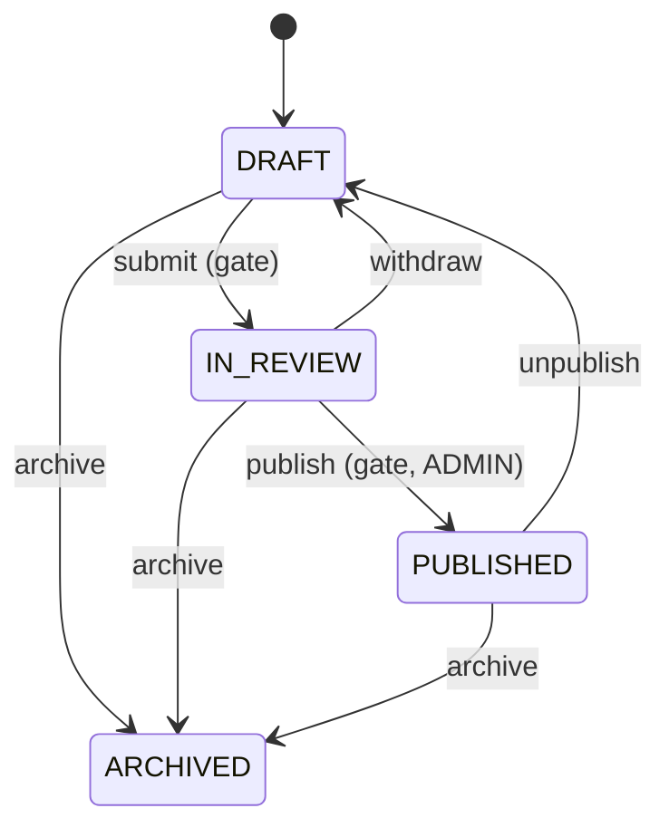

# State — the course lifecycle, where an illegal transition can't be written

> **One-liner:** let an object's **current state decide what it may do next**. Each state is its
> own type that answers only the events legal from it; everything else is refused in one place.

**Type:** Behavioral · **Status:** built (Phase 6.2) · **Last updated:** 2026-10-03
**Real code:** `com.masternova.api.catalog.domain.CourseState` (sealed: `Draft`, `InReview`, `Published`, `Archived`) · used by `Course.transition(action, now)`
**Lab:** [`lab/.../patterns/state/`](../lab/src/main/java/com/masternova/patterns/state/): the same machine written three ways (switch table, enum with bodies, sealed interface + default methods), and a test that the three agree on every pair.

**Trigger phrase:** "status", "lifecycle", "workflow", "can only … when …", "once X it can never …",
"approve / reject / archive".

## 1. The problem in Masternova

A course moves `DRAFT → IN_REVIEW → PUBLISHED`, can step back (withdraw, unpublish), and can be
archived from any live state. Archived is terminal. The status decides what the public sees
(`PUBLISHED`) and what can be sold, so a wrong transition is a real incident: a draft on sale, or a
course taken down for a rights complaint quietly restored.

Without the pattern the rules scatter:

```java
// ❌ in the service, in the controller, in a scheduled job…
if (course.getStatus() == DRAFT || course.getStatus() == IN_REVIEW) { course.setStatus(PUBLISHED); }
```

Every caller re-implements part of the diagram, and one of them will add `DRAFT → PUBLISHED`
"for testing", making review optional.

## 2. Structure



| GoF role | Masternova | Responsibility |
|---|---|---|
| Context | `Course` (keeps the persisted `CourseStatus`) | delegates "may I do X?" to its state, then applies the result |
| State (interface) | `CourseState` (sealed) | declares every event; the **default** answers are "illegal" |
| Concrete states | `Draft`, `InReview`, `Published`, `Archived` (records) | override only their legal events |

## 3. Code walkthrough

```java
public sealed interface CourseState {
  CourseStatus status();

  // ⭐ every event defaults to "illegal": a state that says nothing refuses
  default CourseStatus submit()    { throw illegal(SUBMIT); }
  default CourseStatus withdraw()  { throw illegal(WITHDRAW); }
  default CourseStatus publish()   { throw illegal(PUBLISH); }
  default CourseStatus unpublish() { throw illegal(UNPUBLISH); }
  default CourseStatus archive()   { return ARCHIVED; }        // legal from every live state
  default boolean acceptsEdits()   { return true; }

  record Draft() implements CourseState {
    public CourseStatus submit() { return IN_REVIEW; }          // the ONLY way out of DRAFT (but archive)
  }
  record InReview() implements CourseState {
    public CourseStatus publish()  { return PUBLISHED; }
    public CourseStatus withdraw() { return DRAFT; }
  }
  record Published() implements CourseState {
    public CourseStatus unpublish() { return DRAFT; }
  }
  record Archived() implements CourseState {
    public CourseStatus archive() { throw …; }                 // terminal
    public boolean acceptsEdits() { return false; }            // read-only
  }

  static CourseState of(CourseStatus status) {                  // ⭐ exhaustive: sealed + enum
    return switch (status) {
      case DRAFT -> new Draft(); case IN_REVIEW -> new InReview();
      case PUBLISHED -> new Published(); case ARCHIVED -> new Archived();
    };
  }
}
```

The context applies it, together with the rules that aren't about the graph:

```java
public void transition(CourseAction action, Instant now) {
  CourseStatus next = state().on(action);                    // 1. legal from here? (409 otherwise)
  if (action.isGated()) {                                    // 2. submit/publish re-run the gate
    List<PublishCheck> problems = PublishGate.problems(this);
    if (!problems.isEmpty()) throw new RuleViolationException("COURSE_NOT_READY", …, Map.of("problems", problems));
  }
  status = next;
  if (next == PUBLISHED && publishedAt == null) publishedAt = micros(now);   // 3. stamped once
  touch(now);                                                // 4. bumps @Version: open tabs go stale
}
```

**Count the overrides: five**, and they *are* the diagram. The NestJS version rejected
"a class per state" because 4 states × 5 events = 20 methods, 17 of them `throw`. Java's default
methods remove those 17.

**What the state does NOT decide:** *who* may ask. "Only an ADMIN publishes" is an authorisation
rule, enforced by `@PreAuthorize` on `CourseLifecycleService.publish`. The state answers *whether
the course* may move; the service answers *whether this person* may move it.

## 4. Java features that make it nicer

- **Default methods** carry the "illegal" answer once; states override only what's legal.
- **Sealed interface + records**: a closed set of states; `of(status)` is an exhaustive `switch`,
  so adding a `CourseStatus` value doesn't compile until it has a state. Records compare by value
  (`new Draft().equals(new Draft())`) and could later carry data (`InReview(reviewerId)`).
- **Enum-switch exhaustiveness** in `on(action)`: a new `CourseAction` must be routed.
- **Persistence stays boring**: the column is a plain `@Enumerated(STRING)` enum; behaviour lives
  in the state objects, not in the JPA mapping.

| Style (all in the lab) | Good | Bad |
|---|---|---|
| switch table | everything in one screen | grows into the method everyone edits; rules of all states mixed |
| enum constants with bodies | compact; the state *is* the stored value | singletons only, no per-state data; behaviour inside the persistence type |
| ⭐ sealed interface + default methods | one type per state; illegal by default; exhaustive | a few more lines |

## 5. When NOT to use it

- **Two states and one transition** (`active`/`inactive`): a boolean and an `if`.
- **The rules are data, edited by non-developers** (a configurable approval workflow): use a
  transition table in the database or a workflow engine, not code.
- **Only the display differs by state**: that's a lookup (`Map<Status, Label>`), not behaviour.

## 6. Where Spring itself uses it

- **Spring State Machine** (`spring-statemachine`): a full framework (states, events, guards,
  actions, persistence). Too much for five edges; worth it for long-running workflows with timers.
- **Spring Batch** step/job execution status (`BatchStatus`, `ExitStatus`) and Spring Web Flow
  states.

## 7. Alternatives considered

| Alternative | Why not here |
|---|---|
| status checks in the service | the rules scatter across callers; nothing stops a `DRAFT → PUBLISHED` |
| an `EnumSet`-based transition table (`Map<Status, Set<Status>>`) | good for "is this edge legal?", but events also carry rules (gated or not), which a table of target states doesn't hold. Commerce's order machine (Phase 9) is closer to a pure table. |
| Spring State Machine | a framework for five edges |
| a `WHERE status = ?` conditional update per transition | `@Version` already rejects the second of two concurrent transitions (ADR-0010) |

## 8. Interview Q&A

- **Q:** What's the State pattern?
  **A:** An object delegates state-dependent behaviour to a state object; changing state swaps the
  object. Each state implements only what's legal from it, so illegal transitions aren't expressible.
- **Q:** State vs Strategy?
  **A:** Same shape (delegation to an interface), different intent. A strategy is chosen by the
  *client* and doesn't change itself; states *replace each other* as the object moves through its
  lifecycle.
- **Q:** How do you avoid a class with 17 methods that just throw?
  **A:** Put the "illegal" answer in the interface's default methods; each state overrides only its
  legal events. In Masternova that's 5 overrides for 4 states × 5 events.
- **Q:** How do you test a state machine?
  **A:** Write the diagram down as data (`Map<State, Map<Event, State>>`) and assert every
  (state, event) pair against it, legal *and* illegal: 20 cases. Plus one named test for the edge
  that must never exist (`DRAFT → PUBLISHED`).
- **Q:** Two people trigger conflicting transitions at once?
  **A:** Each is legal from what its caller read. Optimistic locking (`@Version`) makes the second
  commit fail instead of overwriting (`CourseLifecycleIT.aTransitionBasedOnAStaleCopyIsRejectedByTheVersion`).

## 9. 30-second recall

- **Intent:** behaviour depends on state; states replace each other; illegal = unrepresentable.
- **Roles:** context (`Course`) · state interface (`CourseState`) · concrete states (records).
- **In Masternova:** sealed interface, **default methods throw**, 5 overrides = the diagram; gated
  edges re-run the publish gate; `publishedAt` stamped once; a transition bumps `@Version`; ADMIN-only
  publish is authorisation, not state.
- **Pitfalls:** status `if`s in services · state objects deciding *who* · forgetting concurrency
  (two legal transitions racing).

*Related:* [Specification](08-specification.md) (the publish gate) · [Strategy](01-strategy.md) · LLD: [`docs/lld/catalog-authoring.md`](../../docs/lld/catalog-authoring.md) §3
