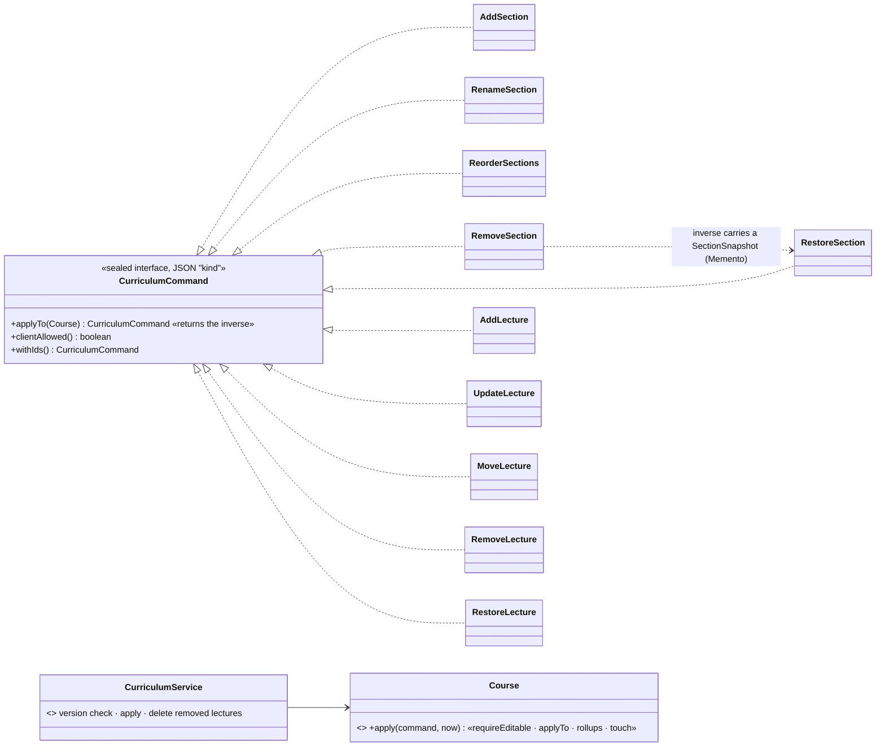

# Command — every curriculum edit is a value that knows its own undo

> **One-liner:** turn a request into an **object** you can pass around, store and replay. Masternova's
> twist: each command's `applyTo` performs the edit **and returns the command that undoes it**,
> computed at the only moment the information exists.

**Type:** Behavioral · **Status:** built (Phase 6.4) · **Last updated:** 2026-10-03
**Real code:** `com.masternova.api.catalog.domain.CurriculumCommand` (sealed records, `@JsonTypeInfo(property = "kind")`) · applied by `Course.apply(command, now)` · `CurriculumService`
**Lab:** [`lab/.../patterns/command/`](../lab/src/main/java/com/masternova/patterns/command/): an outline editor whose edits return their inverses, plus an undo/redo history.

**Trigger phrase:** "undo", "redo", "history", "replay", "queue this", "do it later", "log every
change", "one endpoint for many kinds of edit".

## 1. The problem in Masternova

The curriculum editor (6.8) needs: add/rename/reorder/remove sections, add/edit/move/remove
lectures, and **Ctrl+Z**. As REST it would be nine endpoints, nine service methods, and an undo that
has to know how to reverse each of them, with the reversal information already gone:

- The undo of "remove section 3" is "put back section 3 **with its four lectures, same ids**".
- After the `DELETE` runs, those lectures don't exist anymore. The inverse can't be derived at undo
  time; it must be captured **while** the edit is applied.

## 2. Structure



| GoF role | Masternova | Responsibility |
|---|---|---|
| Command | `CurriculumCommand` (10 records) | one edit as data |
| Receiver | `Course` (the aggregate root) | does the actual work through its own methods |
| Invoker | `CurriculumService` (and, in 6.5, undo/redo) | checks who/version, applies, persists |
| Client | the editor (Angular) | builds `{"kind": "MOVE_LECTURE", …}` |

| Command | Its inverse |
|---|---|
| `AddSection(id, title)` | `RemoveSection(id)` |
| `RenameSection(id, title)` | `RenameSection(id, oldTitle)` |
| `ReorderSections(order)` | `ReorderSections(oldOrder)` |
| `RemoveSection(id)` | `RestoreSection(snapshot, position)` |
| `AddLecture(id, section, …)` | `RemoveLecture(id)` |
| `UpdateLecture(id, title, preview)` | `UpdateLecture(id, oldTitle, oldPreview)` |
| `MoveLecture(id, toSection, toPos)` | `MoveLecture(id, fromSection, fromPos)` |
| `RemoveLecture(id)` | `RestoreLecture(snapshot, section, position)` |

## 3. Code walkthrough

```java
record RemoveSection(UUID sectionId) implements CurriculumCommand {
  public CurriculumCommand applyTo(Course course) {
    int position = course.positionOf(sectionId);
    SectionSnapshot snapshot = course.removeSection(sectionId); // ⭐ captured BEFORE the delete
    return new RestoreSection(snapshot, position);              // …so the inverse can carry it
  }
}

record MoveLecture(UUID lectureId, UUID toSectionId, int toPosition) implements CurriculumCommand {
  public CurriculumCommand applyTo(Course course) {
    Course.Place from = course.placeOf(lectureId);              // where it was
    course.moveLecture(lectureId, toSectionId, toPosition);
    return new MoveLecture(lectureId, from.sectionId(), from.position());
  }
}
```

The receiver applies any command the same way, so no edit can skip a rule:

```java
public CurriculumCommand apply(CurriculumCommand command, Instant now) {
  requireEditable();                                  // archived → 409
  CurriculumCommand inverse = command.applyTo(this);
  recomputeRollups();                                 // lectureCount / duration can't drift
  touch(now);                                         // the root's version covers the edit (ADR-0010)
  return inverse;
}
```

**Commands are JSON** (API conventions §6), one route for every edit:

```json
POST /api/v1/instructor/courses/{id}/curriculum
{ "expectedVersion": 7,
  "command": { "kind": "MOVE_LECTURE", "lectureId": "…", "toSectionId": "…", "toPosition": 0 } }
```

```java
@JsonTypeInfo(use = JsonTypeInfo.Id.NAME, property = "kind")
@JsonSubTypes({ @Type(value = AddSection.class, name = "ADD_SECTION"), … })
public sealed interface CurriculumCommand { … }
```

**Four details that matter:**

1. **Ids in the command.** `AddSection` without an id gets one (`withIds()`) *before* it's applied
   and stored. A redo of "add section" must recreate the **same** id, or the redo of "add a lecture
   to it" points nowhere.
2. **Server-only kinds.** `RESTORE_*` exist only as inverses (`clientAllowed() == false`, 400 if
   sent). A client-made snapshot could attach another course's media asset ids.
3. **No field named like the type property.** `AddLecture`'s lecture kind is `lectureKind`;
   `"kind"` is the command's discriminator.
4. **Jackson 3 refuses `null` for primitives** (`FAIL_ON_NULL_FOR_PRIMITIVES` is on by default):
   optional fields are boxed (`Boolean preview`) and defaulted in the compact constructor. Found by
   `CurriculumCommandJsonTest`.

## 4. Java features that make it nicer

- **Sealed interface of records**: the commands are a closed union, each a compact immutable value
  with validation in its compact constructor (bad input fails while Jackson builds it: a 400, never
  a half-applied edit).
- **`@JsonTypeInfo` + `@JsonSubTypes`** map the union to `{"kind": …}` both ways: the request in,
  the history (6.5) out and back.
- **Records compare by value**, so tests assert `assertThat(read).isEqualTo(new AddLecture(…))`.

## 5. When NOT to use it

- **One kind of write** (save a form): a PUT is simpler. The details step stays a PUT; only the
  curriculum, with its many edit kinds and its undo, is commands.
- **No undo, no replay, no queue**: a command object adds a type per action for nothing.
- **Inverses you can't compute** (an email was sent): use a compensating action, or record that
  the command isn't undoable.

## 6. Where Spring itself uses it

- `Runnable` / `Callable` submitted to an `Executor` or `@Async`: an action as an object.
- `TransactionCallback` (`TransactionTemplate.execute`), `JdbcTemplate`'s `ConnectionCallback`.
- Spring Batch `Tasklet` / `Step`, Spring Integration `Message`s with headers as the "kind".

## 7. Alternatives considered

| Alternative | Why not here |
|---|---|
| nine REST endpoints | not invertible; a new edit touches the controller, the service and the undo path |
| deriving the inverse at undo time | impossible: the removed content is gone after the delete |
| storing a full snapshot per edit (Memento only) | built and compared in 6.5 (size grows with the curriculum; intent is lost) |
| `(id, newIndex)` partial reorders | two tabs dragging different rows produce an order neither asked for; the whole order is a total operation |
| letting clients send `RESTORE_*` | a forged snapshot could reference other courses' media |

## 8. Interview Q&A

- **Q:** What is the Command pattern?
  **A:** A request as an object, with everything needed to execute it, so it can be queued, logged,
  replayed or undone. Roles: command, receiver (does the work), invoker (triggers it), client.
- **Q:** How do you implement undo with commands?
  **A:** Each command, when applied, returns its inverse; keep (command, inverse) pairs on a stack.
  Undo applies the inverse, redo re-applies the command; a new command clears the redo stack.
- **Q:** Why compute the inverse during `apply`?
  **A:** Because destructive edits erase what the inverse needs. "Remove section" must capture the
  section and its lectures before the delete; that snapshot is a Memento carried by the inverse.
- **Q:** How did you expose commands over HTTP?
  **A:** One endpoint; the body is a discriminated union on `kind`, read by Jackson into a sealed
  type. Adding an edit is adding a record.
- **Q:** What broke when you ran it on a real database?
  **A:** Three things, all found by `CurriculumIT`. Moving a lecture between sections under
  `orphanRemoval` deleted it. Two concurrent edits deadlocked under the deferred position constraint
  until the edit locked the course row first. And Jackson 3 rejected omitted primitive fields.

## 9. 30-second recall

- **Intent:** a request as a value: store, replay, undo.
- **Roles:** command (10 sealed records) · receiver (`Course`) · invoker (`CurriculumService`) ·
  client (the editor).
- **In Masternova:** `applyTo` returns the inverse (removals carry a Memento); ids generated before
  applying (redo-safe); `RESTORE_*` server-only; one JSON route; `Course.apply` = editable check +
  rollups + version touch.
- **Pitfalls:** inverses computed too late · client-forged restores · a field named like the type
  property · Jackson 3 primitives.

*Related:* [Memento](05-memento.md) · [State](02-state.md) · LLD: [`docs/lld/catalog-authoring.md`](../../docs/lld/catalog-authoring.md) §6
