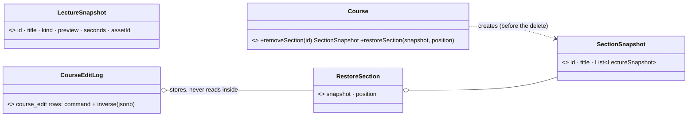

# Memento — capture what an edit destroys, so it can be put back

> **One-liner:** save an object's state in an **opaque, immutable snapshot** that only the object
> can create and read, so something else (a history) can keep it and later hand it back for a
> restore, without breaking encapsulation.

**Type:** Behavioral · **Status:** built (Phase 6.5) · **Last updated:** 2026-10-03
**Real code:** `com.masternova.api.catalog.domain.SectionSnapshot` / `LectureSnapshot` (mementos) · `Course` (originator: `removeSection` captures, `restoreSection` restores) · `com.masternova.api.catalog.domain.CourseEditLog` (caretaker, the `course_edit` table)
**Lab:** [`lab/.../patterns/memento/`](../lab/src/main/java/com/masternova/patterns/memento/): the classic form (originator, private-content memento, snapshot-stack caretaker), which is the design ADR-0011 measured and did **not** ship for whole-curriculum undo.

**Trigger phrase:** "undo", "restore", "roll back to", "keep a copy before", "put it back exactly as
it was", "checkpoint".

## 1. The problem in Masternova

Undo of "remove section *Core*" must bring back *Core* **with its five lectures, the same ids, the
same order, the same media assets**. After the `DELETE` none of that exists. Something must capture
it **before** the delete, keep it safely, and restore it later, possibly in another api replica, days
later.

There were two ways to use the pattern ([ADR-0011](../../docs/adr/0011-undo-with-stored-inverses.md)):

| Design | Memento holds | Per-edit cost (10×5 course) |
|---|---|---:|
| snapshot stack (the lab) | the **whole** curriculum before every edit | 7,541 B |
| ⭐ shipped: Command + a small Memento | only what a **removal** destroyed, carried by the inverse command | 193–880 B |

## 2. Structure



| GoF role | Masternova | Responsibility |
|---|---|---|
| Originator | `Course` | captures (`section.snapshot()` inside `removeSection`) and restores (`restoreSection`) its own state |
| Memento | `SectionSnapshot`, `LectureSnapshot` (records) | immutable copy of exactly what's needed to restore |
| Caretaker | `CourseEditLog` (`course_edit`) | keeps the mementos (inside inverse commands) and hands them back on undo, without interpreting them |

## 3. Code walkthrough

```java
// Course (originator) — capture BEFORE destroying
SectionSnapshot removeSection(UUID sectionId) {
  Section section = section(sectionId);
  SectionSnapshot snapshot = section.snapshot();   // ⭐ the Memento, while the data still exists
  sections.remove(section);                        // orphanRemoval → DELETE, lectures cascade
  renumberSections();
  return snapshot;
}

// …restore from it, with the SAME ids
void restoreSection(SectionSnapshot snapshot, int position) {
  Section section = new Section(snapshot.id(), this, snapshot.title(), 0);
  for (int i = 0; i < snapshot.lectures().size(); i++) {
    section.insert(Lecture.restore(section, snapshot.lectures().get(i), i), i);
  }
  sections.add(Math.clamp(position, 0, sections.size()), section);
  renumberSections();
}

// The command that removes returns the command that restores, carrying the memento
record RemoveSection(UUID sectionId) implements CurriculumCommand {
  public CurriculumCommand applyTo(Course course) {
    int position = course.positionOf(sectionId);
    return new RestoreSection(course.removeSection(sectionId), position);
  }
}
```

The caretaker stores the inverse as JSON and never looks inside it:

```sql
INSERT INTO course_edit (…, command, inverse, …) VALUES (…, '{"kind":"REMOVE_SECTION",…}',
  '{"kind":"RESTORE_SECTION","snapshot":{"id":"…","title":"Core","lectures":[…]},"position":1}', …)
```

**Encapsulation, the Java way.** GoF makes the memento's content readable only by the originator
(a private nested class, as in the lab's `Draft.Memento`). Here the mementos are public records
because they must be JSON-serialisable for the history table. The protection moved: clients **can't
send** a `RESTORE_*` command (`clientAllowed() == false` → 400), so no one can forge a snapshot
(e.g. one pointing at another course's media assets).

## 4. Java features that make it nicer

- **Records** are ideal mementos: immutable, value-equal (tests compare a restored state with
  `isEqualTo`), and Jackson serialises them without setters.
- `List.copyOf` in the compact constructor: a memento must not share mutable state with the live
  object, or a later edit would change the "saved" past.
- The lab's private nested class shows the original GoF encapsulation (only `Draft` reads it).

## 5. When NOT to use it

- **The state is huge and edits are small**: a full snapshot per edit wastes space (the measured
  7.5 KB vs 0.2 KB). Prefer inverse commands and snapshot only what's destroyed.
- **The state includes things you can't copy**: open connections, external side effects (an email
  sent). A memento can't un-send.
- **You need the history's meaning**: snapshots record *what it looked like*, not *what happened*.

## 6. Where Spring itself uses it

- Transaction **savepoints** (`TransactionStatus.createSavepoint()` / `rollbackToSavepoint`): the
  database keeps the memento; your code holds an opaque handle.
- Hibernate's **dirty-checking snapshot**: on load, Hibernate keeps a copy of each entity's state
  (a memento it alone reads) and compares at flush (note 10 §5).
- Spring Web Flow / Spring State Machine persist flow or machine state as snapshots to resume later.

## 7. Alternatives considered

| Alternative | Why not here |
|---|---|
| snapshot stack for whole-curriculum undo | measured: 9–39× bigger per edit, loses intent, a second bulk write path (ADR-0011) |
| soft-delete instead of a memento (`deleted_at` on sections/lectures) | every query must remember to filter it; restoring order still needs the old position |
| re-reading the removed rows from an audit table | needs a full audit of every column; the snapshot is exactly what restore needs |

## 8. Interview Q&A

- **Q:** What's the Memento pattern?
  **A:** Capturing an object's internal state in an opaque object so it can be restored later,
  without exposing the internals. Roles: originator (creates/restores), memento (the snapshot),
  caretaker (stores it, doesn't look inside).
- **Q:** Memento vs Command for undo?
  **A:** Memento stores *states*; Command stores *operations* and their inverses. Snapshots are
  simple and always correct but cost the whole state per step; commands are small and keep intent
  but each needs a correct inverse. Masternova combines them: commands, with a memento of only what
  a removal destroys.
- **Q:** Why capture the state before the operation, not at undo time?
  **A:** After a delete, the data is gone. The only moment the inverse can be computed is during the
  edit.
- **Q:** How do you protect a memento that has to be serialised?
  **A:** Make it immutable, and don't let untrusted callers hand one back: restore commands are
  server-only.

## 9. 30-second recall

- **Intent:** opaque snapshot → keep → restore, without exposing internals.
- **Roles:** originator (`Course`) · memento (`SectionSnapshot`/`LectureSnapshot` records) ·
  caretaker (`CourseEditLog`).
- **In Masternova:** captured *inside* the removal, carried by the inverse command, stored as jsonb,
  restores the **same ids**. The whole-curriculum snapshot stack was built (lab), measured (7.5 KB
  vs ≤0.9 KB per edit) and not shipped.
- **Pitfalls:** shared mutable state inside a memento · snapshots of things you can't copy ·
  client-forged mementos.

*Related:* [Command](04-command.md) · [Prototype](11-prototype.md) (copies to *create*, not to *restore*) · ADR: [0011](../../docs/adr/0011-undo-with-stored-inverses.md)
