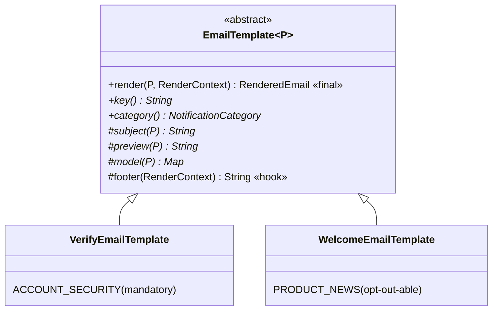

# Template Method — a fixed skeleton, with only the varying steps left open

> **One-liner:** a base class owns the **algorithm's skeleton** in a `final` method and calls
> **abstract steps** (which subclasses must supply) and **hooks** (which they may override). The
> order of the steps, and the steps nobody may skip, live in exactly one place.

**Type:** Behavioral · **Status:** ✅ in real code · **Last updated:** 2026-10-02
**Real code:**
- [`EmailTemplate`](../../backend/worker/src/main/java/com/masternova/worker/notification/template/EmailTemplate.java) (`@DesignPattern(TEMPLATE_METHOD, "AbstractClass")`).
- Its subclasses [`VerifyEmailTemplate`](../../backend/worker/src/main/java/com/masternova/worker/notification/template/VerifyEmailTemplate.java) and [`WelcomeEmailTemplate`](../../backend/worker/src/main/java/com/masternova/worker/notification/template/WelcomeEmailTemplate.java) ("ConcreteClass").
- The Thymeleaf files they render: [`templates/email/`](../../backend/worker/src/main/resources/templates/email/).

**Proof:** [`EmailTemplateTest`](../../backend/worker/src/test/java/com/masternova/worker/notification/template/EmailTemplateTest.java) · **Lab:** [`lab/.../java/oop/template/`](../lab/src/main/java/com/masternova/java/oop/template/) (plain-Java version) · **Background:** [Java note 06 §4](../java/06-oop-composition-over-inheritance.md) (when inheritance is right) · **Design:** [`docs/lld/notification.md`](../../docs/lld/notification.md)

**Trigger phrase:**
- "*every X must do A, then B, then C, but B differs per X*";
- "*no email may ever go out without …*".

## 1. The problem in Masternova

Every email the product sends must:

1. have a subject and a hidden inbox **preview** line;
2. render through the **shared layout** (logo, table layout, inline styles, because email clients
   aren't browsers);
3. ship a **plaintext part** too (a missing text part scores as spam);
4. end with a footer, and, for **opt-out-able** categories, an **unsubscribe link** (the law in
   many places).

Without the pattern, each email class assembles all of that itself. The first time someone adds
a "course published" email and forgets the unsubscribe link or the text part, it ships. The bug
is *in the one email nobody tested for it*.

## 2. Structure



| GoF role | Masternova | Responsibility |
|---|---|---|
| AbstractClass | `EmailTemplate<P>` | `render` (final): the invariant checks, the context, the HTML via the layout, the text part, the footer |
| primitive operations (abstract) | `key()`, `category()`, `subject(P)`, `preview(P)`, `model(P)` | what differs per email |
| hook (overridable default) | `footer(RenderContext)` | rarely changed; has a sensible default |
| ConcreteClass | `VerifyEmailTemplate`, `WelcomeEmailTemplate` | fill in the steps; never touch the order |

## 3. Code walkthrough

```java
public final RenderedEmail render(P payload, RenderContext ctx) {          // ⭐ final: the skeleton is not negotiable
  if (!category().mandatory() && ctx.unsubscribeUrl().isEmpty()) {          // ⭐ an invariant ENFORCED, not documented
    throw new IllegalStateException(key() + " is " + category() + ": needs an unsubscribe link");
  }
  String subject = subject(payload);                                          // step (abstract)
  Context context = new Context(Locale.ENGLISH);
  context.setVariables(model(payload));                                       // step (abstract)
  context.setVariable("subject", subject);
  context.setVariable("preview", preview(payload));                           // step (abstract)
  context.setVariable("unsubscribeUrl", ctx.unsubscribeUrl().map(Object::toString).orElse(null));

  String html = engine.process("email/" + key() + ".html", context);         // content → layout.html
  String text = engine.process("email/" + key() + ".txt", context) + footer(ctx);   // hook
  return new RenderedEmail(subject, html, text);
}
```

A concrete email is now only *content*:

```java
public class WelcomeEmailTemplate extends EmailTemplate<WelcomeEmailTemplate.Payload> {
  public record Payload(String displayName, URI browseUrl) {}               // ⭐ typed payload: no Map<String,Object> guessing
  public String key() { return "welcome"; }
  public NotificationCategory category() { return NotificationCategory.PRODUCT_NEWS; }
  protected String subject(Payload p) { return "Welcome to Masternova, " + p.displayName(); }
  protected String preview(Payload p) { return "Your account is verified. Here's where to start."; }
  protected Map<String, Object> model(Payload p) { return Map.of("displayName", p.displayName(), …); }
}
```

**The skeleton spans two technologies.** The *Java* skeleton is `render`. The *HTML* skeleton is
`layout.html`, which every content template plugs into with
`th:replace="~{email/layout.html :: layout(~{::main})}"`. That's the Thymeleaf version of the same
idea: the layout decides the structure, and the content fills one slot.

What the tests prove (`EmailTemplateTest`, no Spring context):

| Test | Shows |
|---|---|
| `theVerificationEmailHasSubjectHtmlAndAPlaintextTwin` | the layout and preview are applied, the text twin exists, and the footer is added by the skeleton |
| `anOptionalEmailCannotBeRenderedWithoutAnUnsubscribeLink` | ⭐ the invariant fails **before anything is sent** |
| `userTextIsHtmlEscapedSoANameCannotInjectMarkup` | a display name `<script>` renders as `&lt;script&gt;` (Thymeleaf HTML mode escapes `th:text`) |
| `theSkeletonIsFinalSoNoEmailCanSkipASteps` | `render` is `final`, checked by reflection |

## 4. Java features that make it nicer

- **`final` on the template method:** the compiler enforces "you may not reorder or skip steps".
- **`protected abstract`:** steps are visible to subclasses, not to callers.
- **Generics (`EmailTemplate<P>`) + nested payload records:** each email declares exactly what
  it needs. `SendWelcomeEmail` can't hand a `VerifyEmailTemplate.Payload` to the welcome email:
  it doesn't compile.
- **Records for payloads:** immutable, `equals` for free, readable in tests.

## 5. When NOT to use it

- **The steps vary independently,** or need to be combined at runtime. Use **Strategy** or
  **Decorator** (composition), not a subclass per combination.
- **Only one implementation exists:** then it's just a method.
- **The base class wasn't designed for extension** (no `final` skeleton, no documented steps).
  Inheriting from it is the fragile base-class problem (Java note 06 §2).
- **Deep hierarchies:** one level of concrete classes under the template is the sweet spot.

## 6. Where Spring itself uses it

- `JdbcTemplate`, `RestTemplate`, `TransactionTemplate`: the "…Template" classes own the
  skeleton (open, execute, translate exceptions, close), and **you pass the varying step as a
  callback** (lambda). That's Template Method with composition instead of inheritance.
- `AbstractController`, `OncePerRequestFilter` (`doFilterInternal` is the step;
  `doFilter` is the final skeleton). Our `IdempotencyFilter` extends it.
- `AbstractPlatformTransactionManager`: `getTransaction`/`commit` are the skeleton; `doBegin`,
  `doCommit`, `doRollback` are the steps. Our `TransactionalEventPublisherTest` subclasses it.

## 7. Alternatives considered

| Alternative | Why not here |
|---|---|
| each email builds its own HTML and text | the "forgot the unsubscribe link" bug ships with the one email nobody checked |
| a `Map<String, Object>` model + one generic "email" class | no type safety on payloads; invariants checked by convention |
| Strategy (inject a "content provider" into one Email class) | works too (Spring's `…Template` + callback style), but the steps here belong together per email: subject, preview and model are one cohesive unit, so a subclass reads more naturally |
| a template registry keyed by `key()` | handlers inject their template directly (typed). A registry is only needed when the template is chosen from *data*; not yet. |

## 8. Interview Q&A

- **Q: Template Method vs Strategy?**
  **A:** Template Method uses **inheritance**: the skeleton is in the base class and steps are
  overridden; fixed at compile time per subclass. Strategy uses **composition**: the varying
  algorithm is an object passed in, swappable at runtime. Spring's `JdbcTemplate` + callback is
  the composition flavour of the same idea.
- **Q: What's a hook?**
  **A:** A step with a default implementation that subclasses *may* override (our `footer`),
  unlike an abstract step they *must* implement.
- **Q: Why make the template method `final`?**
  **A:** So no subclass can reorder or skip the invariant steps. In our case: the plaintext part,
  the layout and the unsubscribe-link check.
- **Q: When is inheritance the right tool?**
  **A:** When the parent is designed and documented for extension, with a final skeleton and
  explicit steps, and the hierarchy is shallow. Template Method is the classic case.

## 9. 30-second recall

- **Intent:** a `final` skeleton in the base class; abstract steps + optional hooks in subclasses.
- **In Masternova:**
  - `EmailTemplate.render`: an unsubscribe-link invariant → model → HTML through `layout.html`
    → text twin → footer.
  - `VerifyEmailTemplate` / `WelcomeEmailTemplate` supply only subject, preview and model.
  - Generic payload records keep it type-safe.
- **Proof:** an optional email without an unsubscribe link fails before sending; names are
  escaped; `render` is final.
- **Spring's flavour:** `JdbcTemplate` & co. (skeleton + callback), `OncePerRequestFilter`.

*Related:* [Strategy (01)](01-strategy.md) · [Factory Method / Registry (09)](09-factory-method-registry.md) · [Java note 06](../java/06-oop-composition-over-inheritance.md)
