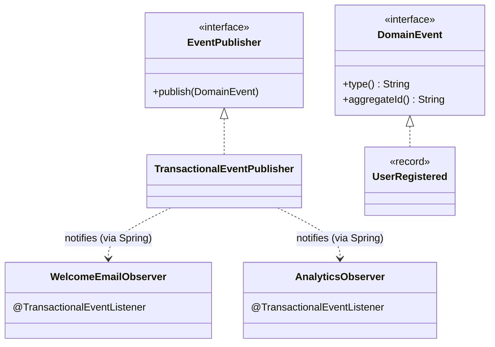

# Observer — "something happened"; whoever cares, reacts

> **One-liner:** a subject announces events, and any number of observers react to them,
> **without the subject knowing who they are**. Adding a reaction means adding an observer, never
> editing the publisher.

**Type:** Behavioral · **Status:** ✅ in real code · **Last updated:** 2026-10-02
**Real code:** [`TransactionalEventPublisher`](../../backend/api/src/main/java/com/masternova/api/platform/events/TransactionalEventPublisher.java) (`@DesignPattern(OBSERVER, "Subject")`), behind the module API [`EventPublisher`](../../backend/api/src/main/java/com/masternova/api/platform/EventPublisher.java); events implement [`DomainEvent`](../../backend/kernel/src/main/java/com/masternova/kernel/event/DomainEvent.java)
**Lab:** [`lab/.../patterns/observer/EventBus`](../lab/src/main/java/com/masternova/patterns/observer/EventBus.java) · **Design:** [`docs/lld/platform-kernel.md`](../../docs/lld/platform-kernel.md)

**Trigger phrase:** "*when X happens, also do Y*", especially when Y belongs to **another
module** and the list of Ys will grow.

## 1. The problem in Masternova

When a learner registers, the system must send a welcome email (notification), create default
preferences, maybe add them to analytics… Without Observer, `IdentityService.register()` calls
each of those directly:

```java
userRepository.save(user);
mailService.sendWelcome(user);              // identity now depends on notification
preferencesService.createDefaults(user);    // … and on preferences
analytics.track("signup", user);            // … and on analytics; every new reaction = edit identity
```

Identity becomes coupled to every module that cares about signups. The modular-monolith
boundaries (ADR-0001) collapse.

**With Observer**, identity says one thing, `events.publish(new UserRegistered(id))`, and every
interested module subscribes on its own. Identity's dependencies don't grow.

## 2. Structure



| GoF role | Masternova | Responsibility |
|---|---|---|
| Subject | `EventPublisher` / `TransactionalEventPublisher` (lab: `EventBus`) | accepts events, notifies observers |
| Observer | any bean method with `@TransactionalEventListener` / `@EventListener` (lab: a `Consumer`) | reacts to one event type |
| Event (the notification) | a `DomainEvent` record: `UserRegistered`, `OrderPaid` | immutable fact, past tense |

## 3. Code walkthrough

**Real code:** publishing is only allowed inside a transaction:

```java
@Transactional(propagation = Propagation.MANDATORY)   // ⭐ join the caller's transaction or fail
public void publish(DomainEvent event) {
  springEvents.publishEvent(event);                    // Spring finds the observers by event type
}
```

**Observer timing:** this is what makes Spring's version production-grade.
`TransactionalEventPublisherTest` records it:

```text
@TransactionalEventListener (AFTER_COMMIT):  tx: begin → tx: commit → observer runs
@EventListener:                              tx: begin → observer runs → tx: commit
rolled back:                                 tx: begin → @EventListener ran → tx: rollback   (AFTER_COMMIT never runs)
```

**Lab:** the mechanism without Spring (`EventBus`):

```java
public <E> Subscription subscribe(Class<E> type, Consumer<? super E> observer)   // typed (note 04)
public PublishResult publish(Object event) {
  for (Subscriber<?> s : subscribers) {
    if (!s.type().isInstance(event)) continue;   // supertype subscriptions work too
    try { s.deliver(event); } catch (RuntimeException e) { failures.add(e); }   // ⭐ isolation
  }
}
```

## 4. Java features that make it nicer

- **Records for events:** immutable facts with free `equals`, safe to hand to many observers.
- **Sealed event families:** `sealed interface CourseEvent` lets an observer `switch` over every
  course event exhaustively (note 02).
- **`Consumer<? super E>`:** a handler for a supertype can observe subtypes (PECS, note 04).
- **`CopyOnWriteArrayList`:** subscribe/cancel during delivery without
  `ConcurrentModificationException`.

## 5. When NOT to use it

- **The caller needs the result** ("check the coupon, then charge"). That's a direct call, not an
  event. Events are fire-and-forget facts.
- **The reaction MUST happen and must survive a crash** (send the receipt, grant access).
  In-process observers die with the process. That's the **Transactional Outbox**
  ([pattern 17](17-transactional-outbox.md)), which delivers the same events durably.
- **One subscriber, forever, in the same module.** Just call the method; indirection without a
  force is noise.
- **Ordering across observers matters.** Observers should be independent.

## 6. Where Spring itself uses it

- `ApplicationEventPublisher` + `@EventListener` / `@TransactionalEventListener`
- application lifecycle events: `ApplicationReadyEvent`, `ContextClosedEvent`
- Spring Modulith's `@ApplicationModuleListener` (async + transactional + persisted)
- Hibernate's entity listeners (`@PostPersist`); servlet `ServletContextListener`

## 7. Alternatives considered

| Alternative | Why not / when instead |
|---|---|
| direct method calls | couples the publisher to every reactor; fine when there's exactly one |
| **Mediator** | a central object *coordinates* participants and knows the workflow. Observer only broadcasts. |
| **Pub/Sub via a broker** (Kafka) | Observer across processes. Adds infrastructure; for us the outbox + worker does this job. |
| Spring Modulith event registry | persisted in-process observers. ADR-0005 (task 2.5) compares it with our outbox. |

## 8. Interview Q&A

- **Q: Observer vs Pub/Sub?**
  **A:** Observer is usually in-process, and the subject holds its observers. Pub/Sub puts a
  broker between publishers and subscribers (topics), so they never reference each other and can
  live in different processes.
- **Q: `@EventListener` vs `@TransactionalEventListener`?**
  **A:** The first runs synchronously, inside the publisher's transaction. The second runs at a
  transaction phase (AFTER_COMMIT by default), so it never sees rolled-back changes.
- **Q: What's the risk of in-process observers?**
  **A:** If the process dies after commit but before an AFTER_COMMIT observer finishes, that
  reaction is lost. Use a transactional outbox for must-happen effects.
- **Q: How do you stop one failing observer from breaking the others?**
  **A:** Isolate each one: catch and report per observer (the lab's `PublishResult`), or run them
  asynchronously / via the outbox with retries.

## 9. 30-second recall

- **Intent:** a subject broadcasts facts and decoupled observers react; add a reaction by adding
  an observer.
- **In Masternova:** `EventPublisher.publish(event)` inside a transaction (`MANDATORY`), with
  `@TransactionalEventListener` observers that run after commit.
- **Rule:** facts in the past tense, as records, with a versioned `type()`. Must-happen
  reactions go through the outbox.
- **Pitfalls:**
  - Observers that need return values.
  - Observers depending on each other's order.
  - In-process observers losing work on a crash.

*Related:* [Transactional Outbox (17)](17-transactional-outbox.md) · [Strategy (01)](01-strategy.md) · Java notes [02 (sealed)](../java/02-sealed-types-and-pattern-matching.md), [09 (`@Transactional`)](../java/09-spring-aop-and-proxies.md)
