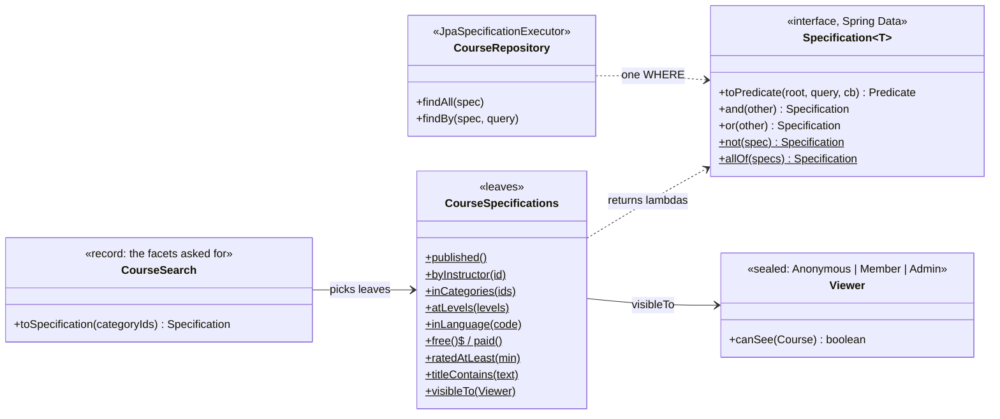

# Specification — a business rule as a small object you can combine and push into SQL

> **One-liner:** turn each filter or rule into a **named, composable object** (`and` / `or` /
> `not`), so a search with seven optional facets is "the AND of whichever leaves are present", and
> a rule like "who may see a draft" is written **once** and applied everywhere.

**Type:** Enterprise (Evans / Fowler, DDD) · **Status:** built (Phase 5.4) · **Last updated:** 2026-10-02
**Real code:** `com.masternova.api.catalog.domain.CourseSpecifications` (leaves) · `com.masternova.api.catalog.application.CourseSearch` (composes them) · `com.masternova.api.catalog.domain.Viewer` (the visibility rule's in-memory twin)
**Lab:** [`lab/.../patterns/specification/`](../lab/src/main/java/com/masternova/patterns/specification/): the full Evans form, both representations (`isSatisfiedBy` + `toWhere`), Spring-free.

**Trigger phrase:** "filter by any combination of…", "only if all of these hold", "the same rule
in the query and in the check", "explain why it was rejected" (Phase 6's publish gate).

## 1. The problem in Masternova

The public catalog takes up to **seven optional facets**: text, category (with its children),
levels, language, free/paid, minimum rating, plus the always-on "published only". That's 2⁷ = 128
combinations. Without the pattern you get this, and it grows every sprint:

```java
// ❌ the query-builder ladder
public List<Course> search(String text, String category, Set<CourseLevel> levels, ...) {
  StringBuilder jpql = new StringBuilder("select c from Course c where c.status = 'PUBLISHED'");
  Map<String, Object> params = new HashMap<>();
  if (text != null) { jpql.append(" and lower(c.title) like :text"); params.put("text", "%" + text + "%"); }
  if (category != null) { jpql.append(" and c.category.id in :cats"); params.put(...); }
  if (!levels.isEmpty()) { ... }
  // … one if per facet, string concatenation, untestable without a DB, and the "%" in the user's
  //   text silently became a wildcard
}
```

The second problem is worse: **visibility**. "A draft is visible to its owner and to admins only"
must hold in **every** query that can return a course (browse, instructor list, detail, search
later). Copied into each, one copy will eventually be updated and the others not, and a draft
leaks.

## 2. Structure



| Role | Masternova class | Responsibility |
|---|---|---|
| Specification (interface) | Spring Data's `Specification<Course>` | a predicate that can be combined and turned into SQL |
| Leaf (concrete specification) | each `CourseSpecifications.x()` | one named condition |
| Composite (and / or / not) | `Specification.allOf / and / or / not` | a tree of leaves = one `WHERE` |
| Client | `CourseSearch.toSpecification` | chooses leaves from what the visitor asked |
| Evaluator | `CourseRepository` (`JpaSpecificationExecutor`) | runs the tree as SQL |

## 3. Code walkthrough

**A leaf** is a lambda over the JPA Criteria API: `root` is the Course row, `cb` builds SQL.

```java
public static Specification<Course> published() {
  return (root, query, cb) -> cb.equal(root.get("status"), CourseStatus.PUBLISHED);
}

// ⭐ a path into the embedded value object: price.amountMinor → course.price_minor
public static Specification<Course> free() {
  return (root, query, cb) -> cb.equal(root.get("price").get("amountMinor"), 0L);
}

// ⭐ the user's text is a LITERAL: escape LIKE's wildcards (% and _), then match lower-case
public static Specification<Course> titleContains(String text) {
  String pattern = "%" + escapeLike(text.strip().toLowerCase(Locale.ROOT)) + "%";
  return (root, query, cb) -> cb.like(cb.lower(root.get("title")), pattern, '\\');
}
```

**The visibility rule**, once, as SQL, chosen by an exhaustive `switch` over a sealed type:

```java
public static Specification<Course> visibleTo(Viewer viewer) {
  return switch (viewer) {
    case Viewer.Admin _ -> Specification.unrestricted();          // everything
    case Viewer.Member(UUID id) -> published().or(byInstructor(id)); // + my own drafts
    case Viewer.Anonymous _ -> published();
  };
}
```

**Composition** happens in exactly one place, one line per facet:

```java
public Specification<Course> toSpecification(Collection<UUID> categoryIds) {
  List<Specification<Course>> specs = new ArrayList<>();
  specs.add(published());                              // always
  if (text != null) specs.add(titleContains(text));    // only facets that are present
  if (categorySlug != null) specs.add(inCategories(categoryIds));
  if (!levels.isEmpty()) specs.add(atLevels(levels));
  ...
  return Specification.allOf(specs);                   // ⭐ AND of the leaves present
}
```

Hibernate turns the tree into **one** statement:

```sql
select … from course c
where c.status = 'PUBLISHED'
  and lower(c.title) like ? escape '\'
  and c.category_id in (?, ?, ?, ?)
  and c.level in (?)
```

⭐⭐⭐ **Two representations, one rule.** The course page loads a course *by slug* (with an entity
graph), so visibility is checked in memory there: `viewer.canSee(course)`. Lists use the SQL form.
Two forms of one rule can drift, so `CourseSpecificationsIT.theSqlAndInMemoryVisibilityRulesAgree`
runs both over the same rows for five kinds of viewer and compares the results. The lab shows the
full Evans form, where every specification carries both (`isSatisfiedBy` and `toWhere`).

## 4. Java features that make it nicer

- **Lambdas:** Spring Data's `Specification` is a functional interface, so a leaf is one
  expression; no class per rule.
- **Static factory methods** with intention-revealing names (`published()`, `free()`) read like the
  requirement. Static imports make composition read like a sentence:
  `allOf(published(), free(), atLevels(BEGINNER))`.
- **Sealed interface + record patterns:** `Viewer` is `Anonymous | Member(id) | Admin(id)`, and
  `switch (viewer)` is exhaustive. Adding a `Reviewer` kind in Phase 6 is a compile error in every
  rule until it decides what a reviewer sees.
- **Records** for the search input (`CourseSearch`), normalised in the compact constructor (blank
  text → absent).

## 5. When NOT to use it

- **One or two fixed filters.** A derived query `findByStatusAndCategory(...)` is clearer. The
  force is *free* combination.
- **Complex reporting SQL** (window functions, CTEs, row comparisons). Criteria trees get unreadable
  and some SQL isn't expressible at all; use a native query or jOOQ. (5.9 measures whether the
  keyset predicate needs one.)
- **In-memory twins for every leaf.** Keep both forms only for rules that genuinely run in both
  places (visibility). A twin nobody calls is a second place to keep correct for nothing.
- **When the rule must explain itself.** Plain predicates only say yes/no. Phase 6's publish gate
  needs "why not" (coded problems), so it returns a list of violations instead of a boolean.

## 6. Where Spring itself uses it

- **Spring Data JPA `Specification<T>` + `JpaSpecificationExecutor`:** exactly this pattern, SQL
  half only. In Spring Data JPA 4: `Specification.unrestricted()` for "no restriction" (instead of the old
  `where(null)` idiom), `allOf` / `anyOf`, and `PredicateSpecification` for specs that don't need
  the query.
- **Querydsl `Predicate`** (`QuerydslPredicateExecutor`): the same idea with generated, type-safe
  paths.
- **Spring Security `RequestMatcher`s** (`AndRequestMatcher`, `OrRequestMatcher`,
  `NegatedRequestMatcher`): composable predicates over requests.

## 7. Alternatives considered

| Alternative | Why not here |
|---|---|
| a JPQL string built with `if`s | untestable without a DB, string concatenation, the ladder grows with every facet |
| one derived query per combination | 128 methods |
| Querydsl | type-safe paths, but an extra annotation processor and code generator for ten attribute names |
| jOOQ for the catalog | the right tool if the queries outgrow JPA; not yet (we'd lose entity loading + fetch graphs) |
| query by example (`Example.of(probe)`) | equality only: no `>=`, no `LIKE` with escaping, no `IN` over a category tree |
| the JPA static metamodel (`Course_.status`) | compile-time-checked names; worth it with many specs. Here an IT runs every leaf instead. |

## 8. Interview Q&A

- **Q:** What is the Specification pattern?
  **A:** A business rule as an object with one method ("is this candidate satisfied?") that can
  be combined with `and` / `or` / `not`. In a repository it's usually rendered as a query predicate
  so the database does the filtering. Spring Data's `Specification<T>` is that: a lambda over the
  JPA Criteria API.
- **Q:** How does it help with a search screen?
  **A:** Each facet is a leaf. The search ANDs whichever leaves are present. Adding a facet is one
  new leaf and one line where they're assembled; the repository method and the other facets don't
  change (Open/Closed). And each leaf can be tested on its own.
- **Q:** What's the risk?
  **A:** Rules with two representations (in memory and SQL) drift apart. Keep a twin only where both
  are used, and test that they agree on the same data. Also: string attribute names fail at
  runtime, so run every leaf against the real database in a test (or use the metamodel).
- **Q:** What do `allOf()` and `anyOf()` of nothing mean?
  **A:** AND's identity is TRUE (no filters = everything); OR's identity is FALSE (no alternatives =
  nothing). A builder that returns "everything" for an empty OR is a classic data leak.
- **Q:** Why is a `%` in the user's search text a bug, not an injection?
  **A:** It's a bind parameter, so it can't change the SQL. But inside `LIKE` it's a wildcard:
  "100%" would match "100 days". Escape `%`, `_` and the escape character itself.
- **Q:** Specification vs Strategy?
  **A:** Strategy swaps *how* something is done (one algorithm at a time). Specification answers
  *whether* something qualifies, and its instances are **combined** into trees.

## 9. 30-second recall

- **Intent:** rules as combinable objects; a search = AND of the facets present.
- **Roles:** Specification interface · leaves (`CourseSpecifications`) · composites
  (`allOf/and/or/not`) · client (`CourseSearch`) · evaluator (`JpaSpecificationExecutor`).
- **In Masternova:** 9 leaves, one composition point, **visibility written once** and pushed
  into SQL; its in-memory twin (`Viewer.canSee`) proven equal by an agreement test.
- **Pitfalls:** drifting twins · string attribute names (test every leaf on Postgres) · LIKE
  wildcards in user text · the empty-OR identity.

*Related:* [Strategy](01-strategy.md) · [Repository](16-repository-unit-of-work.md) · Composite (the and/or/not tree) · LLD: [`docs/lld/catalog.md`](../../docs/lld/catalog.md) §6
