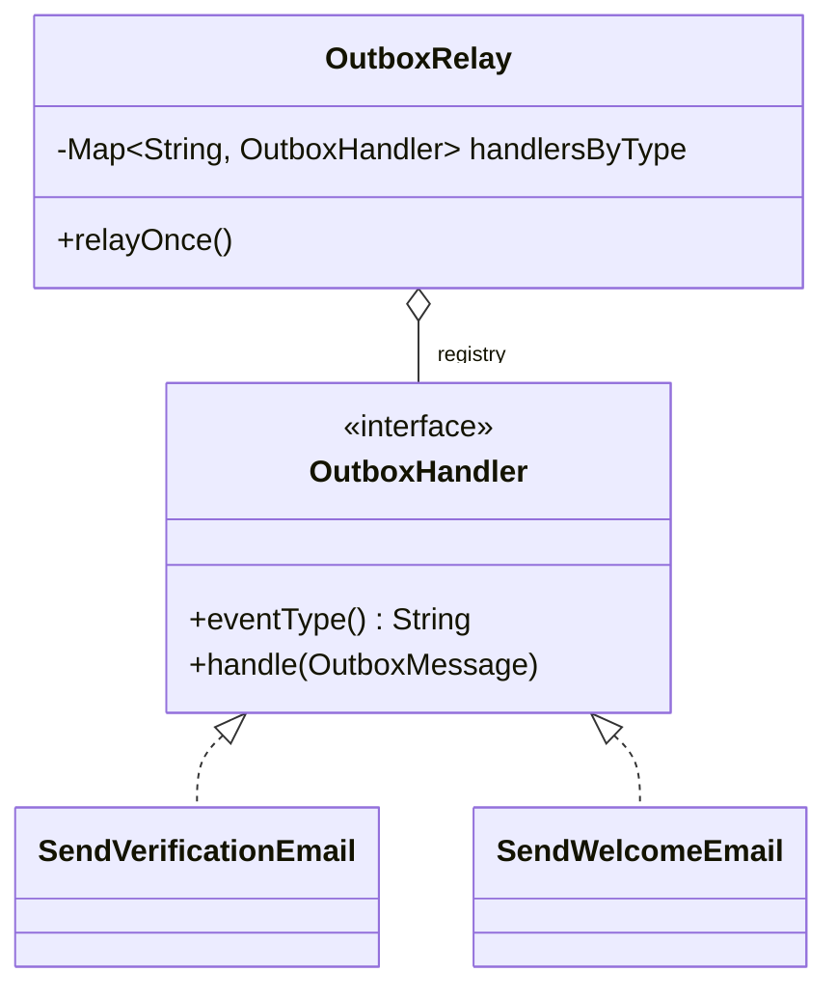

# Factory Method / Registry — pick an implementation by key, never by `switch`

> **One-liner:** when the code must choose *which* implementation to use (or to create) from a
> runtime key, an event type, a template name or a format, put the implementations in a **map
> built once** and look the key up. Adding a case means adding a class; the chooser never changes.

**Type:** Creational · **Status:** ✅ in real code · **Last updated:** 2026-10-02
**Real code:** [`OutboxRelay`](../../backend/messaging/src/main/java/com/masternova/messaging/outbox/OutboxRelay.java) (`@DesignPattern(FACTORY_METHOD, "Registry")`) dispatches each outbox message to the `OutboxHandler` registered for its event type. *(Phase 4.4 adds the email template registry.)*
**Lab:** [`lab/.../patterns/registry/`](../lab/src/main/java/com/masternova/patterns/registry/): `HandlerRegistry` (instances) and `ExporterFactory` (creators, `Supplier` per key), with `RegistryTest`

**Trigger phrase:**
- "*depending on the type / kind / format, do X*";
- "*we'll add more of these later*";
- any `switch` that grows by one case every time a feature lands.

## 1. The problem in Masternova

The worker's relay receives outbox messages of many types: `identity.user-registered.v1` (send
the verification email), `identity.email-verified.v1` (send the welcome email), and later
`commerce.order-paid.v1`, `media.transcode-finished.v1`… Without a registry, the relay grows a
`switch`:

```java
switch (message.type()) {
  case "identity.user-registered.v1" -> verificationEmails.send(message);
  case "identity.email-verified.v1"  -> welcomeEmails.send(message);
  case "commerce.order-paid.v1"      -> receipts.send(message);   // ← every feature edits the relay
  default -> log.warn("unknown {}", message.type());
}
```

The relay, which is infrastructure in a *shared module* (ADR-0008), would import every
consumer in every bounded context. Every new consumer means editing, re-testing and redeploying
the outbox protocol itself.

## 2. Structure



| Role | Masternova | Responsibility |
|---|---|---|
| Registry (client of the products) | `OutboxRelay` | build the `type → handler` map **once**; look up per message |
| Product | `OutboxHandler` | declares the key it serves (`eventType()`) and does the work |
| Concrete products | `SendVerificationEmail`, `SendWelcomeEmail` (worker) | one class per event type |
| Registration | Spring: every `OutboxHandler` bean, injected as `List<OutboxHandler>` | adding a bean = adding a case |

## 3. Code walkthrough

```java
OutboxRelay(OutboxRepository repository, List<OutboxHandler> handlers, …) {   // ⭐ Spring injects ALL handler beans
  this.handlersByType = index(handlers);
}

private static Map<String, OutboxHandler> index(List<OutboxHandler> handlers) {
  Map<String, OutboxHandler> byType = new LinkedHashMap<>();
  for (OutboxHandler handler : handlers) {
    OutboxHandler previous = byType.putIfAbsent(handler.eventType(), handler);
    if (previous != null) {
      throw new IllegalStateException("two OutboxHandlers for " + handler.eventType());  // ⭐ fail at STARTUP
    }
  }
  return Map.copyOf(byType);                                      // ⭐ immutable: shared by the scheduler thread
}

// per message:
OutboxHandler handler = handlersByType.get(message.type());       // O(1), no switch
if (handler == null) { repository.markDone(message.id()); unhandled++; continue; }
```

Three design decisions to remember:

1. **Fail fast on duplicates.** Two handlers for one type is a wiring bug. With `put` the last
   bean silently wins, and which one is "last" depends on classpath scanning order.
   `MessagingAutoConfigurationTest.twoHandlersForOneEventTypeFailStartup` proves the startup
   failure.
2. **Immutable after construction.** `Map.copyOf` means no locking. The scheduler thread only
   reads.
3. **An unknown key is an outcome, not an exception.** An event nobody consumes *yet* is normal
   (producers ship before consumers), so the relay marks it DONE and counts it as `unhandled`.
   The lab models this as a sealed `Dispatch` result (`Delivered | NoHandler`).

**Factory Method vs Registry, in the lab:**

| `HandlerRegistry` | `ExporterFactory` |
|---|---|
| a registry of **instances** (stateless handlers, shared) | a registry of **creators**: `Map<String, Supplier<Exporter>>` |
| `find(type)` returns the same object every time | `create(format)` returns a **new** object every call (`CsvExporter::new`) |
| use for stateless strategies and handlers | use when the product has per-use state (a buffer, a builder) |

Classic GoF **Factory Method** is an abstract `createX()` that subclasses override to decide which
class to instantiate. In modern Java, a map of constructor references gives the same "decide the
class by a key" without a parallel hierarchy of creator subclasses. That's why the catalog groups
them as one family.

## 4. Java features that make it nicer

- **Constructor injection of `List<Interface>`:** Spring collects every bean of that type (note 08).
- **`Map.copyOf`, `putIfAbsent`:** an immutable index and duplicate detection in one pass.
- **Constructor references as factories:** `CsvExporter::new` *is* a `Supplier<Exporter>`.
- **`EnumMap`** when the key is an enum (the lab's Strategy example: `PaymentProvider` →
  `PaymentGateway`).
- **Sealed result types** (`Dispatch`) when "not found" is a legitimate outcome.

## 5. When NOT to use it

- **Two or three fixed cases that never grow:** a `switch` is clearer. Pattern-matching `switch`
  over a sealed type is even exhaustive.
- **The key is the class itself:** that's polymorphism. Call `shape.area()`, don't look up an
  area calculator.
- **Different cases need different inputs:** a registry needs one uniform interface. If every
  case has its own signature, the "registry" is a bag of unrelated objects.

## 6. Where Spring itself uses it

- `DispatcherServlet` → `HandlerMapping` (URL → controller method) and `HandlerAdapter`s.
- `ConversionService`: a registry of `Converter`s keyed by source and target type.
- `MessageConverter`s chosen by media type; the `ViewResolver` chain.
- `BeanFactory.getBean(name)`: the container itself is a registry of factories (bean
  definitions), and `FactoryBean` is literally a Factory Method.

## 7. Alternatives considered

| Alternative | Why not here |
|---|---|
| a `switch` in the relay | the shared relay would depend on every consumer, and every feature would edit it |
| annotations + classpath scanning (`@HandlesEvent("…")`) | more magic, same result: Spring already gives us `List<OutboxHandler>` |
| Spring's `ApplicationEventPublisher` for routing | in-process and not durable; the outbox exists precisely to survive crashes (pattern 17) |
| multiple handlers per type | needed eventually (Phase 9: one event, several consumers), together with per-handler idempotency. Not yet: one consumer per type (notification LLD §6). |

## 8. Interview Q&A

- **Q: Factory Method vs Abstract Factory vs Registry?**
  **A:**
  - **Factory Method:** one method decides which concrete class to instantiate, classically
    overridden by subclasses.
  - **Abstract Factory:** creates *families* of related products.
  - **Registry:** a lookup table from key to implementation, or to its factory.
  - In Spring code a registry built from injected beans is the everyday form.
- **Q: How do you avoid a giant `switch` on a type field?**
  **A:** Define an interface whose implementations declare their key. Inject them all as a list,
  index them into a map once (failing on duplicate keys), and dispatch by lookup. New behaviour
  is a new class.
- **Q: What if two implementations claim the same key?**
  **A:** Fail at startup. Silent "last one wins" depends on bean ordering and is a production
  surprise.

## 9. 30-second recall

- **Intent:** key → implementation via a map built once; adding a case = adding a class.
- **In Masternova:** `OutboxRelay` indexes the injected `List<OutboxHandler>` by `eventType()`,
  fails startup on duplicates, uses an immutable map, and marks unknown types `unhandled`.
- **Factory flavour:** `Map<String, Supplier<T>>` of constructor references when every use needs
  a fresh object.
- **Not for:** 2–3 fixed cases (`switch`), or cases with different signatures.

*Related:* [Strategy (01)](01-strategy.md) (a registry usually picks a strategy) · [Observer (07)](07-observer.md) (handlers are durable observers) · [Transactional Outbox (17)](17-transactional-outbox.md)
