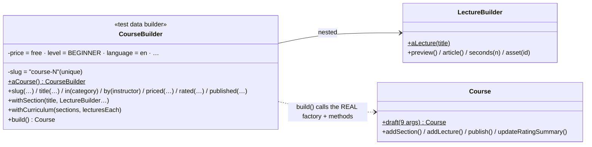

# Builder — name every step, default the rest, validate once

> **One-liner:** build an object **step by step with named methods**, keep defaults in **one**
> place, and check the whole object **once** in `build()`. In tests, the same idea (a *test data
> builder*) lets each test state only the values it's about.

**Type:** Creational · **Status:** built (Phase 5.7: test data builders) · **Last updated:** 2026-10-02
**Real code:** `com.masternova.api.catalog.domain.CourseBuilder` (test sources: the Course aggregate's test data builder) · the ffmpeg command builder arrives in Phase 7
**Lab:** [`lab/.../patterns/builder/`](../lab/src/main/java/com/masternova/patterns/builder/): Bloch's builder for an immutable object (required fields, defaults, cross-field validation, defensive copies, `toBuilder`).

**Trigger phrase:** "many optional parameters", "the constructor has 9 arguments and two are
`null`", "every test repeats the same setup", "a new required field broke 40 tests".

## 1. The problem in Masternova

`Course.draft(...)` takes **nine** arguments: slug, title, description, level, language, price,
category, instructor, time. That's right for production (a course really needs all nine), and
painful in tests. Before 5.7, `CourseSpecificationsIT` seeded six courses like this:

```java
// ❌ before: which "0" is the price and which is the rating? (after google-java-format, 10 lines each)
course("k8s-basics", "Kubernetes Basics", "containers-kubernetes", CourseLevel.BEGINNER,
       "en", 0, "4.6", CourseStatus.PUBLISHED, asha);
course("aws-draft", "AWS Draft", "cloud-platforms", CourseLevel.INTERMEDIATE,
       "en", 99900, "0", CourseStatus.DRAFT, asha);
```

And each of the eight catalog test classes had its own private `course(...)` / `draft(...)` /
`seedCourse(...)` helper with its own idea of a default. Adding a tenth required field would have
meant editing all of them.

## 2. Structure



| GoF role | Masternova | Responsibility |
|---|---|---|
| Builder | `CourseBuilder` (+ nested `LectureBuilder`) | collects values step by step, holds the defaults |
| Product | `Course` | the aggregate being built |
| Director | the test itself (or `withCurriculum`, a canned sequence of steps) | decides which steps to call |

## 3. Code walkthrough

```java
public static CourseBuilder aCourse() { return new CourseBuilder(); }

// ⭐ defaults: valid, boring, and UNIQUE where the schema demands it
private String slug = "course-" + SEQUENCE.incrementAndGet();
private Money price = Money.zero("INR");
private CourseLevel level = CourseLevel.BEGINNER;
private Instant publishedAt;                    // null = stays a draft

public CourseBuilder priced(long amountMinor) { this.price = Money.of(amountMinor, "INR"); return this; }

// ⭐ build() goes through the REAL factory and methods, so a built course is always a legal one
public Course build() {
  Course course = Course.draft(slug, title != null ? title : "Course " + slug, description,
                               level, language, price, category != null ? category : new Category(),
                               instructor, createdAt);
  for (SectionSpec spec : sections) {
    Section section = course.addSection(spec.title());
    spec.lectures().forEach(lecture -> lecture.addTo(course, section));   // → course.addLecture
  }
  if (ratingAverage != null) course.updateRatingSummary(ratingAverage, ratingCount);
  if (publishedAt != null) course.publish(publishedAt);
  return course;
}
```

**After** (the same seed, `CourseSpecificationsIT`):

```java
em.persist(aCourse().slug("k8s-basics").title("Kubernetes Basics")
    .in(category("containers-kubernetes")).by(ashaRao).rated("4.6", 10).published(NOW).build());
em.persist(aCourse().slug("aws-draft").title("AWS Draft").in(category("cloud-platforms"))
    .level(CourseLevel.INTERMEDIATE).priced(99900).by(ashaRao).build());     // a draft: nothing said
```

Each line reads as a sentence and states **only** what makes that row different. A course page
test reads like the page:

```java
aCourse().slug("k8s").priced(149900)
    .withSection("Intro", aLecture("Welcome").preview().seconds(90))
    .withSection("Core", aLecture("Pods").seconds(600), aLecture("Services").article())
    .published(T0)
    .build();
```

⭐⭐⭐ **Why through the real methods?** A builder that set fields by reflection could build a
course whose `lectureCount` doesn't match its lectures, a state production can never reach.
Tests would then pass against impossible data. Going through `addLecture` means the builder gets
the rollups right for free (`CourseBuilderTest.aBuiltCurriculumKeepsTheAggregatesRollups`).

## 4. Java features that make it nicer

- **Static factory + static import:** `aCourse()` / `aLecture("…")` read as English
  (Nat Pryce / Steve Freeman, *Growing Object-Oriented Software*).
- **Nested static builder** (`LectureBuilder`) for a part of the product, passed as varargs:
  `withSection("Intro", aLecture(…), aLecture(…))`.
- **Records** for the builder's private notes (`SectionSpec`).
- **Records instead of builders** for small immutable values: a record with 2–4 components needs
  no builder; a canonical constructor plus "withers" (`withPrice(…)` returning a new record)
  covers "the same, but…".
- Bloch's form (lab): **required fields in the entry point** (`builder(title, price)`), optional
  ones as steps, **`build()` validates cross-field rules** ("free courses can't be featured"),
  **defensive copies** of collections, **`toBuilder()`** for modified copies of an immutable object.

## 5. When NOT to use it

- **Few parameters, all required.** A constructor or a static factory is clearer.
- **To make an entity "easy to construct" in production.** `Course` has one legal way to be born
  (`Course.draft`, as a DRAFT). A production builder with `status(PUBLISHED)` would bypass the
  lifecycle. The builder lives in **test** sources, and even there it calls the real methods.
- **Lombok `@Builder` on JPA entities.** It generates an all-args constructor that skips
  invariants and fights the no-arg constructor JPA needs. (This project doesn't use Lombok:
  records cover the boilerplate.)
- **A builder per tiny test class.** One builder per aggregate, shared, or the defaults drift
  apart again.

## 6. Where Spring itself uses it

- `ResponseEntity.created(uri).header(…).body(…)`, `ProblemDetail` setters
- `UriComponentsBuilder`, `MockMvc` request builders (`get(…).header(…).with(jwt())`)
- `RestClient.builder()`, `WebClient.builder()`, `SecurityFilterChain` via `HttpSecurity`
  (a builder with nested configurers)
- `JdbcClient.sql(…).param(…).query(…)`: a fluent statement builder
- Spring Data's fluent query: `q.sortBy(…).limit(…).scroll(…)` (used in 5.5)

## 7. Alternatives considered

| Alternative | Why not here |
|---|---|
| a private `course(…)` helper per test class | eight helpers, eight sets of defaults, positional arguments; what 5.7 removed |
| Object Mother (`CourseMother.publishedKubernetesCourse()`) | one method per variation; explodes combinatorially, and the interesting value hides inside the method name |
| fixtures in SQL files | invisible in the test, break on every schema change, bypass the aggregate's rules |
| Instancio / EasyRandom (random data) | great for "any valid object", but random values make the *relevant* value implicit; and they fill fields by reflection, skipping invariants |
| Lombok `@Builder` | see §5 |

## 8. Interview Q&A

- **Q:** What problem does Builder solve?
  **A:** Constructing an object with many parameters, especially optional ones: telescoping
  constructors are unreadable (which `null` is which?), and JavaBeans setters leave the object
  mutable and possibly half-built. A builder names each step, keeps defaults in one place, and
  validates the whole object once in `build()`.
- **Q:** Builder vs Factory?
  **A:** A factory (method) decides *which* object to create in one call; a builder assembles
  *one* complex object in several steps.
- **Q:** What's a test data builder?
  **A:** A builder in test code where every field has a sensible default, so each test only sets
  what matters to it. It keeps tests readable and makes a new required field a one-line change
  in the builder instead of a change in every test.
- **Q:** How do you keep a test builder from producing impossible objects?
  **A:** Build through the domain's real factory and methods, not reflection or setters, so the
  aggregate's invariants run.
- **Q:** Builder vs records with withers?
  **A:** For a small immutable value, a record + `withX` methods is enough. Builders pay off with
  many optional fields, cross-field validation, or a nested structure (a curriculum).

## 9. 30-second recall

- **Intent:** step-by-step construction with named steps, central defaults, one validation.
- **Roles:** builder · product · director (the test, or a canned sequence like `withCurriculum`).
- **In Masternova:** `aCourse().slug(…).in(…).priced(…).withSection(…).published(…).build()`,
  used by all 8 catalog test classes; unique default slugs; builds through `Course.draft` /
  `addLecture` / `publish`, so every built course is a legal one.
- **Pitfalls:** production builders that bypass lifecycles · reflection-based fillers · Lombok
  `@Builder` on entities · one builder per test class.

*Related:* [Prototype](11-prototype.md) (copy an existing object vs build a new one) · [Factory Method](09-factory-method-registry.md) · LLD: [`docs/lld/catalog.md`](../../docs/lld/catalog.md) §6
