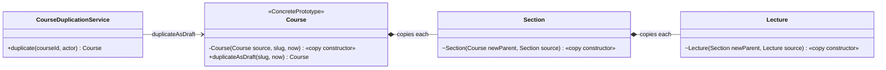

# Prototype — "a new course like this one", copied by the object that knows its own structure

> **One-liner:** create a new object by **copying an existing one** (the prototype), with each
> class deciding what it copies **deeply**, what it **resets**, and what it **shares**, instead
> of rebuilding it field by field from the outside.

**Type:** Creational · **Status:** built (Phase 5.6) · **Last updated:** 2026-10-02
**Real code:** `com.masternova.api.catalog.domain.Course#duplicateAsDraft` (+ the copy constructors of `Course`, `Section`, `Lecture`) · used by `com.masternova.api.catalog.application.CourseDuplicationService`
**Lab:** [`lab/.../patterns/prototype/`](../lab/src/main/java/com/masternova/patterns/prototype/): the `clone()` shallow-copy trap next to copy constructors, plus GoF's prototype manager.

**Trigger phrase:** "duplicate", "make a copy of", "start from a template", "clone this but…".

## 1. The problem in Masternova

Instructors want **Duplicate course**: start next term's version from this one. A course is an
aggregate (Course → 10 sections → 50 lectures), and each part needs a different rule:

| Part | Rule | Why |
|---|---|---|
| title, description, price, level, sections, lectures | **deep copy** | the copy will be edited; edits must not touch the original |
| ids | **new** | a copy is a different course |
| status, `publishedAt`, ratings, enrollments | **reset** | a copy has no history: it's a DRAFT nobody has rated |
| `Money`, `LectureDuration` | **shared** | immutable value objects: sharing the reference *is* a copy |
| category | **shared** | another aggregate; we reference it, never copy it |
| media `assetId` | **shared, on purpose** | gigabytes of transcoded HLS (Phase 7), immutable. Copying it would be slow, expensive and pointless. |

Without the pattern, a `CourseDuplicationService` would read every field of every entity and
rebuild them, knowing the internals of three classes. Every new field is one more place to
forget (and a forgotten field is silently *not* copied).

## 2. Structure



| GoF role | Masternova | Responsibility |
|---|---|---|
| Prototype | `Course` (the source course) | knows how to copy itself |
| Clone operation | `duplicateAsDraft(slug, now)` | the public way to ask for a copy |
| Client | `CourseDuplicationService` | decides **who** may copy and **which slug**; never touches fields |
| Prototype manager (optional) | lab's `CourseTemplates` | a registry of templates to copy from (not needed in the product yet) |

## 3. Code walkthrough

```java
// Course.java — the clone operation is a named method; the copy constructor is private
public Course duplicateAsDraft(String newSlug, Instant now) {
  return new Course(this, newSlug, now);
}

private Course(Course source, String slug, Instant now) {
  this.id = UUID.randomUUID();                 // NEW identity
  this.slug = requireSlug(slug);               // the constructor's checks still run
  this.title = copyTitle(source.title);        // "Kubernetes (copy)", kept within 120 chars
  this.price = source.price;                   // ⭐ immutable value object: share it
  this.category = source.category;             // another aggregate: reference it
  this.status = CourseStatus.DRAFT;            // ⭐ RESET: no history
  this.publishedAt = null;
  this.ratingAverage = BigDecimal.ZERO.setScale(2);
  // ⭐ DEEP: each section copies itself into THIS course
  source.sections.forEach(section -> this.sections.add(new Section(this, section)));
  // rollups are DERIVED: recomputed from the copy, not trusted from the source
  this.lectureCount = sections.stream().mapToInt(s -> s.lectures().size()).sum();
  ...
}

// Section.java — copies what IT owns: its lectures
Section(Course course, Section source) {
  this.id = UUID.randomUUID();
  this.course = course;                        // ⭐ points at the NEW parent
  this.title = source.title;
  this.position = source.position;
  source.lectures.forEach(lecture -> this.lectures.add(new Lecture(this, lecture)));
}

// Lecture.java
Lecture(Section section, Lecture source) {
  this.id = UUID.randomUUID();
  ...
  this.assetId = source.assetId;               // ⭐ shallow ON PURPOSE (and tested)
}
```

**The use case around it** (`CourseDuplicationService.duplicate`):

1. `@PreAuthorize("hasAnyRole('INSTRUCTOR', 'ADMIN')")`.
2. Load the source with its curriculum; the owner or an admin may copy, anyone else gets a 404.
3. `source.duplicateAsDraft(copySlug(source.slug()), clock.instant())`.
4. `courses.save(copy)`: `cascade = ALL` inserts course + sections + lectures in **one
   transaction**, so a half-copied course is never visible.

The endpoint requires an **`Idempotency-Key`** (API conventions §4): a double-clicked button
replays the first `201` instead of making two copies (`CourseDuplicationIT`).

## 4. Java features that make it nicer

- **Copy constructors** (Effective Java item 13): an ordinary constructor, so `final` fields work,
  invariant checks run, no casts, no checked exception.
- **Records for the immutable parts** (`Money`, `LectureDuration`): sharing a record is a correct
  copy, and the compiler guarantees it can't change under you.
- **Package-private constructors** (`Section(Course, Section)`): only the aggregate can create
  copies of its insides, the same way only it can create the originals.

**Why not `Cloneable` / `clone()`?** (the lab's `ClonedCourse` shows it failing)

| `clone()` problem | Consequence |
|---|---|
| `Object.clone()` copies fields (**shallow**) | the copy and the original share the same `List<Section>`: rename in one, both change |
| bypasses constructors | invariant checks don't run |
| `Cloneable` is a marker with no method; `Object.clone` is `protected` and throws a checked exception | casts, `try/catch` for an "impossible" exception |
| can't reassign `final` fields | mutable fields just to make cloning work |
| with JPA: copies the id, the `@Version` and Hibernate's `PersistentBag`s | the "copy" is the same row to Hibernate |

## 5. When NOT to use it

- **The object is cheap and simple to build from scratch** (a DTO, a value object): just call the
  constructor or a builder.
- **Everything is immutable**: there's nothing to copy; share the instance.
- **You'd need an interface for one implementation.** No `CourseDuplicator`: the copy logic lives
  on the aggregate that knows its structure, forever.
- **Copying across aggregates.** A course copy doesn't copy its category, its orders, or its
  reviews; those belong to other aggregates and other modules.

## 6. Where Spring itself uses it

- **Prototype bean scope** (`@Scope("prototype")`): every `getBean` returns a new instance built
  from the same bean definition, the definition acting as the prototype (note 08 §5, and the
  "prototype in a singleton" trap).
- `BeanDefinition`s are copied when a definition is derived from a parent
  (`RootBeanDefinition(RootBeanDefinition original)`): a copy constructor.
- `HttpHeaders` / `MultiValueMap` copies (`new HttpHeaders(other)` style constructors).

## 7. Alternatives considered

| Alternative | Why not here |
|---|---|
| `clone()` | shallow by default, bypasses constructors, and with JPA copies ids and versions (§4) |
| serialization round trip (`ObjectOutputStream` / Jackson) | deep, but copies **everything**, ids and asset ids included; slow; no place for "reset" and "share" rules |
| a mapper (MapStruct) from entity to entity | rules spread across annotations; the aggregate's invariants don't run |
| copying in SQL (`INSERT … SELECT`) | fast for huge trees, but invisible to the domain model, and new ids for three tables in SQL gets fiddly. Worth it only if a course had thousands of lectures. |
| copying the media files too | gigabytes per copy, for bytes that never change |

## 8. Interview Q&A

- **Q:** What is the Prototype pattern?
  **A:** Creating new objects by copying an existing instance instead of building them from
  scratch. The object itself knows how to copy itself, so clients don't depend on its structure.
- **Q:** Shallow vs deep copy?
  **A:** Shallow copies the field values, so a copied reference still points at the same mutable
  object (shared list → shared edits). Deep copies the mutable objects too. In practice you mix:
  deep for mutable parts, share immutable parts, reset history.
- **Q:** Why avoid `clone()` in Java?
  **A:** It's shallow, bypasses constructors, needs a cast and a checked exception, can't assign
  `final` fields, and `Cloneable` doesn't even declare `clone`. Use a copy constructor or a copy
  factory (Effective Java item 13).
- **Q:** How do you copy a JPA entity?
  **A:** Never `clone()` it or reuse the instance: build a **new** entity (new id, `@Version` null)
  with new child entities pointing at the new parent, then `save`/`persist`. Cascading inserts the
  tree in one transaction.
- **Q:** What did you share instead of copy, and how do you stop someone "fixing" it?
  **A:** Media asset ids: immutable and huge. A unit test asserts the copy's lecture points at the
  same asset (`mediaAssetsAreSharedNotCopied`), so making it "deep" fails the build.

## 9. 30-second recall

- **Intent:** new object = copy of a prototype; each class copies what it owns.
- **Roles:** prototype (`Course`) · clone operation (`duplicateAsDraft`) · client
  (`CourseDuplicationService`) · optional prototype manager (template registry).
- **In Masternova:** deep (sections, lectures, new ids) · reset (DRAFT, no `publishedAt`, no
  ratings) · shared (`Money`, category, **media asset ids**); one transaction; `Idempotency-Key`
  makes the button safe to double-click.
- **Pitfalls:** `clone()` is shallow · copying JPA ids/versions · copying across aggregates ·
  forgetting to point children at the new parent.

*Related:* [Value Object](../java/01-records-and-value-objects.md) (why sharing immutables is safe) · [Builder](10-builder.md) · LLD: [`docs/lld/catalog.md`](../../docs/lld/catalog.md) §5
