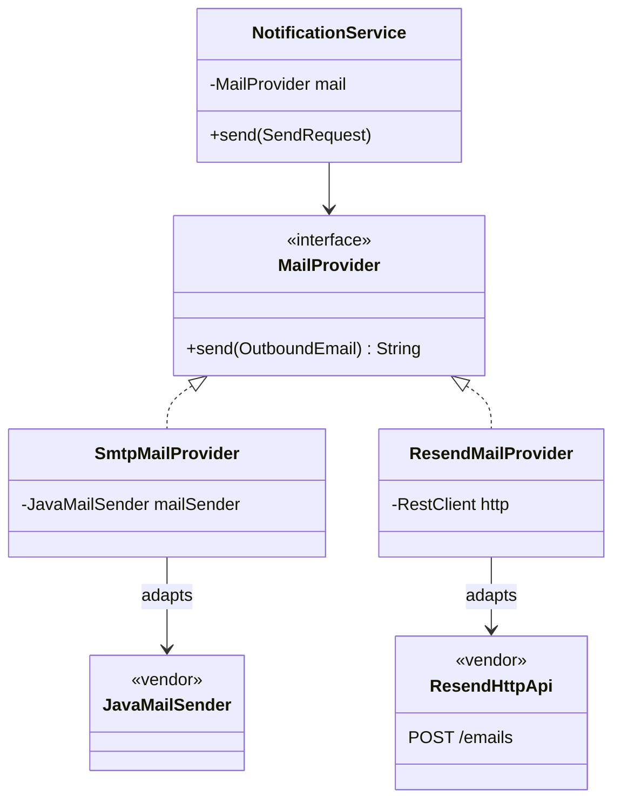

# Adapter — make a vendor's API look like the interface our code already speaks

> **One-liner:** wrap a class whose interface you **can't change** (a vendor SDK, an HTTP API, a
> legacy library) in a small class that implements **your** interface. The wrapper translates the
> request, the response **and the failures**, so the rest of the code never learns the vendor
> exists.

**Type:** Structural · **Status:** ✅ in real code · **Last updated:** 2026-10-02
**Real code:**
- [`MailProvider`](../../backend/worker/src/main/java/com/masternova/worker/notification/mail/MailProvider.java) (`@DesignPattern(ADAPTER, "Target")`) plus our message shape [`OutboundEmail`](../../backend/worker/src/main/java/com/masternova/worker/notification/mail/OutboundEmail.java).
- [`SmtpMailProvider`](../../backend/worker/src/main/java/com/masternova/worker/notification/mail/SmtpMailProvider.java) adapts Spring's `JavaMailSender` / Jakarta Mail (Mailpit in dev).
- [`ResendMailProvider`](../../backend/worker/src/main/java/com/masternova/worker/notification/mail/ResendMailProvider.java) adapts Resend's JSON-over-HTTP API.
- The client: [`NotificationService`](../../backend/worker/src/main/java/com/masternova/worker/notification/NotificationService.java), which only knows `MailProvider`.

**Proof:** `SmtpMailProviderTest`, `ResendMailProviderTest` (`MockRestServiceServer`), `SmtpMailProviderIT` (real Mailpit container) · **Lab:** [`lab/.../patterns/adapter/`](../lab/src/main/java/com/masternova/patterns/adapter/): `Mailer` + `SmtpMailer` / `AcmeMailer` over two fake vendors, with one contract test run against both (`AdapterTest`) · **Design:** [`docs/lld/notification.md`](../../docs/lld/notification.md)

**Trigger phrase:**
- "*we'll use provider X for now, but we might switch*";
- "*integrate with <third-party SDK / API>*";
- any vendor type (`MimeMessage`, `RestClientResponseException`, a Razorpay `Order`) showing up in a
  service class.

## 1. The problem in Masternova

The worker must send email. In dev that's SMTP to Mailpit; in production it may be an SMTP relay
(SES, Postmark) **or** Resend's HTTP API. The two have nothing in common:

| | SMTP (Jakarta Mail) | Resend |
|---|---|---|
| request | a `MimeMessage` built through `MimeMessageHelper` | `POST /emails` with JSON; `to` is a **list** |
| auth | session properties (host, user, password) | `Authorization: Bearer <key>` |
| result | `getMessageID()` after `send` | `{ "id": "…" }` in the body |
| "this address is dead" | `SMTPAddressFailedException` with code 550, wrapped in `MailSendException` | HTTP **422** |
| "try later" | 4xx, connection refused, timeouts | 429, 5xx |

Without an adapter, `NotificationService` would contain both: an `if (provider == SMTP)` around
MIME building, another around error handling. Worse, the **retry decision** (suppress the address
vs. try again later) would be smeared across vendor-specific `catch` blocks. That decision is the
one that protects the sender's reputation: retrying a 550 forever gets you blocklisted.

## 2. Structure



| GoF role | Masternova | Responsibility |
|---|---|---|
| Client | `NotificationService` | renders, claims, calls `send`, decides SENT / FAILED / BOUNCED from **our** exception types |
| Target | `MailProvider` + `OutboundEmail` + `PermanentDeliveryException` | the interface *we* designed, in *our* vocabulary, including the failure contract |
| Adapter | `SmtpMailProvider`, `ResendMailProvider` | translate request, response and failures |
| Adaptee | `JavaMailSender` / Jakarta Mail, Resend's HTTP API | vendor code we don't own and can't change |

## 3. Code walkthrough

An adapter does exactly **three translations**. The Resend one shows all three:

```java
@Override
public String send(OutboundEmail email) {
  try {
    SendEmailResponse response = http.post().uri("/emails")
        .body(new SendEmailRequest(email.from(), List.of(email.to()),   // ⭐ 1. request: OUR record → THEIR JSON shape
            email.subject(), email.html(), email.text(), email.headers()))
        .retrieve()
        .body(SendEmailResponse.class);
    return response.id();                                              // ⭐ 2. response: THEIR body → OUR message id
  } catch (RestClientResponseException e) {
    throw translate(e.getStatusCode(), e);                             // ⭐ 3. failure: THEIR status → OUR contract
  }
}

private static RuntimeException translate(HttpStatusCode status, RestClientResponseException e) {
  if (status.value() == 422) {
    return new PermanentDeliveryException("Resend 422: " + e.getResponseBodyAsString(), e);
  }
  return e;                                                            // 429 / 5xx → temporary, retried
}
```

The SMTP adapter does the same for a much uglier vendor error: the real cause is buried inside
`MailSendException.getMessageExceptions()`, possibly several `getCause()` levels deep.

```java
static RuntimeException permanentIfRejected(MailSendException e) {
  for (Exception failure : e.getMessageExceptions()) {
    for (Throwable cause = failure; cause != null; cause = cause.getCause()) {
      if (cause instanceof SMTPAddressFailedException rejected && rejected.getReturnCode() >= 500) {
        return new PermanentDeliveryException("SMTP " + rejected.getReturnCode() + ": " + …, e);
      }
    }
  }
  return e;   // connection refused, 4xx greylisting, timeouts → temporary
}
```

And the client never sees a vendor type:

```java
try {
  String providerMessageId = mail.send(outbound);
  deliveries.markSent(claimed.deliveryId(), providerMessageId);
} catch (PermanentDeliveryException e) {      // ⭐ OUR exception, from either adapter
  deliveries.markBounced(claimed.deliveryId(), e.getMessage());   // no rethrow: retrying can't help
} catch (RuntimeException e) {
  deliveries.markFailed(claimed.deliveryId(), e.getMessage());
  throw e;                                     // the outbox relay backs off and retries
}
```

**Choosing the adapter is configuration, not code.** Both classes are `@Component`s guarded by
`@ConditionalOnProperty(name = "masternova.notification.provider", …)`. The SMTP one has
`matchIfMissing = true`, so exactly one `MailProvider` bean exists, and `MAIL_PROVIDER=resend`
switches it.

Three design decisions to remember:

1. **The failure contract is part of the Target.** An adapter that translates the happy path but
   lets `RestClientResponseException` escape hasn't finished adapting. The client would have to
   know the vendor to handle errors.
2. **Vendor shapes stay inside the adapter.** `SendEmailRequest` / `SendEmailResponse` are
   package-private nested records of `ResendMailProvider`. Nothing outside can depend on them.
3. **Fail at startup, not at the first email.** A missing Resend API key throws in the adapter's
   constructor (`aMissingApiKeyFailsAtStartupNotAtTheFirstEmail`). A misconfigured worker never
   becomes ready, instead of silently failing every send.

What the tests prove:

| Test | Shows |
|---|---|
| `ResendMailProviderTest.adaptsOurEmailToResendsJsonApi` | the exact JSON, path and Bearer header (`MockRestServiceServer`) |
| `a422IsAPermanentRejection` / `a5xxRecipientRejectionIsPermanent` | both vendors' "dead address" become `PermanentDeliveryException` |
| `rateLimitsAndServerErrorsAreTemporary` / `a4xxIsTemporaryAndKeptAsIs` / `aConnectionProblemIsTemporary` | everything else stays retryable |
| `SmtpMailProviderIT.anEmailArrivesWithHtmlTextAndHeaders` | a real round trip through a Mailpit container: HTML, text twin and custom headers arrive |
| lab `AdapterTest` | ⭐ **one contract test run against every adapter**, which is what "interchangeable" means |

## 4. Java features that make it nicer

- **Records** for both sides of the boundary: `OutboundEmail` (ours) and `SendEmailRequest` (theirs).
  The compact constructor of `OutboundEmail` validates and copies headers (`Map.copyOf`).
- **Package-private classes:** the adapters are not `public`. Only the Target interface is, so
  nobody can `new SmtpMailProvider(...)` and bypass the configuration choice.
- **Pattern-matching `instanceof`** (`cause instanceof SMTPAddressFailedException rejected`) for
  walking a cause chain.
- **Switch expressions** on a status code (lab `AcmeMailer`): one expression maps every outcome.
- **Unchecked wrapping** (`UncheckedIOException`) when the vendor throws checked exceptions our
  interface doesn't declare (lab `SmtpMailer`).

## 5. When NOT to use it

- **You own both sides.** Change the interface instead of wrapping it.
- **There is one vendor and no realistic second one, *and* its types are already pleasant** (say,
  `JdbcClient`). A wrapper adds a class and a mapping for nothing. In Masternova the mail adapter
  is justified by *two real providers* plus the failure contract; Phase 9's Razorpay adapter is
  justified by keeping payment-vendor types out of the order state machine, even with one vendor.
- **The interfaces differ in *capability*, not just shape.** If provider A supports scheduled
  sends and B doesn't, an adapter can't invent the feature. Either the Target leaves it out, or
  you need a capability query, not a thinner wrapper.
- **"Adapters" that adapt nothing** (a `UserServiceAdapter` that forwards every call unchanged)
  are just indirection.

## 6. Where Spring itself uses it

- **`HandlerAdapter`** in Spring MVC: `DispatcherServlet` calls one interface; adapters exist for
  `@RequestMapping` methods, `HttpRequestHandler`, and plain `Controller` objects.
- **`JavaMailSender`** itself adapts Jakarta Mail's `Transport`/`Session` to a friendlier API. Our
  adapter sits on top of Spring's adapter.
- **Exception translation:** `SQLErrorCodeSQLExceptionTranslator` turns vendor `SQLException`
  codes into the portable `DataAccessException` hierarchy (`DuplicateKeyException`, …), the same
  idea as our `permanentIfRejected`.
- **`HttpMessageConverter`s** adapt JSON/XML libraries (Jackson, …) to Spring's conversion API.
- **`MethodInterceptor` adapters** in Spring AOP (`AdvisorAdapter` turns `MethodBeforeAdvice` into
  an interceptor).

## 7. Alternatives considered

| Alternative | Why not here |
|---|---|
| call `JavaMailSender` directly from `NotificationService` | the service would hold MIME and SMTP-exception logic, and switching to Resend would rewrite it |
| a class adapter (`extends` the vendor class) | Java has single inheritance, and we'd inherit every vendor method into our type. Object adapter (composition) is the default in Java. |
| a provider `switch` inside one `MailService` | that's Strategy-selection mixed with translation, and it grows a case per vendor. Each adapter is a Strategy *and* an Adapter; Spring picks one by property. |
| a generic library (Apache Commons Email, a multi-provider SDK) | still leaks its own types and exceptions, and we'd need an adapter over it anyway for our failure contract |

**Adapter vs its neighbours** (the classic interview trap):

| Pattern | Changes the interface? | Purpose |
|---|---|---|
| **Adapter** | yes: theirs → ours | make an existing class usable where a different interface is expected |
| Facade (14) | yes: many → one simpler | hide a *subsystem* behind one entry point |
| Decorator (13) | no: same interface | *add behaviour* (caching, logging) |
| Proxy (15) | no: same interface | *control access* (lazy, security, transactions) |

## 8. Interview Q&A

- **Q: Object adapter vs class adapter?**
  **A:** An object adapter holds the adaptee as a field and implements the target (composition);
  a class adapter extends the adaptee and implements the target (inheritance). In Java, use
  object adapters: single inheritance, no leaking of the adaptee's methods, and you can adapt any
  subclass or a mock.
- **Q: Adapter vs Facade?**
  **A:** An adapter converts *one* interface into another one that already exists (the client's).
  A facade *defines a new, simpler* interface over a *whole subsystem*. Our `MailProvider` is an
  adapter: one vendor client behind our existing interface.
- **Q: How do you switch email providers without a deploy?**
  **A:** Both adapters are on the classpath behind `@ConditionalOnProperty`; changing
  `MAIL_PROVIDER` and restarting picks the other bean. The client depends only on the
  `MailProvider` interface.
- **Q: What belongs in an adapter besides the method call?**
  **A:** Request mapping, response mapping and **error translation** into the target's failure
  contract. Without the last one the vendor still leaks through every `catch`.
- **Q: How do you test adapters?**
  **A:** Unit-test the mapping against a fake transport (`MockRestServiceServer`), integration-test
  one real round trip (Mailpit in Testcontainers), and run one shared contract test against every
  implementation.

## 9. 30-second recall

- **Intent:** a vendor's interface → our interface, by composition; translate request, response
  **and failures**.
- **In Masternova:** `MailProvider` (Target) ← `SmtpMailProvider` (`JavaMailSender`, 5xx
  `SMTPAddressFailedException` → permanent) and `ResendMailProvider` (`RestClient`, 422 →
  permanent); chosen by `masternova.notification.provider`; `NotificationService` sees only our
  types.
- **Proof:** `MockRestServiceServer` mapping tests, a Mailpit IT, a lab contract test run on both
  adapters.
- **Spring's flavour:** `HandlerAdapter`, `SQLExceptionTranslator`, `JavaMailSender`.
- **Not to confuse with:** Decorator/Proxy (same interface), Facade (a new interface over a
  subsystem).

*Related:* [Strategy (01)](01-strategy.md) (each adapter is also an interchangeable strategy) · [Template Method (06)](06-template-method.md) (what renders the email the adapter sends) · [Proxy (15)](15-proxy.md)
