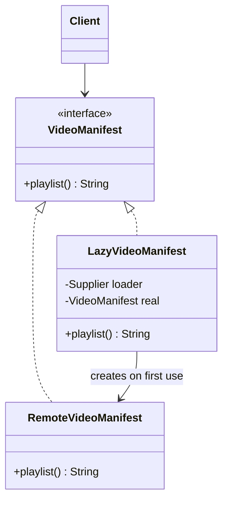

# Proxy — a stand-in that controls access to the real object

> **One-liner:** an object with the **same interface** as the real one, which sits in front of
> it and decides **whether, when and how** each call reaches it: lazily, with access checks, or
> wrapped in a transaction.

**Type:** Structural · **Status:** lab built; Spring's proxies in every phase · **Last updated:** 2026-10-02
**Real code:** Spring-generated proxies around our beans (`@Transactional`, `@PreAuthorize`, `@Cacheable`, `@Async`). Our own `@DesignPattern(PROXY)` class arrives with the Phase 8 playback-token guard.
**Lab:** [`lab/.../patterns/proxy/`](../lab/src/main/java/com/masternova/patterns/proxy/) · **Spring deep-dive:** [Java note 09](../java/09-spring-aop-and-proxies.md)

**Trigger phrase:** "*do X before/after every call*", "*only load it if it's actually used*",
"*only certain users may call this*". In each case the caller shouldn't have to know.

## 1. The problem in Masternova

- A course page lists 40 lectures. Loading and signing 40 video manifests up front wastes 38
  storage round-trips. **Load lazily.**
- Instructor revenue must be visible only to that instructor or an admin. Security checks
  scattered inside the report code tangle two concerns. **Guard access.**
- Every service method that writes must run in a transaction, and copy-pasting
  `begin/commit/rollback` everywhere is unmaintainable. **Wrap every call.**

In all three, the caller must keep calling the same interface, unaware anything sits in between.

## 2. Structure



| GoF role | Masternova class | Responsibility |
|---|---|---|
| Subject | `VideoManifest`, `RevenueReport` | the shared interface |
| RealSubject | `RemoteVideoManifest`, the real revenue query | the actual work |
| Proxy | `LazyVideoManifest` (virtual), `AccessControlledRevenueReport` (protection), `TimingProxy` (dynamic) | controls access, then delegates |

## 3. Code walkthrough

**Virtual proxy** (lazy creation):

```java
public synchronized String playlist() {
  if (real == null) real = loader.get();    // ⭐ the expensive object is created on FIRST use
  return real.playlist();
}
```

`virtualProxyLoadsOnlyWhatIsUsedAndOnlyOnce`: 4 lectures on the page, 1 opened twice, 1 load.

**Protection proxy** (access control):

```java
if (!viewer.admin() && !viewer.userId().equals(instructorId)) throw new IllegalStateException(…);
return real.totalFor(instructorId);          // the real report has no security code at all
```

**Dynamic proxy:** one handler for **any** interface, generated at runtime:

```java
Proxy.newProxyInstance(loader, new Class<?>[] {type}, (proxy, method, args) -> {
  try { return method.invoke(target, args); }
  catch (InvocationTargetException e) { throw e.getCause(); }   // ⭐ rethrow the REAL exception
  finally { log.add(method.getName() + " timed"); }
});
```

That last shape is the core of Spring AOP. Spring builds such proxies (or CGLIB subclasses) for
every bean that has `@Transactional`, `@Cacheable`, `@Async` or a matching `@Aspect`.

## 4. Java features that make it nicer

- **`java.lang.reflect.Proxy`**: runtime-generated interface proxies, in the JDK, no library.
- **Lambdas as the subject:** `RevenueReport real = earnings::get;` gives a test double in one line.
- **`Supplier<T>`** for the deferred construction in a virtual proxy.
- **`Class.cast`** to return the proxy with the right generic type (note 04's type tokens).

## 5. When NOT to use it

- **The call is cheap and always needed.** A lazy proxy only adds indirection and a lock.
- **You're *adding features*, not controlling access.** That's Decorator (same shape, different
  intent: see §7).
- **Hidden behaviour surprises people.** Generated proxies make code "magic", so keep the rules
  visible (annotations, documented aspects), and remember the self-invocation trap
  ([note 09 §4](../java/09-spring-aop-and-proxies.md)).

## 6. Where Spring itself uses it

| Spring feature | Kind of proxy |
|---|---|
| `@Transactional` | wraps calls in begin/commit/rollback |
| `@PreAuthorize`, `@Secured` | protection proxy |
| `@Cacheable` | caching proxy (returns the stored result instead of calling) |
| `@Async` | runs the call on another thread |
| Hibernate lazy `@ManyToOne` / `getReference()` | virtual proxy (a subclass of your entity) |
| `@Configuration` (full mode) | intercepts `@Bean` method calls (note 08 §7) |
| scoped proxies (`proxyMode = TARGET_CLASS`) | finds the current request/prototype instance per call |
| Spring Data repository interfaces | the *entire* implementation is a generated proxy |

## 7. Alternatives considered

| Alternative | Why not / how it differs |
|---|---|
| **Decorator** | same structure (implements + wraps). The *intent* differs: Decorator **adds** behaviour (retry, quiet hours: note 06); Proxy **controls access** to the same behaviour (lazy, security, transactions). Interviewers ask this. |
| **Adapter** | wraps an object with a **different** interface to make it fit; a Proxy keeps the **same** interface |
| Inline checks in the real class | mixes concerns (security inside a revenue query) and repeats in every class |
| AspectJ compile-time weaving | no self-invocation trap, but needs a special compiler/agent. Spring's runtime proxies are simpler. |

## 8. Interview Q&A

- **Q: Proxy vs Decorator?**
  **A:** Same shape. A Proxy controls access (lazy, security, remote, transactions) and usually
  manages the real object's lifecycle. A Decorator adds responsibilities and is stacked by the
  client.
- **Q: How does Spring implement `@Transactional`?**
  **A:** With a proxy around the bean. It's a JDK dynamic proxy for interfaces or a CGLIB
  subclass (Boot's default), and it opens the transaction, calls the target, then commits or
  rolls back.
- **Q: Why doesn't `@Transactional` work when a method calls another method of the same class?**
  **A:** Self-invocation goes through `this`, the raw target, not the proxy. Fix it by moving the
  method to another bean, or by using `TransactionTemplate`.
- **Q: JDK dynamic proxy vs CGLIB?**
  **A:** JDK proxies implement interfaces only. CGLIB generates a subclass, so it can't proxy
  `final` classes or methods, and it skips constructors.
- **Q: Name the kinds of proxy.**
  **A:** Virtual (lazy), protection (access control), remote (a local stand-in for a remote
  object), caching, smart reference.

## 9. 30-second recall

- **Intent:** same interface, in front of the real object; controls access (lazy, security,
  transactions).
- **Roles:** Subject · RealSubject · Proxy.
- **In Masternova:** lazy video manifests, a guarded revenue report, and every
  `@Transactional`/`@PreAuthorize`/`@Cacheable` bean.
- **Pitfalls:**
  - Self-invocation bypasses it.
  - `final` classes can't be CGLIB-proxied.
  - Fields aren't proxied, only methods.
  - Dynamic proxies must unwrap `InvocationTargetException`.

*Related:* Decorator (`java/06` §3) · [Strategy](01-strategy.md) · [Java note 09 — Spring AOP & proxies](../java/09-spring-aop-and-proxies.md)
