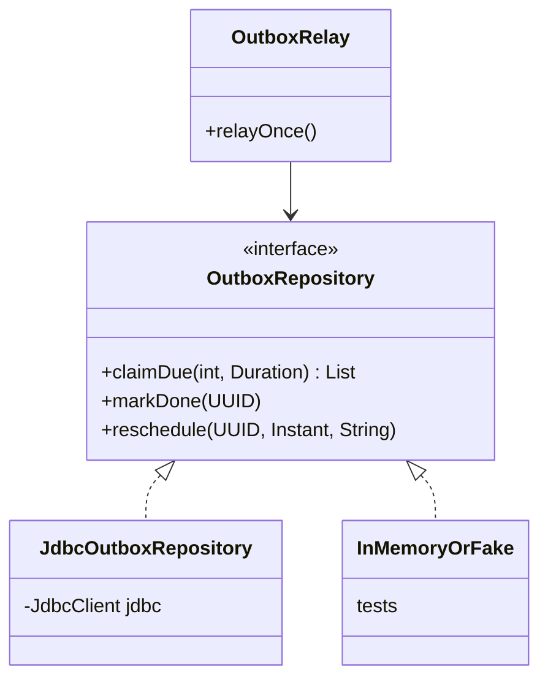

# Repository + Unit of Work — persistence behind an interface, committed as one

> **One-liner:** a **Repository** gives the domain a collection-like interface for one aggregate
> ("find this course", "add this order") and hides how storage works. A **Unit of Work** tracks
> every change made during one business operation and commits them **together, or not at all**.
> In Spring, Spring Data / your `JdbcClient` classes are repositories, and
> **`@Transactional` + Hibernate's persistence context are the Unit of Work**.

**Type:** Enterprise (Fowler, *PoEAA*) · **Status:** ✅ in real code · **Last updated:** 2026-10-02
**Real code:**
- **Repositories:** [`OutboxRepository`](../../backend/messaging/src/main/java/com/masternova/messaging/outbox/OutboxRepository.java) → [`JdbcOutboxRepository`](../../backend/messaging/src/main/java/com/masternova/messaging/outbox/JdbcOutboxRepository.java), and [`IdempotencyStore`](../../backend/api/src/main/java/com/masternova/api/platform/idempotency/IdempotencyStore.java) → [`JdbcIdempotencyStore`](../../backend/api/src/main/java/com/masternova/api/platform/idempotency/JdbcIdempotencyStore.java).
- **Unit of Work:** every `@Transactional` service method; `TransactionalEventPublisher` *requires* one (`MANDATORY`).

**Lab:** [`lab/.../patterns/repository/`](../lab/src/main/java/com/masternova/patterns/repository/): a hand-built `UnitOfWork` with an identity map · **Spring/JPA deep-dive:** [Java note 10](../java/10-request-lifecycle-and-jpa.md)

**Trigger phrase:** "*the service shouldn't know about SQL*", "*I need to test this logic without
a database*", "*these three writes must all happen or none*".

## 1. The problem in Masternova

Without a repository, SQL ends up scattered through services: the outbox relay would build
`UPDATE outbox_message …` strings inline, next to its retry logic, and testing the retry policy
would need Postgres. Without a unit of work, "mark the order paid, write the outbox row, grant the
entitlement" are three independent writes. A failure halfway through leaves the data
inconsistent.

## 2. Structure



| Role | Masternova | Responsibility |
|---|---|---|
| Repository (interface) | `OutboxRepository`, `IdempotencyStore` | domain-shaped operations: `claimDue`, `markDone`, `claim` |
| Concrete repository | `JdbcOutboxRepository`, `JdbcIdempotencyStore` | the SQL, and only the SQL |
| Unit of Work | Spring's transaction (`@Transactional`) + Hibernate's persistence context | groups writes; commit or rollback; identity map; dirty checking |
| Client | `OutboxRelay`, `IdempotencyFilter`, services | business logic, written against the interface |

## 3. Code walkthrough

**Repository: domain language, not table language.** `OutboxRepository` has `claimDue`,
`markDone`, `reschedule` and `markDead`, not `update(row)`. The relay reads like the business
rule:

```java
for (OutboxMessage message : repository.claimDue(batchSize, lease)) {
  … handler.handle(message); repository.markDone(message.id()); …
}
```

Both of our repositories are **package-private** behind the module boundary (CLAUDE.md §3): no
other module can call them.

**Unit of Work: what `@Transactional` does, built by hand in the lab:**

```java
UnitOfWork uow = new UnitOfWork(courses);
Course c = uow.find("c1").orElseThrow();   // ⭐ identity map: find("c1") again returns the SAME object
c.rename("Spring Boot 4");
uow.registerDirty(c);                      // (Hibernate detects this itself, by comparing snapshots)
uow.registerNew(new Course("c2", "Java Streams"));
uow.commit();                              // ⭐ validates everything, THEN writes all of it
```

`aRejectedCommitWritesNothingAtAll` shows the all-or-nothing rule: one invalid course stops the
valid one being written too. `everythingIsWrittenAtCommitAndNotBefore` shows write-behind:
nothing touches storage until commit.

**In Spring, you get all of this from one annotation:**

```java
@Transactional                     // ⭐ the unit of work: one DB transaction, one persistence context
public void pay(OrderId id) {
  Order order = orders.findById(id).orElseThrow(...);   // identity-mapped, managed
  order.markPaid();                                      // dirty-checked, no save() needed
  events.publish(new OrderPaid(id));                     // outbox row, same transaction
}                                                        // commit: all three writes, or none
```

## 4. Java features that make it nicer

- **Interfaces + package-private implementations:** the seam is visible, the implementation is
  hidden.
- **`Optional<T>` from `findById`** (note 05): "not found" is in the type.
- **Sealed result types** (`IdempotencyStore.Claim`): a repository can return *outcomes*, not
  just rows.
- **Text blocks** for SQL that stays readable.

## 5. When NOT to use it

- **A generic repository per table** (`Repository<T, ID>` with `findAll`/`save` for everything).
  That's a DAO with extra steps. Repositories are per **aggregate**, with domain operations.
  (Spring Data's `JpaRepository` is fine as an *implementation detail* behind a narrower
  interface, or directly inside one module.)
- **Leaking query builders** (returning `Specification`s or `CriteriaBuilder`s to callers): the
  abstraction then hides nothing.
- **A home-made Unit of Work on top of JPA**: Hibernate already is one. Build it by hand only to
  learn (the lab).

## 6. Where Spring itself uses it

- **Spring Data repositories:** `JpaRepository<T, ID>` and derived queries (note 10 §9).
- **`@Repository`:** also translates persistence exceptions to Spring's `DataAccessException`.
- **`@Transactional` + `JpaTransactionManager`:** the Unit of Work. Hibernate's `Session` is the
  identity map and change tracker.
- **`TransactionTemplate`:** a programmatic Unit of Work (note 09 §5).

## 7. Alternatives considered

| Alternative | Why not / when |
|---|---|
| DAO (table-shaped CRUD) | fine for very simple CRUD; repositories speak the domain's language and stay per aggregate |
| Active Record (`course.save()`) | mixes persistence into the entity; hard to test; not idiomatic in Spring |
| SQL directly in services | scattered SQL, no seam for tests, rules and storage tangled |
| Spring Data JPA for the outbox | it needs `FOR UPDATE SKIP LOCKED … RETURNING`, so `JdbcClient` is clearer than fighting JPQL. Spring Data JPA comes into its own for the domain modules (Phase 3+). |

## 8. Interview Q&A

- **Q: Repository vs DAO?**
  **A:** A DAO maps to a table with CRUD operations. A repository maps to an aggregate with
  domain operations, and acts like an in-memory collection of domain objects.
- **Q: What is a Unit of Work? Where is it in Spring?**
  **A:** It tracks new, changed and removed objects during a business operation and commits them
  atomically. In Spring, that's the `@Transactional` boundary plus Hibernate's persistence
  context (identity map + dirty checking + flush at commit).
- **Q: Why put repositories behind interfaces?**
  **A:** It hides storage details, gives tests a seam (an in-memory fake), and keeps SQL in one
  place.
- **Q: What is an identity map?**
  **A:** One object per database row within a unit of work. It stops inconsistent copies, and
  saves repeat queries.

## 9. 30-second recall

- **Repository:** a collection-like interface per aggregate, in domain verbs. The SQL lives only
  in the implementation, which is package-private.
- **Unit of Work:** track changes, commit all or nothing. In Spring it's `@Transactional` plus
  the persistence context: identity map, dirty checking, flush at commit.
- **In Masternova:**
  - `OutboxRepository` and `IdempotencyStore` with JDBC implementations.
  - Every write service method is `@Transactional`.
  - Events require it (`MANDATORY`).
- **Pitfalls:**
  - Generic per-table repositories.
  - Leaking query builders.
  - Re-implementing a Unit of Work on top of JPA.

*Related:* [Transactional Outbox (17)](17-transactional-outbox.md) · [Proxy (15)](15-proxy.md) (how `@Transactional` wraps your method) · [Java note 10 (JPA)](../java/10-request-lifecycle-and-jpa.md)
