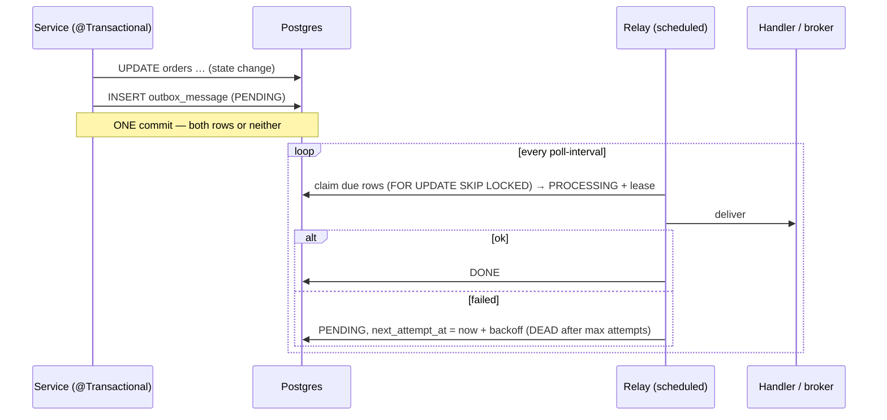

# Transactional Outbox — never lose an event, never send a ghost one

> **One-liner:** write the event into an **outbox table in the same database transaction** as the
> state change, then let a separate **relay** deliver it. One commit covers both, so an event
> exists **if and only if** the change happened, and delivery is retried until it succeeds.

**Type:** Enterprise (distributed systems) · **Status:** ✅ in real code · **Last updated:** 2026-10-02
**Real code:**
- **Writer:** [`JdbcOutboxWriter`](../../backend/messaging/src/main/java/com/masternova/messaging/outbox/JdbcOutboxWriter.java), called by [`TransactionalEventPublisher`](../../backend/api/src/main/java/com/masternova/api/platform/events/TransactionalEventPublisher.java) inside the caller's transaction.
- **Relay:** [`OutboxRelay`](../../backend/messaging/src/main/java/com/masternova/messaging/outbox/OutboxRelay.java) + [`OutboxRelayScheduler`](../../backend/messaging/src/main/java/com/masternova/messaging/outbox/OutboxRelayScheduler.java).
- **Claim SQL:** in [`JdbcOutboxRepository`](../../backend/messaging/src/main/java/com/masternova/messaging/outbox/JdbcOutboxRepository.java).
- **Table:** [`V2__platform_outbox.sql`](../../backend/messaging/src/main/resources/db/migration/V2__platform_outbox.sql).

**Proof:** [`TransactionalOutboxIT`](../../backend/messaging/src/test/java/com/masternova/messaging/outbox/TransactionalOutboxIT.java) (real Postgres) · **Lab:** [`lab/.../patterns/outbox/`](../lab/src/main/java/com/masternova/patterns/outbox/) · **Design:** [`docs/lld/platform-kernel.md`](../../docs/lld/platform-kernel.md)

**Trigger phrase:** "*save X **and** tell Y*", whenever Y is another system (email, broker,
search index, another service) and losing or inventing the message is unacceptable.

## 1. The problem: the dual write

Checkout must mark the order paid **and** trigger the receipt email and course access:

```java
orderRepository.markPaid(orderId);   // write 1: Postgres, committed
broker.publish(new OrderPaid(…));    // write 2: another system
```

Two systems, two writes, no transaction spanning both. Every ordering fails somehow:

| What happens | Result |
|---|---|
| commit, then the process dies before publishing | **paid, but no receipt, no access** (`dualWriteLosesTheEvent…` in the lab) |
| publish first, then the DB commit fails | **an email for an order that doesn't exist**: a ghost event |
| publish inside the transaction, then a rollback | same ghost |
| the broker is down | the request fails, or the event is dropped |

Distributed transactions (2PC/XA) are slow, fragile, and unsupported by most brokers and HTTP APIs.

## 2. The solution and its structure



| Role | Masternova class | Responsibility |
|---|---|---|
| **Writer** | `TransactionalEventPublisher` → `JdbcOutboxWriter` | append the event row **in the caller's transaction** (`Propagation.MANDATORY`) |
| **Outbox table** | `outbox_message` | durable queue in the same DB as the business data |
| **Relay** | `OutboxRelay` (+ scheduler) | claim → deliver → mark; retries with backoff |
| **Consumer** | an `OutboxHandler` bean per event type | the reaction; **must be idempotent** |

## 3. Code walkthrough

**Writer: atomic by construction:**

```java
@Transactional(propagation = Propagation.MANDATORY)   // ⭐ join the caller's tx, or fail
public void publish(DomainEvent event) {
  outbox.append(event);                               // INSERT … in THAT transaction
  springEvents.publishEvent(event);                   // + in-process observers (pattern 07)
}
```

`aRolledBackChangeLeavesNoRowAtAll` proves the guarantee: a business method publishes, then
throws, and the table stays empty.

**Relay claim: concurrency-safe in one statement:**

```sql
UPDATE outbox_message m
   SET status = 'PROCESSING', attempts = m.attempts + 1, next_attempt_at = :leaseUntil
 WHERE m.id IN (SELECT id FROM outbox_message
                 WHERE status IN ('PENDING','PROCESSING') AND next_attempt_at <= :now
                 ORDER BY next_attempt_at, occurred_at
                 LIMIT :batchSize
                   FOR UPDATE SKIP LOCKED)          -- ⭐ skip rows another relay is taking
RETURNING m.id, m.event_type, m.aggregate_id, m.payload::text, m.occurred_at, m.attempts
```

- **`FOR UPDATE SKIP LOCKED`:** concurrent relays get **disjoint** batches without blocking each
  other (`concurrentRelaysNeverClaimTheSameMessage`: 200 rows, 4 relays, 0 duplicates).
- **Lease via `next_attempt_at`:** a claimed row is PROCESSING until `now + lease`. If the relay
  crashes, the row simply becomes **due again** when the lease expires
  (`aCrashedRelaysLeaseExpiresAndTheMessageIsReclaimed`, where `attempts` goes 1 → 2). No extra
  column and no "stuck job" sweeper.
- **The partial index** `WHERE status IN ('PENDING','PROCESSING')` keeps the claim fast however
  many `DONE` rows pile up.

**Relay loop: at-least-once:**

```java
handler.handle(message);
repository.markDone(message.id());          // ⭐ only AFTER the handler succeeded
} catch (RuntimeException e) {
  if (message.attempts() >= maxAttempts) repository.markDead(…);
  else repository.reschedule(id, now + backoff(attempts), error);   // 10 s, 20 s, 40 s … capped
}
```

The relay is **not** `@Transactional`. A slow handler (email) must not hold a DB connection
(notes 07 §9, 09 §5).

## 4. Java features that make it nicer

- **Records:** `DomainEvent` records serialise straight to JSON (Jackson 3), and `OutboxMessage`
  is an immutable value.
- **Text blocks** for readable SQL; **`JdbcClient`** fluent named parameters.
- **`Duration.multipliedBy` + bit shift** for exponential backoff without floating point.
- **Constructor injection of `List<OutboxHandler>`** to build the type → handler registry, with
  a duplicate check at startup (note 08 §4).

## 5. When NOT to use it

- **The reaction is non-critical and in-process** (evict a cache). An AFTER_COMMIT observer
  (pattern 07) is enough.
- **The reaction is part of the same consistency boundary** (grant an entitlement when an order
  is paid). Do it **in the same transaction** directly (NestJS ADR-0020). An outbox would make it
  eventually consistent for no reason.
- **The caller needs the reaction's result synchronously.** That's a call, not an event.

## 6. Where it shows up in the wild

- Debezium / CDC tails the outbox table instead of polling it: the same pattern, different relay.
- Spring Modulith's event publication registry is a persisted, in-process cousin (ADR-0005,
  task 2.5).
- Every payment, e-commerce and banking system that sends emails or webhooks after a state change.

## 7. Alternatives considered

| Alternative | Why not |
|---|---|
| publish directly to a broker | the dual write (§1) |
| 2PC / XA transactions | slow and fragile; brokers and HTTP APIs don't participate |
| listen-to-yourself (consume your own broker topic) | still needs a reliable first write |
| CDC (Debezium) instead of polling | great at scale; adds Kafka + Connect infrastructure. The polling relay is simpler and enough for us. |
| `REQUIRES_NEW` for the outbox insert | commits the event even when the business tx rolls back: a ghost (that's why it's `MANDATORY`) |

## 8. Interview Q&A

- **Q: What problem does the outbox solve?**
  **A:** The dual write. You can't atomically update a DB and publish to another system, so you
  write the event to an outbox table in the same DB transaction, and a relay publishes it
  afterwards.
- **Q: What delivery guarantee do you get?**
  **A:** At-least-once. A crash after delivery but before `DONE` re-delivers the message, so
  consumers must be idempotent (dedupe on event id, Phase 4).
- **Q: How do multiple relay instances avoid double-processing?**
  **A:** `SELECT … FOR UPDATE SKIP LOCKED` inside the claim, plus a lease so crashed claims are
  retried.
- **Q: What about ordering?**
  **A:** Claim in `occurred_at` order. Strict per-aggregate ordering needs one relay per
  aggregate partition, or a sequence check in the consumer. Global ordering is usually
  unnecessary.
- **Q: How do you stop the outbox table from growing forever?**
  **A:** A cleanup job deletes or archives `DONE` rows older than N days. The partial index keeps
  claims fast meanwhile.
- **Q: Outbox vs CDC?**
  **A:** Same write side. Polling is simple; CDC reads the WAL with lower latency and no polling
  load, but needs extra infrastructure.

## 9. 30-second recall

- **Intent:** the event row commits **with** the state change. A relay delivers it later.
- **Writer:** `MANDATORY` transaction. Rollback means no row (no ghost events).
- **Relay:**
  - Claim with `FOR UPDATE SKIP LOCKED`, lease via `next_attempt_at`.
  - Mark DONE only after success. Exponential backoff, then DEAD.
- **Guarantee:** at-least-once, so **consumers must be idempotent**.
- **Pitfalls:**
  - `REQUIRES_NEW` on the insert.
  - A transactional relay holding connections during slow handlers.
  - An unbounded table: add a cleanup job.
  - Using it for same-transaction effects.

*Related:* [Observer (07)](07-observer.md) · [Repository + Unit of Work (16)](16-repository-unit-of-work.md) · Java notes [07 (concurrency)](../java/07-concurrency-and-virtual-threads.md), [09 (`@Transactional`)](../java/09-spring-aop-and-proxies.md)
